# PipelineCore 流程重構 · 架構整理與大改版實施戰略

> 本文件對照 `pipeline_core.py`、`rag_processor.py`、`slides_processor.py` 與各 `processor/` 原始碼進行了嚴格的代碼級審計，並融合了對話紀錄中的核心設計洞察。
> 聚焦三件事：**(1) 深度剖析舊流程主旁支與四大病灶、(2) 定義新流程「物理四 Phase」主旁支與四份數據接口合約（IngestionMetadataSpec／GlossaryReadySpec／BilingualMarkdownSpec／RAG&DB）、(3) 制定大改版與四份既有計畫（GLOSSARY-CORE, TRANSLATE-BOOK, API-PERF, QUEUE-1）對齊的全局實施戰略。**
> 所有流程圖一律使用 Mermaid。

---

## 第一部分：舊流程（Current Architecture）深度剖析

當前的 `PipelineCore` 是一個高度耦合的 **「大型單體控制器（God Class）」**。在一個扁平的 Main Loop 中，混合了三種本應隔離的職責：工作流調度（stages 控制、checkpoint 檢查）、狀態生命週期管理（`self._metadata` / `output_paths` 可變字典）、以及特化的業務路由細節（`doc_type` 分流、並行容錯、LLM 呼叫）。

### 1.1 舊流程 — 主流程（Master Flow）

11 個標準處理階段由 `STAGE_NAMES` 靜態陣列唯一決定。主幹生命週期為「初始化 ➜ Stage A ➜ 主 Loop 迴圈 ➜ Stage B ➜ DB 元數據寫入」。Stage A 與 Stage B 被強行割裂在迴圈的最前與最後，形成了時空跨度極大的耦合。

**11 個標準處理階段（依序）**：
`pdf2md ➜ analyze ➜ detect_domain ➜ md2json ➜ json_process ➜ tiling ➜ translate ➜ image_caption ➜ md_restore ➜ extra_info ➜ rag`

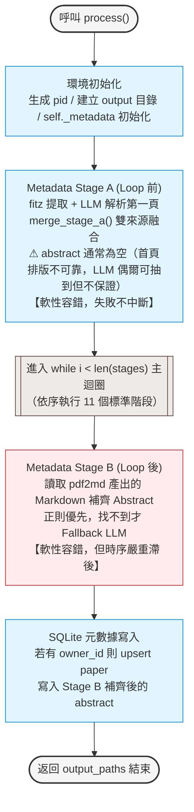

主迴圈內部的調度（Checkpoint 檢查與並行執行）流程如下：

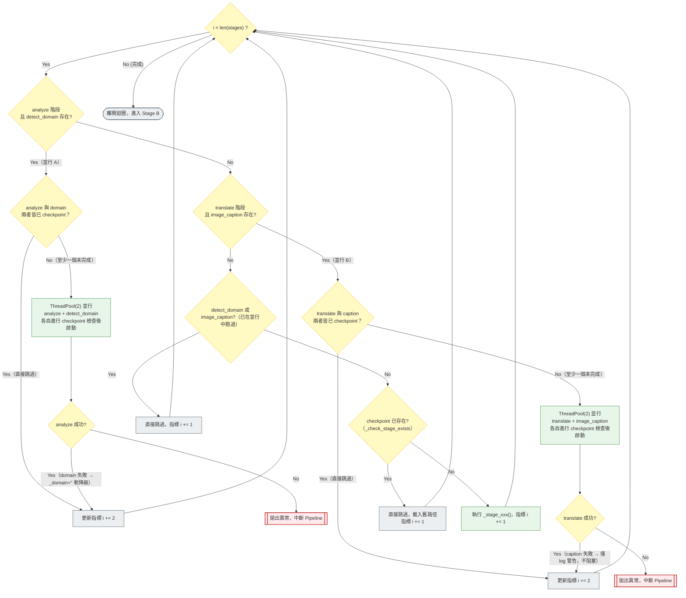

*   **Checkpoint 特殊檢測邏輯**：
    *   `md2json` 階段：除檢查 JSON 檔外，還會檢查同目錄下是否存在 `_doc_structure.json`（結構解析隨身檔） sidecar，缺失則強制重跑。
    *   `md_restore` 與 `rag` 階段：expected 輸出是字典結構。它會遍歷所有預期產生的中英 Markdown、RAG Markdown、Tree JSON 與向量索引目錄是否存在，**全數存在**才判定為已完成。

---

### 1.2 舊流程 — 旁支流程（Branch Logic）

系統在 Main Loop 的單一 stage 執行中，嵌入了五個關鍵的旁支處理與降級防線：

```mermaid
flowchart TD
    classDef br fill:#fff9c4,stroke:#fbc02d,stroke-width:1px;
    classDef p fill:#e1f5fe,stroke:#0288d1,stroke-width:1px;
    classDef fb fill:#ffebee,stroke:#c62828,stroke-width:1px;

    subgraph B1["旁支一：pdf2md 解析器分流（_stage_pdf_to_md）"]
        T1{"doc_type?"}:::br
        T1 -- slides --> S1["SlidesProcessor（Vision 每頁）<br>跳過 md_cleaner 雜訊過濾"]:::p
        T1 -- resume --> S2["ResumeProcessor（Vision 整份忠實轉錄）<br>跳過 md_cleaner 雜訊過濾"]:::p
        T1 -- "academic / book / technical / news / web" --> S3["PDFProcessor（MinerU）<br>強制執行 md_cleaner.clean()"]:::p
        T1 -- "未知類型 (Fallback)" --> S4["log warning 降級至 MinerU<br>強制執行 md_cleaner.clean()"]:::fb
    end

    subgraph B2["旁支二：detect_domain 優化路徑（_stage_detect_domain）"]
        T2{"self._metadata.domain.value 非空?"}:::br
        T2 -- "Yes (Stage A LLM 已抽到)" --> U2["直接返回，省略 DomainDetector 呼叫"]:::p
        T2 -- "No" --> V2["Fallback：呼叫 DomainDetector.detect() 重跑"]:::fb
    end

    subgraph B3["旁支三：translate 摘要側路翻譯（_stage_translate）"]
        T3["translate_processor.process()"]:::p --> Q3{"translated_abstract<br>已產生?"}:::br
        Q3 -- Yes --> U3["寫入 self._metadata"]:::p
        Q3 -- No --> Q3b{"self._metadata.abstract.value 非空?<br>（Bug B1 側路）"}:::br
        Q3b -- No --> E3["保持空，階段完成<br>⚠ 由於 Stage B 未跑，此處通常為空<br>（Stage A LLM 偶爾可抽到則非空）"]:::fb
        Q3b -- "Yes（觸發側路翻譯）" --> X3["單獨呼叫 translate_text('abstract')"]:::p
        X3 --> U3
    end

    subgraph B4["旁支四：rag 輸入來源選擇（_stage_rag）"]
        T4{"extra_info 已產出?"}:::br
        T4 -- Yes --> R4["input = output_paths['extra_info']"]:::p
        T4 -- No --> R4b["input = output_paths['translate']（fallback）"]:::p
        R4 --> DB4{"owner_id 存在?"}:::br
        R4b --> DB4
        DB4 -- Yes --> G4["paper_manager.get_paper_db_id()<br>成功：同步寫 SQLite Chunks + 向量庫<br>失敗/None：軟警告，僅寫向量庫"]:::p
        DB4 -- No --> W4["僅寫向量庫（CLI 可補建）"]:::fb
    end

    subgraph B5["旁支五：並行失敗軟降級"]
        T5a["analyze 失敗 ──> reraise 中斷整條管線"]:::fb
        T5b["detect_domain 失敗 ──> _domain='' 軟降級續跑"]:::p
        T5c["translate 失敗 ──> reraise 中斷整條管線"]:::fb
        T5d["image_caption 失敗 ──> log 警告，不設路徑，不阻塞"]:::p
    end
```

---

### 1.3 舊流程的四大致命缺陷（重構動機）

這些在長期演進中累積的架構缺陷，是本次大改版必須根除的病灶：

#### 1. 摘要時序悖論 (Temporal Time-Travel Paradox) — 側路翻譯淪為擺設
在中文翻譯模式下，論文摘要 toolbar 長期只能顯示英文。
*   **成因**：`_stage_translate`（Stage 7）設計了**側路翻譯 (Side-Channel Fallback)** 兜底機制——若正則匹配不到翻譯 JSON 中的 abstract，則直接翻譯 `self._metadata["abstract"]["value"]`。但 Stage A 執行時（Loop 開始前）英文 `abstract` **通常為空**（首頁排版不穩定，Stage A LLM 嘗試提取但常常失敗）。真正去 Markdown 提取摘要的 **Stage B 是在整個 Loop（包括 `translate`）完全結束後才運行的！**
*   **後果**：當翻譯階段啟動時，英文摘要幾乎必然為空（Stage A 極少數成功提取時才非空），側路翻譯判定無摘要可翻而直接跳過，導致**中文翻譯摘要永久遺失**，前端只能防禦性顯示英文摘要。

#### 2. JSON 樹無元數據保護 — 臃腫的「25 種狀態決策樹」
*   **成因**：`md2json`（Stage 4）結構化轉換時，三軸融合與元數據 Resolution 尚未執行，這導致生成的 JSON 樹根節點只帶有未清洗的 raw title。
*   **後果**：下游的 `md_restore` 在生成雙語 Markdown 的最後一刻，被迫使用一套極起臃腫、包含 25 種狀態與黑名單規則的決策樹進行動態修補。這直接違反了「數據在源頭洗乾淨」的工程原則。

#### 3. RAG 與 extra_info 拖累主鏈路 — 嚴重的效能與 Token 浪費
*   **成因**：`rag`（Stage 11）寫庫與向量化留在主同步鏈路中，一旦向量資料庫出錯，會直接導致整條翻譯流水線 `FAILED`，造成單點故障。而 `extra_info`（Stage 10）對每個章節遞迴呼叫 LLM 進行總結與 Q&A（消耗 10~20 次 LLM），但這些產出在前端頁面 `static/index.html` 中**完全沒有任何渲染代碼**，純屬 100% 的無效消耗。

#### 4. 簡報（Slides）重複 Caption 渲染 Bug
*   **成因**：在 `slides_processor.py` 輸出 Markdown 時，將圖片標記與圖表說明分開寫入：
    ```markdown
    
    
    *圖表：{figure_desc}*
    ```
*   這段文字被 `md2json` 解析為 `type: "figure"` (caption為空) 與 `type: "text"` (獨立段落) 兩個節點。
*   在還原 `type: "figure"` 時，因其 `en_caption` 為空，`md_restore_processor` 自動觸發 Fallback，去讀取 `ImageCaptionProcessor` 為該圖片生成的描述並渲染（第一組解釋）；隨後，那個被誤判為普通 Text Block 的 `*圖表：{figure_desc}*` 段落經翻譯後也被輸出（第二組解釋）。
*   **後果**：最終的雙語簡報中，一張投影片下方會同時重疊渲染出兩組重複的圖表說明。

#### 1.4 舊 RAG 與 extra_info 階段之代碼級剖析

在舊單體架構中，最後的 `extra_info` (Stage 10) 與 `rag` (Stage 11) 階段被緊密地綁定在 Main Loop 的最後，採用同步阻塞方式運行。以下為其詳細的代碼級運作機制：

##### 1. 運作機制與順序
*   **執行時機**：在並行翻譯與雙語 HTML/MD 還原（`md_restore`）完成後，緊接著同步調用。這使得整份 PDF 必須等到向量建庫與資料庫批量落庫 100% 結束，主程序才會完成並返回。
*   **數據流向**：`md_restore` ➜ `extra_info` ➜ `rag` ➜ 寫入 SQLite。

##### 2. 代碼級外部呼叫與依賴
*   **`extra_info` 階段**：
    *   調用 `ExtraInfoProcessor`。
    *   使用 `settings.LLM_EXTRA_INFO_MODEL` 模型發送 LLM 請求。
    *   在非短文（Academic/Book）模式下，使用 `ThreadPoolExecutor` (max_workers 預設為 4) 來並行處理同層 sibling sections。對每個章節內容，遞迴向 LLM 呼叫並生成章節總結（`summary`）；若 `skip_questions=False`（通常為 True），還會生成問題與公式解析。
*   **`rag` 階段**：
    *   調用 `RagProcessor.process()`。
    *   呼叫 `EmbeddingModel` 實例，對 Markdown 片段計算向量。
    *   使用 `FAISS` 向量庫的 `save_local` 方法，將向量索引物理寫入磁碟物理目錄 `vectors/`。
    *   調用資料庫模組 `paper_manager.get_paper_db_id(owner_id, paper_id)`，查詢當前 Paper 的 SQLite PK `paper_db_id`。
    *   調用 `paper_manager.replace_paper_chunks(...)`，將過濾後的 meaningful chunks 批量落庫到 SQLite 資料表 `paper_chunks` 中。

##### 3. 條件與分流判斷
*   **`extra_info` 分流**：
    *   若 `doc_type in ('news', 'web', 'slides', 'resume')`，執行簡化模式 `generate_document_summary`，拼合全文發送 1 次 LLM 請求產生整體摘要，並寫入頂層 `data['summary']`。
    *   若為 `academic` 或 `book` 等，執行遞迴模式 `generate_section_summaries`，自下而上對每個 section 生成摘要並填入 `section['summary']`（消耗高達 10~20 次 LLM 呼叫）。
*   **`rag` 分流與降級**：
    *   輸入來源檢查：優先讀取 `extra_info` 的 output，若不存在則 fallback 讀取 `translate` 的 output。
    *   資料庫防禦判定：若 `self._owner_id` 為空，則警告並跳過 SQLite 批量寫入，僅在磁碟保存 FAISS 向量庫（離線 CLI fallback）。若 `get_paper_db_id` 返回為空或失敗，同樣降級跳過 `paper_chunks` 寫入。
    *   Chunk 實質內容過濾：在 `_is_chunk_meaningful` 中判定實質字元數（去除 Markdown 符號與空格後的字元長度）。若 `doc_type` 為 `resume` 或 `slides`，字元長度放寬至 `≥ 3`；其他文檔類型則嚴格限制為 `≥ 10`；純數字年份過濾；包含 Email/Phone/URL 的結構化 chunk 無條件保留。

##### 4. 數據產出與實體路徑
*   **`extra_info` 產出**：一個 JSON 檔案，儲存在 `output_paths['extra_info']`，其結構中填補了 sections summaries 和整體 summary。
*   **`rag` 產出**：
    *   RAG 專用 Markdown 檔案 `output_paths['rag']['md']`（包含 Context 層級標籤前綴）。
    *   結構化檢索樹 JSON 檔案 `output_paths['rag']['tree_json']` (`rag_tree.json`)。
    *   物理向量目錄 `output_paths['rag']['vector_store']`（包含 `index.faiss`, `index.pkl`）。
    *   中繼說明檔 `index_meta.json`。
    *   SQLite `paper_chunks` 資料表記錄。

---

## 第二部分：新流程（Target Architecture）規劃

重構的核心哲學是：**「三層解耦（調度層 / Context 狀態層 / 原子階段層）+ 物理四 Phase 生命週期（Ingestion／Glossary&Context Prep／Translation&Restore／Async RAG）+ 數據在源頭洗淨」**。

### 2.1 新流程 — 三層解耦架構 (Decoupled 3-Layer)

重構後的 `PipelineCore` 廢除 God Class 設計，劃分為明確的三層架構：
1.  **調度層 (Orchestrator)**：僅負責順序控制（宣告式 DAG）、Checkpoint 讀寫與線程並行，不涉及業務細節。
2.  **狀態層 (Pipeline Context)**：使用 Pydantic 封裝為類型安全的 `PipelineContext` 統一傳遞，嚴格限制狀態變更，消除 mutable dict 的隱式修改。
3.  **原子階段層 (Atomic Stages)**：每個 Stage 都是獨立、無狀態的 Class 插件（如 `Pdf2MdStage`），只專注於處理 Context 中的數據。

#### 三層職責泳道（PipelineCore 的邊界 vs 五路 Strategy 的下放）

下圖以職責泳道呈現解耦邊界：**`PipelineCore` 只涵蓋①②③三層通用骨架，唯一職責是保證「每個 Stage 按 DAG 順序、依 `PipelineContext` schema 契約正確交付」**；而 `doc_type` 專屬的**執行細節**（如何解析、如何提術語、如何調度翻譯）一律**下放至五路 `DocumentStrategy` 插件**，主幹完全不碰——這正是「主幹只呼叫 `strategy.parse()`、新增 doc_type 主幹 100% 不動」（§2.3 L304）的結構基礎。

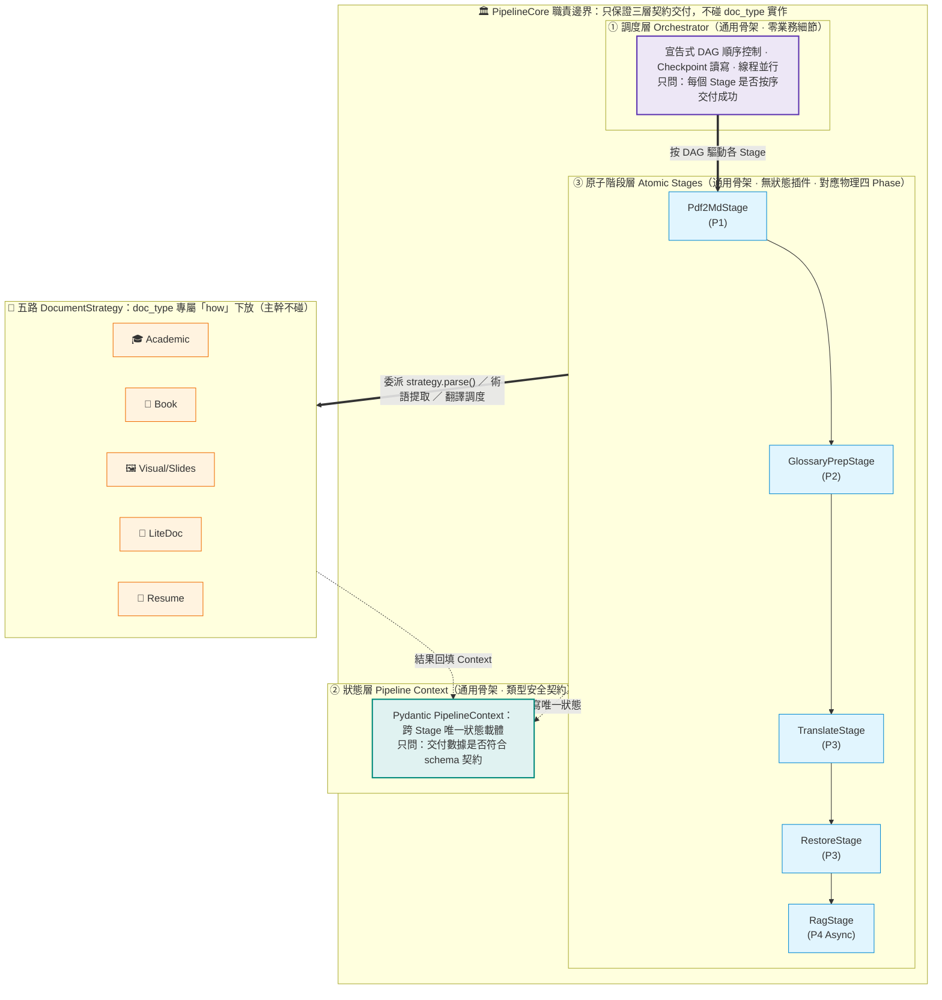

> **一句話契約**：PipelineCore 問的永遠是「**契約有沒有依約交付**」（順序對不對、schema 合不合）；它**從不問**「academic 怎麼提術語、book 怎麼滾動大綱」——那是五路 Strategy 的家務事。換 doc_type＝換插件，三層骨架原封不動。

---

### 2.2 新流程 — 主流程（Master Flow）

主鏈路在入口先依 `doc_type` 分類，由 `DocumentPipeline` 策略模式派工至五大自適應管線（學術 / 書籍 / 視覺 / 輕量短文 / 履歷），於物理四 Phase 骨架（Ingestion → Glossary&Context Prep → Translation&Restore → Async RAG）下各走精細時序（詳見 §2.3.1）。主鏈路本體做「解析 ➜ 術語/語境準備 ➜ 翻譯/還原」三段：`md_restore` 一完成即宣告 `reading_ready`，前端立即解鎖閱讀與 Print PDF。RAG 向量化則從主鏈中剝離，移為非同步背景任務（P4），在背景完成後再解鎖 AI Chat 功能。**四 Phase 各自交付一塊凍結的乾淨產物：P1 只交原文解析與元數據（不碰 Abstract／LCC／Glossary、零翻譯）；P2 交出原文摘要、LCC、最終 Glossary 與 `translated_abstract`；P3 收到凍結的最終 Glossary 後純做正文翻譯與還原。**

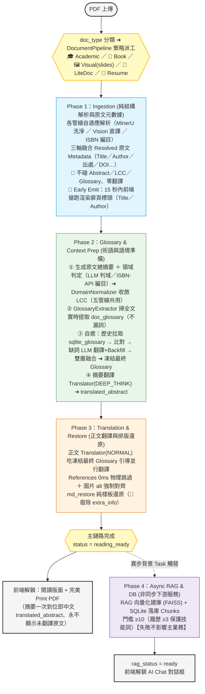

#### Phase 1 內部主流程（雙軌並行 + Early Emit 搶跑）

為了消除 MinerU 對整份長文檔解析的漫長等待，Phase 1 採用「快元數據軌（前 2 頁）」與「全文本文軌（整份）」雙軌並行調度：

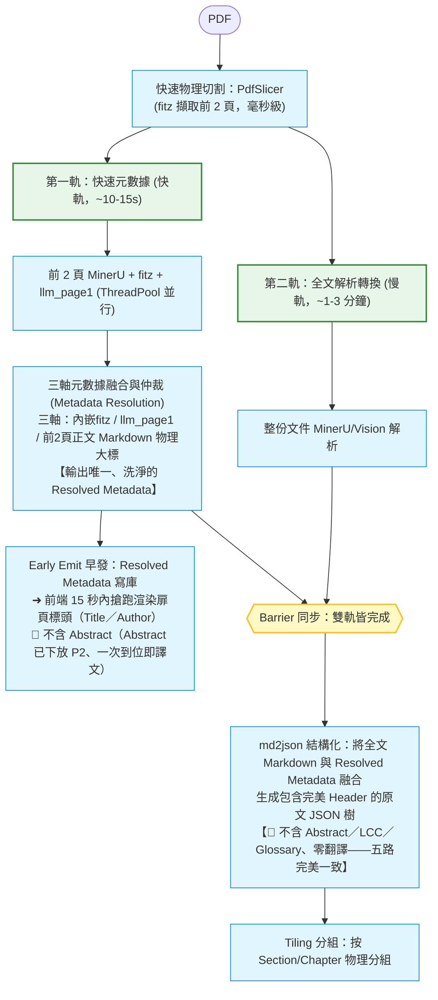

#### Phase 2 內部主流程（Glossary &amp; Context Prep — 原文語境準備）

Phase 2 收下 Phase 1 凍結的原文 JSON 樹，集中產出所有「需要讀全文才能算」的衍生語境：原文總摘要、LCC 領域分類、最終 Glossary，並把摘要一次翻成目標語凍結為 `translated_abstract`。Book 的滾動例外（章節滾動摘要與術語提取共用同一次 LLM 呼叫）完整內聚於本層，對 P1／P3 交接點零外溢。

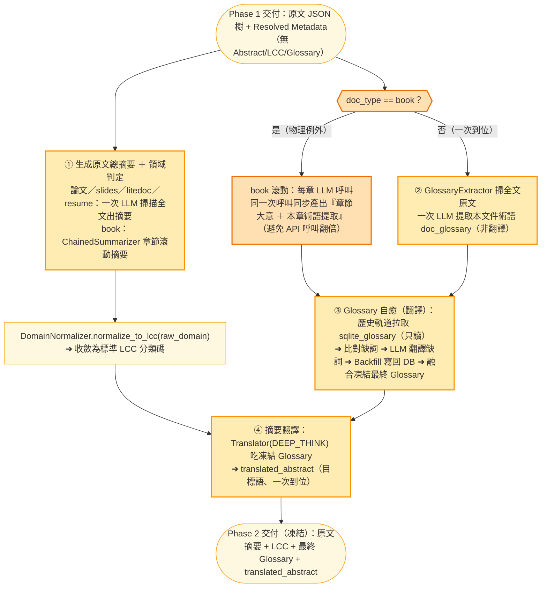

#### Phase 3 內部主流程（大區塊引導翻譯 + md_restore 減肥）

引導翻譯機制徹底根治了「並行翻譯下的譯名漂移」；`md_restore` 丟棄所有動態修補與決策，退化為純 Markdown 樣板渲染引擎（代碼量削減 80%），徹底解決 slides 雙重解釋 Bug。Phase 3 收下 Phase 2 凍結的最終 Glossary 與原文摘要後純做正文翻譯與還原，自身不再做任何術語提取或自癒。

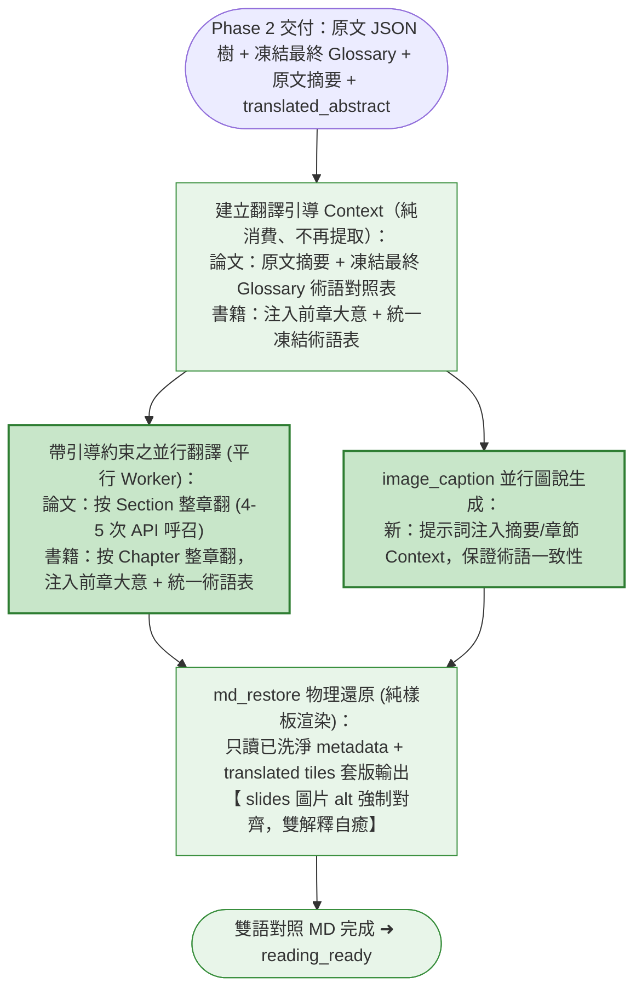

#### Phase 4 內部主流程（非同步旁支）

RAG 向量建庫徹底移出主 Pipeline 成為非同步旁路，寫庫失敗時不會拋錯中斷，並將特徵工程（如分塊摘要）內聚於 `rag_processor` 中。

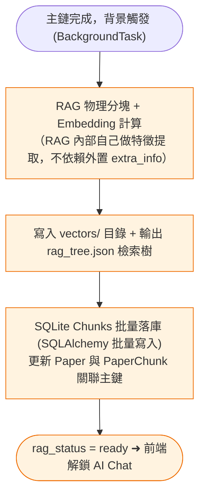

---

### 2.3 新流程 — 旁支流程（Branch Logic）

新架構將 `doc_type` 旁支抽象化為獨立策略插件，並將 TextTiling 的複雜 Embedding 相似度計算，簡化為基於 Section/Chapter 的排版分組，大幅節約 Token 消耗：

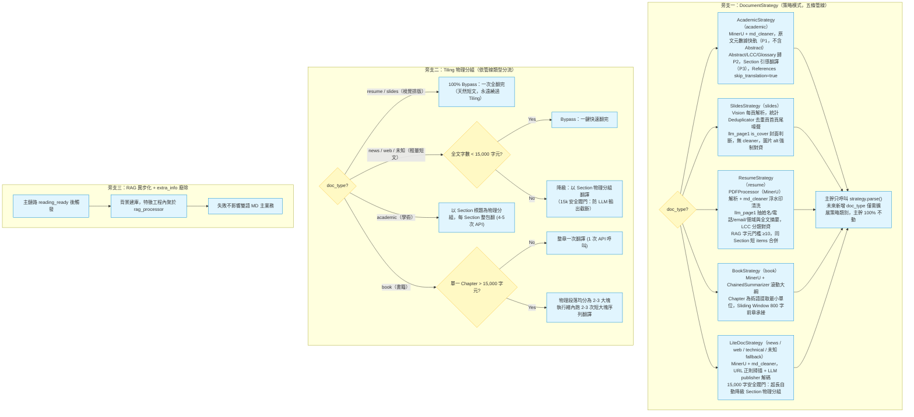

**長文 Tiling 方案現行 vs 新目標對比**：

| 維度 | 現行（TextTiling） | 新設計（Section/Chapter 物理分組） |
|---|---|---|
| **基本策略** | 合併段落 ➜ 分句 ➜ 調用 Embedding 計算相鄰餘弦相似度 ➜ 尋找「語意谷底」作斷點 | 直接依據正文 `### Section` 或 `## Chapter` 進行物理排版分組，不切碎段落 |
| **長章節處理** | 強行將長文切成 500~1000 字的小分片，全體並行 | 當單章 > 15000 字元時，才均分為 2-3 大塊，在 Chapter 執行緒內短迴圈翻譯 |
| **API 呼叫次數** | 翻譯 20-30 次（Tile） | 論文 4-5 次（Section）/ 書籍每章 1-3 次（Chapter） |
| **Embedding 呼叫** | 每個 Tile 在 Tiling 階段都需呼叫一次 Embedding | **完全省去（0次呼叫）**，僅在 Phase 4 Async RAG 建庫時計算一次 |

### 2.3.1 五大策略管線之極致自適應流程與詳細時序 Hook 點

在物理四 Phase（Ingestion / Glossary &amp; Context Prep / Translation &amp; Restore / Async RAG）的宏觀骨架下，為了解決特定文件類型的時序悖論與噪聲干擾，系統透過 `DocumentPipeline` 策略模式實現了五大管線的精細自治。**四 Phase 邊界鐵律**：P1 只交「原文解析 + 原文 Metadata（Title/Author/出處/DOI…，無 Abstract/LCC/Glossary、零翻譯）+ 物理分組 Tiles」、五路完美一致；所有「需讀全文才能算」的衍生語境（原文摘要 / LCC / Glossary 提取 / 自癒 / translated_abstract）一律內聚於 P2；P3 純消費 P2 凍結產物做正文翻譯與還原；P4 為非同步 RAG。

#### 1. 🎓 學術管線策略 (`AcademicPipeline`)
*   **文件定義範圍**：**僅限 `academic`（學術論文）**。原因在於只有標準學術論文具備嚴格穩定的首頁 Abstract。技術白皮書、專利或報告因格式隨機，由 LiteDocPipeline 兜底。
*   **Phase 1 Ingestion（純結構解析與原文元數據）**：
    *   *主幹解析*：使用 `PDFProcessor` (MinerU) 解析全文，強制調用 `md_cleaner.clean()` 洗淨雜訊。
    *   *原文元數據快軌 (Fast-Track)*：快軌只解析前 2 頁產出 Resolved 原文 Metadata（Title/Author）➜ **15秒內 Early Emit 寫庫**，搶跑渲染扉頁標頭。🚫 **本階段不提取 Abstract**（Abstract 已下放 P2，於 P2 一次翻成目標語、永不顯示未翻譯原文）。
    *   *交付*：原文 JSON 樹 + Resolved 原文 Metadata + 物理分組 Tiles。🚫 不含 Abstract / LCC / Glossary、零翻譯。
*   **Phase 2 Glossary &amp; Context Prep（摘要 / LCC / 提取 / 自癒 / 摘要翻譯）**：
    *   *原文摘要與 LCC (時序 ①)*：一次 LLM 掃全文出原文 Abstract / 總摘要，並 `DomainNormalizer` 將 `detect_domain` 的 Raw 領域對齊為標準 LCC 代碼（如 `"QA"`），供本層拉取該領域歷史術語。
    *   *實時術語提取 (時序 ②)*：調用 `GlossaryExtractor`，**掃全文 Markdown**（物理剔除 References）一次提取本文專屬核心術語（`doc_glossary`，**不設數量上限**）。**提取源必為全文、嚴禁用摘要 / Abstract**——摘要漏詞會使同一專有名詞前後譯名不一致。論文輸入可一次呼叫掃完，無 Book 滾動例外。
    *   *自癒與雙層字典融合 (時序 ③)*：歷史軌道拉取 `sqlite_glossary`（只讀）➜ 比對缺詞 ➜ LLM 翻譯缺詞 ➜ Backfill 回寫 DB ➜ 與 `doc_glossary` 融合去重凍結最終 Glossary（本文專屬擁有最高優先權）。
    *   *摘要翻譯 (時序 ④)*：**呼叫共用 `Translator(mode=DEEP_THINK)`** 吃凍結 Glossary 翻譯原文 Abstract ➜ 寫入 `translated_abstract`（目標語、一次到位）。
    *   *交付（凍結）*：原文摘要 + LCC + 最終 Glossary + `translated_abstract`。
*   **Phase 3 Translation &amp; Restore（正文翻譯與 References 物理防線）**：
    *   *正文強約束並行翻譯*：按 Section 進行大塊物理分組，逐包 **呼叫共用 `Translator(mode=NORMAL)`** 並行翻譯。純消費 P2 凍結產物，注入 `zh_summary（已譯摘要）` + `凍結最終 Glossary` + `constraints=[人名不翻譯，防止 He et al. 翻成「他等人」]` + `preceding=[上一段譯文]`。
    *   *References 物理防線*：在 `md2json` 解析時，將 `type == 'references'` 節點標記為 `skip_translation = true`。翻譯 Worker 遍歷到此節點時，直接 **0ms 複製原文跳過，完全不打 API**。
*   **Phase 4 Async RAG（向量化）**：
    *   採用 `translated_abstract` 進行「摘要前綴增強分塊」，`_is_chunk_meaningful` 門檻限制為 **`≥ 10`**。

#### 2. 📖 書籍管線策略 (`BookPipeline`)
*   **文件定義範圍**：`book`（長篇小說 / 專著 / 教科書）。
*   **Phase 1 Ingestion（純結構解析與原文元數據）**：
    *   *主幹解析*：MinerU 解析全文 + `md_cleaner.clean()`。
    *   *原文元數據*：以 `fitz` 正則匹配版權頁（Page 2-4）的 `ISBN` 碼 / `Title+Author`，產出 Resolved 原文 Metadata。
    *   *交付*：原文 JSON 樹 + Resolved 原文 Metadata + 物理分組 Tiles。🚫 不含 Abstract / LCC / Glossary、零翻譯——與其餘四路完美一致。
*   **Phase 2 Glossary &amp; Context Prep（🌟 Book 滾動物理例外完整內聚於此層）**：
    *   *ISBN 權威編目與 LCC (時序 ①)*：以 P1 交付的 ISBN / `Title+Author` 為 Key ➜ 異步查詢 Google Books 或 Open Library API ➜ 提取真實圖書大數據中的 `lcc_number` 或 `categories` ➜ 自動對齊標準 LCC 標籤（如 `"B"` - 哲學），寫入快取。
    *   *🌟 滾動大綱與術語提取同呼叫 (時序 ②、物理例外)*：書籍受 context 上限約束**無法一次掃全書**，故啟用 `ChainedSummarizer` / `GlobalTranslator` Chapter-by-Chapter 滾動。**於滾動生成各章大綱的同一次 LLM 呼叫中，同步從該章全文正文提取**這本書專屬術語表（`book_glossary`）——避免 API 呼叫翻倍。**提取源為全章正文（非大綱），故不漏詞**，落地「提取源必為全文、嚴禁用摘要」原則。此「摘要與提取必須融於同一次呼叫」之物理例外**完整內聚於 P2、不外溢 P1/P3 交接點**。
    *   *自癒與雙層字典融合 (時序 ③)*：歷史軌道拉取 `sqlite_glossary`（只讀）➜ 比對缺詞 ➜ LLM 翻譯缺詞 ➜ Backfill 回寫 ➜ `book_glossary`（書籍實時）+ `sqlite_glossary`（歷史）融合凍結最終 Glossary。
    *   *摘要翻譯 (時序 ④)*：**呼叫共用 `Translator(mode=DEEP_THINK)`** 吃凍結 Glossary，注入 `lcc`，翻譯全書總摘要；各章摘要亦同步 DEEP_THINK 翻譯，注入 `lcc + zh_summary + Glossary + preceding=[前一章詳細摘要]（Sliding Window 滾動壓縮，防 Context 爆炸）`，凍結為各章 `translated_abstract`。
    *   *交付（凍結）*：原文總摘要 + 各章摘要 + LCC + 最終 Glossary + `translated_abstract`。
*   **Phase 3 Translation &amp; Restore（雙速思考章節翻譯）**：
    *   *正文各章節翻譯 (🚀 `Translator(mode=NORMAL)` 降本提速)*：純消費 P2 凍結產物，不再做任何提取 / 自癒。
        *   *長章節分片 (Chapter > 15,000字)*：在 Chapter Worker 內短序列迴圈逐塊 **呼叫 `Translator(mode=NORMAL)`**。每塊注入 `lcc + zh_summary（已譯總摘要）+ 凍結 Glossary + 本章摘要 + preceding=[上個切片結尾 800 字中文譯文]`，確保極速。
        *   *短章節 (Chapter < 15,000字)*：整章一次 **呼叫 `Translator(mode=NORMAL)`** 全翻完，注入 `lcc + zh_summary（已譯總摘要）+ 凍結 Glossary + 本章摘要`。
*   **Phase 4 Async RAG（向量化）**：
    *   採用 `Chapter Summary` 進行「章節摘要前綴注入」，`_is_chunk_meaningful` 限制為 **`≥ 10`**。

#### 3. 🖼️ 視覺排版管線策略 (`VisualPipeline`)
*   **文件定義範圍**：**僅限 `slides`（簡報 PPT / Keynote）**。為防止噪聲交織，履歷已被獨立成一類。
*   **Phase 1 Ingestion（視覺解析與統計去噪）**：
    *   *主幹解析*：**絕對禁止** MinerU 與 `md_cleaner`。必須採用 `Vision 每頁解析` 進行實體轉錄。
    *   *重複頁首頁尾物理去噪*：引入「簡報統計去重過濾器」，對每頁文字行進行掃描，若某行文字（如商標 `MAD PROFESSOR INC.` 或是保密宣告 `CONFIDENTIAL`）在 **超過 30% 的頁面中重複出現**，則在最終合攏前直接物理剔除。
    *   *封面防錯判斷*：`llm_page1` 結構化判斷第一頁是否具備 `is_cover: boolean` 特徵。若非封面，放棄填入任何 Metadata，防範隨機正文內容污染 Title。
    *   *交付*：原文 JSON 樹 + Resolved 原文 Metadata + 物理分組 Tiles。🚫 不含 Abstract / LCC / Glossary、零翻譯。
*   **Phase 2 Glossary &amp; Context Prep（摘要 / LCC / 提取 / 自癒 / 摘要翻譯）**：
    *   *原文總摘要與 LCC (時序 ①)*：一次 LLM 掃全文生成全文原文總摘要，並由 LLM 判斷領域產出 `raw_domain` ➜ 呼叫共用 `DomainNormalizer.normalize_to_lcc(raw_domain)` 收斂為標準 LCC。
    *   *實時術語提取 (時序 ②)*：呼叫 LLM **掃全文 Markdown** 一次提取核心 Glossary（`doc_glossary`，**不設數量上限**）。**提取源必為全文、嚴禁用摘要 / Abstract**——摘要漏詞會使同一專有名詞前後譯名不一致。slides 輸入短，可一次呼叫掃完。
    *   *自癒 (時序 ③)*：比對 SQLite。缺失者附帶全文摘要與 LCC 翻譯，Backfill 回寫 DB，凍結最終 Glossary。
    *   *摘要翻譯 (時序 ④)*：`Translator(mode=DEEP_THINK)` 吃凍結 Glossary 翻原文總摘要 ➜ `translated_abstract`。
    *   *交付（凍結）*：原文摘要 + LCC + 最終 Glossary + `translated_abstract`。
*   **Phase 3 Translation &amp; Restore（全文翻譯與圖片 Alt 對齊）**：
    *   *全文總翻譯 (100% 繞過 Tiling)*：總字數極少，整份 **呼叫共用 `Translator(mode=NORMAL)`** 一次全翻完。純消費 P2 凍結產物，注入 `lcc + zh_summary（已譯摘要）+ 凍結 Glossary + constraints=[圖片 alt 強制對齊]`。
    *   *圖片 Alt 強制對齊*：在翻譯全部內文時，圖片 Markdown Alt 標籤 `` 內的描述文字必須**同步譯出並回寫 alt 中**，嚴禁在下方生成 `*圖表：desc*` 獨立文字段落，物理根除雙重解釋 Bug。
*   **Phase 4 Async RAG（向量化）**：
    *   採用標準平鋪分塊，合併同 section 短 items，字元門檻限制為 **`≥ 10`**。

#### 4. 📰 輕量短文管線策略 (`LiteDocPipeline`)
*   **文件定義範圍**：`news`（新聞）、`web`（網頁轉錄）、`未知類型（預設 Fallback）`。
*   **Phase 1 Ingestion（輕量解析與網址解碼）**：
    *   *主幹解析*：使用 `PDFProcessor` 解析全文，強制 `md_cleaner.clean()` 洗淨。
    *   *網址與正式名稱解碼*：正則掃描 Markdown 前 5 行以提取 `raw_url` ➜ 將網址與前 2 頁內文丟給 `llm_page1` ➜ LLM 結構化解碼並提供該發布媒體的正式中英文名稱（如把 `nytimes.com/...` 轉換為 `"The New York Times / 紐約時報"`）➜ 寫入 `metadata.publisher`。
    *   *交付*：原文 JSON 樹 + Resolved 原文 Metadata（含 publisher）+ 物理分組 Tiles。🚫 不含 Abstract / LCC / Glossary、零翻譯。
*   **Phase 2 Glossary &amp; Context Prep（摘要 / LCC / 提取 / 自癒 / 摘要翻譯）**：
    *   *原文總摘要與 LCC*：一次 LLM 掃全文生成全文原文總摘要，並由 LLM 判斷領域產出 `raw_domain` ➜ 呼叫共用 `DomainNormalizer.normalize_to_lcc(raw_domain)` 收斂為標準 LCC。
    *   *實時術語提取與自癒*：呼叫 LLM **掃全文 Markdown** 一次提取核心 Glossary（**不設數量上限**），比對 SQLite 進行翻譯自癒與 Backfill 回寫，凍結最終 Glossary。**提取源必為全文、嚴禁用摘要**——摘要漏詞會使同一專有名詞前後譯名不一致。
    *   *摘要翻譯*：`Translator(mode=DEEP_THINK)` 吃凍結 Glossary 翻原文總摘要 ➜ `translated_abstract`。
    *   *交付（凍結）*：原文摘要 + LCC + 最終 Glossary + `translated_abstract`。
*   **Phase 3 Translation &amp; Restore（一鍵快速翻譯與字數安全閥門）**：
    *   *字數安全物理閥門 (防溢出)*：純消費 P2 凍結產物，不再做提取 / 自癒。
        *   **【字數 < 15,000 字元】**：**100% 繞過 Tiling**，整份 **呼叫共用 `Translator(mode=NORMAL)`** 一鍵翻譯全部內文（注入 `lcc + zh_summary（已譯摘要）+ 凍結 Glossary`）。
        *   **【字數 ≥ 15,000 字元】**：觸發 Fallback 安全防線，**自動降級走學術管線的 Section 物理分組**，逐包 **呼叫 `Translator(mode=NORMAL)`**，防範 LLM 輸出溢出截斷。
*   **Phase 4 Async RAG（向量化）**：
    *   採用標準平鋪分塊，合併同 section 短 items，字元門檻限制為 **`≥ 10`**。

#### 5. 📄 履歷管線策略 (`ResumePipeline` [NEW])
*   **文件定義範圍**：**僅限 `resume`（個人履歷）**。從 VisualPipeline 中拆分，專注於履歷的極致排版還原。
*   **Phase 1 Ingestion（多模態視覺直譯方案一）**：
    *   *多模態視覺直譯*：**100% 採用 LLM Vision 視覺直譯**。直接將履歷每頁渲染成圖片送給多模態 LLM，要求其精確輸出單語 Markdown。這**徹底根治了雙欄與表格排版在 MinerU 下破碎的災難，且實現了天然的視覺去噪（自動忽略浮水印）**。
    *   *結構化 Metadata 提取*：`llm_page1` 結構化提取姓名、聯絡電話、Email 以及職業領域分類。
    *   *交付*：原文 JSON 樹 + Resolved 原文 Metadata（姓名 / 電話 / Email / 領域）+ 物理分組 Tiles。🚫 不含 Abstract / LCC / Glossary、零翻譯。
*   **Phase 2 Glossary &amp; Context Prep（摘要 / LCC / 提取 / 自癒 / 摘要翻譯）**：
    *   *原文總摘要與 LCC*：一次 LLM 掃全文生成全文原文總摘要，並依 P1 提取出的專業領域對齊 **LCC** 標準分類（行銷 → 商業分類 `H`、程式設計師 → 電腦科學 `QA`；因行銷與財務同字異譯，須以領域別精準對齊）。
    *   *術語實時提取與自癒*：**掃全文 Markdown** 一次提取核心 Glossary（**不設數量上限**），比對 SQLite 進行翻譯自癒與 Backfill 回寫，凍結最終 Glossary。**提取源必為全文、嚴禁用摘要**——摘要漏詞會使同一專有名詞前後譯名不一致。
    *   *摘要翻譯*：`Translator(mode=DEEP_THINK)` 吃凍結 Glossary 翻原文總摘要 ➜ `translated_abstract`。
    *   *交付（凍結）*：原文摘要 + LCC + 最終 Glossary + `translated_abstract`。
*   **Phase 3 Translation &amp; Restore（一鍵快速翻譯）**：
    *   *全文一鍵翻譯 (100% 繞過 Tiling)*：字數極少，整份 **呼叫共用 `Translator(mode=NORMAL)`** 一次全翻完。純消費 P2 凍結產物，注入 `lcc + zh_summary（已譯摘要）+ 凍結 Glossary`。
*   **Phase 4 Async RAG（短項目合併與技能詞保護）**：
    *   *短項目合併 (Merged Chunking)*：在向量化前，將同一個 section（如技術列表）內的所有短項目合併為單一 chunk，防止語意信號被稀釋。
    *   *技能詞保護門檻*：**【字數過濾門檻硬性放寬為 `≥ 3`】**，以 100% 物理保護 `Go`、`C++`、`AI`、`AWS` 等極短的履歷核心技能標籤不被誤殺，確保 HR 在進行技能關鍵字檢索時 100% 精準召回。

---

### 2.4 新流程 — 流程接口合約（Interface Contracts）

大改版成功的唯一硬性防線在於**凍結 Phase 之間的交接點合約**。一旦合約接口以 JSON Schema 形式凍結，各 Phase 的內部邏輯（如並行調度、解析引擎）皆可獨立改版與重寫，互不干擾。

```mermaid
flowchart LR
    classDef ph fill:#e1f5fe,stroke:#0288d1,stroke-width:2px;
    classDef c fill:#fff9c4,stroke:#fbc02d,stroke-width:1px;

    P1["Phase 1<br>Ingestion"]:::ph -->|"交接點 ①<br>(IngestionMetadataSpec)"| C1["原文結構化 JSON 樹<br>+ Resolved 原文 Metadata<br>(無 Abstract/LCC/Glossary)<br>+ 已物理分組之 Tiles"]:::c
    C1 --> P2["Phase 2<br>Glossary & Context Prep"]:::ph
    P2 -->|"交接點 ②<br>(GlossaryReadySpec)"| C2["原文摘要 + LCC<br>+ 凍結最終 Glossary<br>+ translated_abstract"]:::c
    C2 --> P3["Phase 3<br>Translation & Restore"]:::ph
    P3 -->|"交接點 ③<br>(BilingualMarkdownSpec)"| C3["100% 乾淨雙語 Markdown<br>final_zh.md / final_en.md"]:::c
    C3 --> P4["Phase 4<br>Async RAG & DB"]:::ph
    P4 -->|"交接點 ④"| C4["向量庫 (FAISS)<br>+ SQLite Paper/Chunk 落庫"]:::c
```

各交接點接口合約細則（已凍結）：

| 交接點 | 上游 | 下游 | 數據合約與規格 (JSON Schema) | 行為合約與硬性約束 |
| :--- | :--- | :--- | :--- | :--- |
| **① P1 ➜ P2** | Ingestion | Glossary &amp; Context Prep | **`IngestionMetadataSpec`**：<br>根節點必須含有經三軸融合 Resolved 完畢的 **原文 Title 與原文 Author / 出處 / DOI 等基礎欄位**（原文＝文件原生語言，可能為英／日／德／中等）。結構化 JSON 樹的章節 Tiles 已按 Section/Chapter 物理完成分組。 | **完美一致性約束**：P1 對五路（academic/book/slides/litedoc/resume）交付**絕對均勻**的產物——🚫 **不含 Abstract / LCC / Glossary、零翻譯**。所有「需讀全文才能算」的衍生語境一律留給 P2，使本交接點成為五路共用的單一乾淨契約。Early Emit 只渲染扉頁標頭（Title/Author），不含 Abstract。 |
| **② P2 ➜ P3** | Glossary &amp; Context Prep | Translation &amp; Restore | **`GlossaryReadySpec`**：<br>必須含 **原文摘要 + 標準 LCC 分類碼 + 凍結最終 Glossary（doc/book_glossary ⊕ sqlite_glossary 融合去重）+ `translated_abstract`（目標語、一次到位）**。Book 各章 `chapter_summary` 亦於此交付。 | **凍結契約約束**：Glossary 在此點**一次凍結**，P3 純消費不得再做提取 / 自癒。`translated_abstract` 已為目標語，前端摘要**一次到位即譯文、永不顯示未翻譯原文**（時序 Bug 由「摘要一次譯到位」而非「P1 早發原文」消滅）。Book 滾動例外（摘要與提取同呼叫）完整內聚於 P2，不外溢本交接點。 |
| **③ P3 ➜ P4** | Translation &amp; Restore | RAG/DB | **`BilingualMarkdownSpec`**：<br>輸出在硬碟中的雙語 Markdown 文件 `final_zh.md` / `final_en.md` 與對應 JSON 節點。`metadata.translated_abstract` 已由 P2 寫入並沿用。 | **物理還原乾淨度約束**：還原的雙語 Markdown 檔案**嚴禁包含**任何非原著文字（如 AI 的 Questions、章節 Summary 或公式解析說明），以確保 Print PDF 最極致的乾淨版面。對於 slides，投影片描述必須**強制對齊**為圖片的 native alt text ``，嚴禁在下方寫入 `*圖表：desc*` 獨立段落，徹底消滅簡報雙 Caption 的 Bug。 |
| **④ P4 ➜ 外部** | RAG/DB | 前端/API | **SQLite `Paper` + `PaperChunk` 表結構** 與 `vectors/` 物理目錄。 | **解耦容錯約束**：RAG 建庫與 Chunks 批量落庫完全非同步進行。失敗時僅拋出 warning 並將 paper 標記為 `rag_failed`，主鏈路 `reading_ready` 的閱讀與 Print PDF 依然 100% 可用，不引發單點故障。 |

### 2.5 解耦 Phase 4 (RAG & DB) 暨特徵工程內聚規劃

為根除舊流程中「RAG 計算與落庫一旦死鎖或 API 異常直接導致主鏈路 FAILED」的單點故障，並徹底解放主翻譯流水線的效能，新架構實施了「Phase 4 背景非同步旁支化」與「特徵工程內聚」方案：

#### 1. 保留與廢除的工作邊界
*   **徹底廢除**：
    *   主鏈路上的獨立 `extra_info` 同步處理階段完全消滅。
    *   廢除對每個 section 無休止遞迴調用 LLM 生成章節摘要（`summary`）的無效浪費（省去 10~20 次 LLM）。
*   **核心保留（RAG 向量基建）**：
    *   保留 `RagProcessor` 核心向量化與樹狀檢索樹重構功能。
    *   保留 `_restructure_tree` 重構 JSON 樹，生成 RAG 專屬的 `rag_tree.json` 檢索樹。
    *   保留 `_generate_markdown` 按 `Header` 及 Context 層級前綴（如 `Context: doc_type > section`）生成 RAG Markdown。
    *   保留 `_create_vector_store` 計算 Embedding 並調用 FAISS 的 `save_local` 寫入物理向量庫。
    *   保留 `_write_paper_chunks_to_db` 批量落庫 SQLite 的 `paper_chunks` 表，以及物理寫入 `index_meta.json` 說明檔。

#### 2. 新 Phase 4 的極致非同步流程
*   **單一且確定的輸入來源**：因 `extra_info` 被廢除，RAG 背景任務的唯一輸入來源硬性限制為 **Phase 3 產出的乾淨 `translate` JSON**。
*   **主鏈路完成即解鎖 `reading_ready`**：主流程（Phase 1 ➜ Phase 2 ➜ Phase 3）在完成物理 Markdown 還原（`md_restore`）時即宣告完成，立即更新 SQLite 狀態為 `reading_ready`，閱讀器與 Print PDF 已 100% 可用。
*   **非同步觸發背景任務**：外部呼叫端（如 `web_server.py`）利用 FastAPI 的 `BackgroundTasks` 啟動背景任務，異步調用 `RagProcessor.process(...)`，不佔用任何前台 HTTP 連線。
*   **特徵工程全面內聚**：如果特定 doc_type（如 news/web）仍需對文檔進行整體大摘要，相關特徵工程代碼直接在 `RagProcessor` 內部以非同步方式調用 LLM，不再向主 Pipeline 暴露任何外部 stages。
*   **AI Chat 解鎖解耦**：背景 RAG 任務順利完成（FAISS 寫盤、SQLite 落庫、`index_meta.json` 生成皆完成）後，調用 `paper_manager.load_paper_resources(...)` 載入向量庫，並將 paper 的 `rag_status` 更新為 `ready`，前端解鎖 AI Chat。

#### 3. 新 Phase 4 的防礙判斷與降級防護
*   **資料庫連線超時與死鎖保護**：背景批量寫入 SQLite `paper_chunks` 表時，透過 try-except 進行硬性包裹，結合 `API-PERF` 中的 30 秒 `busy_timeout` 與 SQLAlchemy 連接池，防止背景批量落庫的寫鎖與前台高頻讀鎖發生衝突。
*   **單點故障完全隔離**：Embedding API 超時、FAISS 磁碟空間滿或資料庫寫入拋錯時，背景任務捕獲異常並僅發出 log warning，將文檔標記為 `rag_failed`。主閱讀與 Print PDF 功能依然 100% 完好可用。CLI 工具 `tools/regen_rag.py --init` 可離線手動補建。

#### 4. 外部呼叫同步更新規劃（`web_server.py` 改造）
*   **舊調用模式**：`run_pipeline` 同步等待 `PipelineCore` 跑完 11 個 stages ➜ 呼叫 `load_paper_resources` ➜ 狀態設為 `done`。一旦 `rag` 失敗，整個進度卡死，前台完全無法閱讀。
*   **新調用模式**：
    1.  `run_pipeline` 啟動 `PipelineCore.process()`（執行 Phase 1 / Phase 2 / Phase 3 內部 stages）。
    2.  完成後立即將論文狀態更新為 `reading_ready`。
    3.  藉由 FastAPI 的 `background_tasks.add_task(run_async_rag, owner_id, paper_id)` 拋送非同步背景任務。
    4.  背景任務 `run_async_rag` 調用 `RagProcessor.process(...)`，若成功調用 `paper_manager.load_paper_resources(...)` 並更新 `rag_status = ready`（或將總 status 更新為 `done`）。
    5.  若背景任務失敗，僅更新 `rag_status = failed`，用戶依然可進行完美閱讀與列印。

> **⚡ Phase 4 (RAG) 向下相容過渡方案（主鏈 Phase 1–3 尚未改版時）**：
> 若需要在主鏈仍跑舊流程的情況下優先實施 Phase 4 (RAG) 解耦，採用**最小化剪枝策略**：
> *   `pipeline_core.py`：僅從 `STAGE_NAMES` 尾端刪除 `extra_info` 與 `rag`，主同步鏈路在 `md_restore` 完成後直接截斷返回。輸出的 `output_paths['translate']` JSON 已是翻譯完成的物理文件，直接作為 RAG 輸入。
> *   `RagProcessor` 自帶舊 JSON 向下相容：`_extract_abstract_summary()` 自適應遍歷舊 JSON 的 `sections` 尋找 `type == "abstract"` 節點；`_restructure_sections` 以 `node.get("summary", "")` 安全拿到空值，不因缺失 summaries 而崩潰，降級直接向量化原文。
> *   `web_server.py` 四步改造：主鏈同步返回 ➜ 立刻解鎖 `reading_ready` ➜ 拋送 `background_tasks.add_task(run_async_rag, ...)` ➜ 背景完成後更新 `rag_status = ready` + 調用 `load_paper_resources`。

#### 5. 基於「策略管線模式 (Document Pipeline Strategy)」的特定文件處理優雅方案

在新流程中，所有文件類型的摘要／LCC／Glossary 一律於 **Phase 2 Glossary & Context Prep** 生產（論文一次提取；書籍以滾動物理例外漸進生成、完整內聚於 Phase 2），故 **Phase 1 交付的原文資料完美一致**。架構引入**「策略管線模式 (Document Pipeline Strategy)」**：

*   **核心哲學**：對外保留全域調度上的四個物理 Phase 與統一狀態機（`reading_ready`, `rag_ready`），但將 Phase 內部具體的 Stage 執行細節，委託給各文檔類型的 `DocumentPipeline` 策略插件類別去實現。
*   **統一根節點摘要欄位 `metadata.resolved_summary`**：
    *   所有文件類型的「整體摘要」統一命名為根節點的 `resolved_summary`。
    *   前端廢除「只有論文才顯示摘要」的 conditional `doc_type` 限制，改為：**只要 `resolved_summary` 非空，即在學術扉頁/大綱 Toolbar 上統一渲染展示**。
        *   書籍 ➜ 渲染「全書核心大綱與引導」
        *   簡報 ➜ 渲染「簡報核心要點總結」
        *   履歷 ➜ 渲染「個人核心競爭力與亮點」
*   **特定文件管線的極致自適應**（摘要／LCC／Glossary 一律落在 Phase 2，Phase 1 僅交付原文 JSON 樹 + 原文元數據）：
    *   **學術管線 (`AcademicPipeline`)**：
        *   *Phase 1 純解析*：`pdf2md` / `md_cleaner` 產出原文 JSON 樹 + 物理提取原文 Title / Author / 出處 / DOI。**🚫 不提取 Abstract、零 LLM 摘要消耗、零翻譯。**
        *   *Phase 2*：以 `fitz` 正則或首頁物理提取原著 `abstract` 寫入 Context 填滿 `resolved_summary`（100% 忠於原著、零額外 LLM）➜ 推導 LCC ➜ 提取全文術語＋GLOSSARY-CORE 自癒 ➜ 將原文 Abstract 丟給翻譯 Worker 得到 `translated_abstract`。
    *   **書籍管線 (`BookPipeline`)**：
        *   *Phase 1*：快速切分大 Chapter，物理提取 Chapter 樹 + ISBN / Title / Author。**🚫 此時無 `resolved_summary`、無 LCC、無 Glossary。**
        *   *Phase 2（🌟 滾動物理例外完整內聚）*：API 編目推導 LCC ➜ 啟動 `ChainedSummarizer` 滾動翻譯，每跑完一章在 JSON 樹對應節點回填 `chapter_summary`、並於**同一 LLM 呼叫**搭載術語提取；最後一章結束時用 **1 次 LLM** 拼合全書大綱回填 `resolved_summary` ➜ GLOSSARY-CORE 自癒 ➜ 翻譯全書總摘要得 `translated_abstract`。全程在 Phase 2 交付前完成。
*   **Phase 4 (RAG) 的統一防禦性消費**：
    RAG 處理器退化為「防禦性消費者」：**有什麼摘要就吃什麼**。
    *   若 `resolved_summary` 存在：建立一個帶有 `is_document_summary: true` 元數據標記的獨立全域摘要 Chunk，確保「這文件在講什麼？」類問題 100% 精準命中此 Chunk。
    *   若 section 節點有 `summary`：在 Chunk 內容前注入摘要前綴（Strategy B）；若為 null，優雅降級直接向量化原文。

    **摘要增強型分塊格式（Strategy B — Summary-Augmented Context）**：
    ```markdown
    # {chunk_key}
    Context: {doc_type} > {section_title}
    Chapter Summary: {section_summary}
    
    {chunk_content}
    ```
    此 `Chapter Summary:` 前綴使每個正文 Chunk 都隨身攜帶本章「語意保護傘」，即便正文缺乏宏觀關鍵字，也能透過 summary 的 Embedding 向量提供強大的語意召回力。

#### 6. 補全 RAG 向量化核心：Embedding 顯式物理流程與合約規格

為避免 RAG 核心 Embedding 被隱式黑盒化，以下將其作為 Phase 4 的一等公民顯式定錨在物理流程、異常防線與合約規格中。**Embedding 從 Ingestion 階段被徹底驅逐**（舊流程在 Phase 1 為 TextTiling 物理分組同步調用 Embedding API，是極大的性能卡頓與 API 消耗），新流程 **Ingestion / Glossary Prep / Translation 三階段 0 次 Embedding 呼叫**，Embedding 高度內聚於 Phase 4。

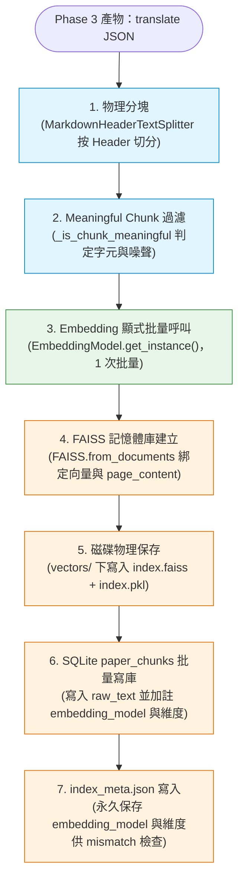

*   **批量化計算**：禁止對 chunk 循環單次調用，必須將過濾後留存的 `meaningful_docs` 拼成一個 `list` 進行 **1 次批量 Embedding 呼叫**，大幅減少 HTTP Round-trip 延遲。
*   **SQLite 模型版本標記**：批量寫入 `paper_chunks` 表時，每條 row 必須寫入 `embedding_model` 名稱與 `output_dimensions` 欄位（如 768 維），確保未來換模型時能自動偵測 mismatch 並觸發 `regen_rag.py --check` 重建。
*   **RAG 接口合約「交接點 ④」顯式規格（`index_meta.json`）**：
    ```json
    {
      "rag_status": "ready | failed",
      "vector_store_signature": {
        "embedding_model": "gemini-embedding-2",
        "output_dimensions": 768,
        "chunk_filter_version": "B2-2026-05-22"
      },
      "physical_outputs": {
        "vector_store_dir": "vectors/",
        "meta_file": "vectors/index_meta.json",
        "tree_json_file": "rag_tree.json"
      }
    }
    ```
*   **Embedding 異常防線**：Embedding API 呼叫包裝指數退避重試（`1s ➜ 2s ➜ 4s`）；重試 3 次仍失敗時：不向上拋錯、更新 `rag_status = failed`、寫入錯誤狀態至 `index_meta.json`，前台正常閱讀與列印，右側 AI Chat 顯示提示。

#### 7. 解決 RAG「笨笨的」：父子分塊、術語庫聯動混合檢索與 Gemini Flash 重排

當前的 RAG 採用最原始的「單一平鋪分塊（Flat Chunking）+ 單一 FAISS 語意向量檢索」，有三大致命病灶：

*   **語意稀釋與 Context 丟失（Granularity Paradox）**：按 `# Header` 粗暴切分，長章節 Chunk 超過 1000 字語意信號被稀釋，檢索失焦；切太細則丟失前後文，AI 看到公式或表格碎片根本無法理解。
*   **專有名詞「語意漂移」**：完全依賴 FAISS 語意距離計算，對 `ResNet-50`、`owner_id` 等特定專有名詞極度鈍感，語意空間中相近但錯誤的詞彙會把正確 Chunk 擠出 Top K。
*   **無 Re-ranking（重排機制）**：召回的 Chunks 直接餵給 LLM，中間夾雜的噪聲 Chunk 導致「Lost in the Middle（在上下文中迷失）」幻覺。

**新 Phase 4 可融合的業界最領先優化方案**：

*   **父子分塊策略（Parent-Child / Hierarchical Chunking）**：
    *   *子分塊（Child Chunks）*：正文切成 `150~300 字` 小分片進行向量化，保持極高的檢索敏感度與信號濃度。
    *   *父分塊（Parent Chunks）*：子分片被命中時，不把子分片餵給大模型，而是將其對應的父分片（整段 Section 完整上下文，含摘要前綴，約 800~1500 字）餵給大模型。「**小分片檢索，大分片閱讀**」徹底解決上下文丟失問題。
*   **雙路混合檢索與 `GLOSSARY-CORE` 聯動（Entity-Constrained RAG）**：
    *   將 **BM25（字面關鍵字精確匹配）** 與 **Dense Embedding（語意相似度理解）** 雙路並行召回，以 **RRF (Reciprocal Rank Fusion)** 進行分數融合。
    *   **術語庫聯動**：檢索前系統先比對 `GLOSSARY-CORE` 術語庫，發現特定學術名詞（如「時序悖論」）自動觸發 **查詢擴展 (Query Expansion)**，將 Query 重寫為 `時序悖論 OR "Temporal Paradox"`，使雙路檢索能完美召回中英對照 Chunks，徹底解決術語語意漂移。
*   **無 GPU 本地環境下的 Gemini Flash API-based Re-ranking**：
    *   **本地 CPU 困局**：GCP 低階規格、無 GPU。本地跑 BERT/Cross-Encoder 架構重排小模型會讓 CPU 100% 爆載且延遲高達數秒，不可行。
    *   **Gemini Flash 重排方案**：混合檢索召回 Top 15 個 Chunks 文本後，向 **Gemini 2.5 Flash** 發送一次極輕量 API 請求：「*給定問題：{Query}，請從以下 15 個段落中，挑選出最相關的 5 個段落，返回 ID 陣列（格式：[3, 5, 12, 1, 9]）。*」Flash 回傳僅需 **0.2~0.4 秒**，成本近乎為零（約 3k~4k tokens），且推理邏輯遠勝本地任何小模型，檢索精準度產生質的飛躍。

#### 8. 集中式入口替代方案：雙速調度器 (Dual-Speed Pipeline)

若未來有其他 API 呼叫端（如 CLI 批次腳本）希望保留 `PipelineCore` 作為系統唯一調度入口，可啟用「雙速調度器」設計：
*   **快軌（同步/半同步）**：調用 `pipeline.process(stages=['pdf2md' ... 'md_restore'])`，主管線同步完成乾淨排版還原，更新狀態為 `reading_ready` 後立即返回。
*   **慢軌（異步背景任務）**：調用端在背景協程中單獨呼叫 `pipeline.process(stages=['rag'])` 補齊向量資料庫。
*   **優勢**：保留 Pipeline 核心類別作為單一入口的集中度，同時在實際運行期實現完美的時序與物理解耦。

---

### 2.6 五條策略管線完整規格（Document Pipeline Strategies）

對照 `baton/五大管線.md` 設計討論，`doc_type` 的雜亂分流邏輯全面收斂為五條高內聚策略管線。調度器只需呼叫 `PipelineFactory.get_strategy(doc_type)` 拉取對應管線，主幹程式碼 100% 不需修改。

#### 管線概覽表

| 管線 | 文件類型 | Phase 1 解析（純解析＋原文元數據） | Phase 2 Glossary &amp; Context Prep | Phase 3 翻譯與還原 | Phase 4 RAG 字元門檻 |
|---|---|---|---|---|---|
| 🎓 `AcademicPipeline` | academic | MinerU + md_cleaner（🚫 無 Abstract/LCC/Glossary） | 原文摘要 + LCC → 全文 Glossary 提取 → DB 自癒 → 摘要翻 translated_abstract | Section 引導翻 + References 0ms 跳過 | ≥ 10 |
| 📖 `BookPipeline` | book | MinerU + md_cleaner（🚫 無 Abstract/LCC/Glossary） | 🌟 滾動例外內聚：ChainedSummarizer 章節大綱＋術語同呼叫 → 全書摘要聚合 → ISBN/API LCC → 自癒 → 總/各章摘要翻（Deep Think） | 正文翻（Bypass/NORMAL）＋三層 Sliding Window | ≥ 10 |
| 🖼️ `SlidePipeline` | slides | Vision 每頁解析，無 cleaner（🚫 無 Abstract/LCC/Glossary） | 原文總摘要 + LCC → 術語提取 → DB 自癒 → 摘要翻 | 內文 100% Bypass + alt 強制對齊 | ≥ 3（Short Chunk 合併） |
| 📄 `ResumePipeline` | resume | Vision 整份解析，無 cleaner（🚫 無 Abstract/LCC/Glossary） | 原文總摘要 + LCC（專業領域推導）→ 全文術語提取 → DB 自癒 → 摘要翻 | 內文 100% Bypass | ≥ 3（Short Chunk 合併） |
| 📰 `LiteDocPipeline` | news, web, 未知 fallback | MinerU + md_cleaner（🚫 無 Abstract/LCC/Glossary） | 原文總摘要 + LCC → 術語提取 → DB 自癒 → 摘要翻 | 15k 閥門判斷 → 全文翻譯 | ≥ 10 |

---

#### 🎓 學術管線（`AcademicPipeline`）— academic

*   **Phase 1 Ingestion（雙路並行，純解析＋原文元數據）**：
    * **🅐 Meta 路（快軌 · Early Emit）**：
    
      前 2 頁 `fitz` 正則或 `llm_page1` 物理提取原文 Title / Author 等基礎 metadata，15 秒內 Early Emit 寫庫、搶跑渲染扉頁標頭。🚫 **本階段不提取 Abstract**（Abstract 已下放 P2，於 P2 一次翻成目標語、永不顯示未翻譯原文）。
    
    * **🅑 MinerU 路（全文軌）**：MinerU 全文解析 + 強制 `md_cleaner` 洗淨，產出乾淨全文 Markdown 供 Phase 2 摘要/術語提取與 Phase 3 逐 Section 翻譯。
    
    *   **⟹ 匯流（Join）**：兩路完成後合流，原文 `metadata`（Title/Author，🚫 無 Abstract/LCC/Glossary）與全文 Markdown 一併交付 Phase 2。五路完美一致。
    
*   **Phase 2 Glossary &amp; Context Prep（摘要/LCC/提取/自癒/摘要翻譯）**：
    1.  **原文摘要與 LCC**：一次 LLM 掃全文產出原文 Abstract / 總摘要（若文獻有摘要標題則物理提取，無標題但有實質內容則寫入 Abstract，完全無摘要則 LLM 全文生成）；`detect_domain` 掃全文推斷 raw 領域 ➜ `DomainNormalizer.normalize_to_lcc` 收斂標準 LCC。
    2.  **全文術語提取**：讀取「全文 Markdown（物理剔除 References 段落與人名）」➜ `GlossaryExtractor` **掃全文**一次提取本文核心英文術語（`doc_glossary`，**不設數量上限**，有多少抓多少）。（*注意*：刻意讀取全文 Markdown 而非快軌前 2 頁，確保 Methodology / Experiment 深處的硬核術語 100% 不遺漏。論文輸入可一次呼叫掃完，無 Book 滾動例外。）
    3.  **GLOSSARY-CORE DB 比對與動態自癒**：對 `doc_glossary` 執行五管線共用的〈GLOSSARY-CORE 標準自癒演算法〉，餵入 `context = 原文 Abstract`、`domain = LCC`（防止 `Attention` 無語境被直譯為「注意」而非「注意力機制」）➜ 凍結最終 Glossary。
    4.  **摘要翻譯**：**呼叫共用 `Translator(mode=DEEP_THINK)`**，注入 `lcc + 凍結最終 Glossary`，翻譯原文 Abstract ➜ 寫入 `metadata.translated_abstract`。
    *   **⟹ 交付（凍結）**：原文摘要 + LCC + 最終 Glossary + `translated_abstract`。
    
*   **Phase 3 Translation &amp; Restore（逐 Section 引導翻譯）**：
    *   **逐 Section 引導翻譯**：純消費 P2 凍結產物。以 `### Section` 標題為物理邊界切包，每 Section 整包 **呼叫共用 `Translator(mode=NORMAL)`**（4~5 次 API 總計），注入 `lcc + 已譯摘要 + 凍結最終 Glossary + constraints=[人名不翻正則鎖定 `et al.` / `(Author, 2024)` / `[1]`]`（防 LLM 腦補中文化）。
        References 節點（`skip_translation = true`）直接複製原文，**0 ms、0 API 消耗**。
    
*   **Phase 4 Async RAG**：標準平鋪分塊，字元門檻 `≥ 10`。Strategy A 全域摘要 Chunk + Strategy B 章節摘要前綴注入。

---

#### 📖 書籍管線（`BookPipeline`）— book

*   **Phase 1 Ingestion（雙路並行，純解析＋原文元數據）**：
    *   **🅐 Meta 路（快軌 · ISBN 號碼擷取）**：
        *   **版權頁正則匹配 (ISBN Extraction)**：利用 `fitz` (PyMuPDF) 讀取 PDF 前 5 頁（版權頁通常在 Page 2-4，即 CIP 頁面），用正則快速匹配標準 `ISBN` 號碼（如 `ISBN 978-X-XX-XXXXXX-X`）。若匹配不到，則以提取出的 `Title`（書名）+ `Author`（作者）作為查詢 Key。🚫 **本階段僅擷取 ISBN/Title/Author 原文識別碼，不做 API 編目、不產 LCC**（編目與 LCC 已下放 P2）。
    *   **🅑 MinerU 路（全文軌）**：MinerU 全文解析 + 強制 `md_cleaner` 洗淨，產出乾淨全文 Markdown 供 Phase 2 ChainedSummarizer 逐章掃描與翻譯。
    *   **⟹ 匯流（Join）**：兩路完成後合流，原文 `metadata`（ISBN/Title/Author，🚫 無 LCC/Abstract/Glossary）與全文 Markdown 一併交付 Phase 2。五路完美一致。
*   **Phase 2 Glossary &amp; Context Prep（🌟 滾動例外完整內聚 · 六步 Deep Think × Bypass）**：
    1.  **ISBN/API 權威編目與 LCC**：以 P1 交付的 ISBN/`Title+Author` 為 Key ➜ 向 **Google Books API** 或 **Open Library API** 發送極速 HTTP 請求（`q=isbn:{isbn}` 或 `q=intitle:{title}+inauthor:{author}`）➜ 讀取 `lcc_number`（如 `"BF109.F7"`）或 `categories`（如 `["Psychology"]`）➜ 調用 `DomainNormalizer` 收斂為混合一級白名單代碼（如 `"BF"`），寫入 `DomainMapping` 本地快取。
    2.  **🌟 滾動原文摘要與術語提取（同呼叫物理例外）**：以 Chapter 為最小物理單位，序列**掃描各章全文 Markdown**（控制在 10~20 次 LLM 呼叫，15 秒完成）➜ 單次呼叫的提示詞同時要求 LLM 產出**該章大綱 + 該章候選 `book_glossary`**。**術語提取源為全章正文（非大綱），故不漏詞**——書籍受 context 上限約束無法一次掃全書，故拆成逐章掃全章正文，落地「提取源必為全文、嚴禁用摘要」原則。**此「摘要與提取必須融於同一次呼叫」之物理例外完整內聚於 P2、不外溢 P1/P3 交接點。**
    3.  **聚合全書原文總摘要**：LLM 一次聚合各章大綱，生成「全書原文總摘要」。
    4.  **GLOSSARY-CORE DB 比對與動態自癒**：對提取的 `book_glossary` 執行五管線共用的〈GLOSSARY-CORE 標準自癒演算法〉，餵入 `context = 全書原文總摘要`、`domain = LCC` ➜ 凍結最終 Glossary。
    5.  **翻譯全書總摘要 + 🌟 滾動翻譯各章摘要**：**呼叫共用 `Translator(mode=DEEP_THINK)`**，注入 `lcc + 最終 Glossary` 翻全書總摘要；各章摘要以三層 Sliding Window 承接前文作為 `preceding`——「全書中文總摘要（宏觀全局）+ 緊鄰 2 章詳細摘要（微觀承接）+ 更前章壓縮故事線（Timeline 精簡）」，整體鎖定在 3k tokens 以內，注入 `lcc + zh_summary + 最終 Glossary + preceding`，Deep Think 確保文學靈魂與用字一致性，凍結為各章 `translated_abstract`。
    *   **⟹ 交付（凍結）**：原文總摘要 + 各章摘要 + LCC + 最終 Glossary + `translated_abstract`。
*   **Phase 3 Translation &amp; Restore（🚀 雙速正文章節翻譯）**：
    *   **🚀 翻譯正文各章節（`Translator(mode=NORMAL)` 極速模式）**：純消費 P2 凍結產物，不再做提取/自癒。
        *   **分流 A（長章，有切片）**：單章 > 15,000 字元時，均分為 2~3 大塊序列 **呼叫 `Translator(mode=NORMAL)`**。每塊注入 `lcc + zh_summary（全書中文總摘要）+ 凍結最終 Glossary + 本章摘要 + preceding=[上一切片最後 500~800 字中文譯文]`（確保半句話語氣不斷層）。
        *   **分流 B（短章，無切片）**：整章一次 **呼叫 `Translator(mode=NORMAL)`**，注入 `lcc + zh_summary + 凍結最終 Glossary + 本章摘要`。
        *   NORMAL 模式確保翻譯極速與成本最優。翻譯完成後非同步 Backfill `resolved_summary` 至頂層節點。
*   **Phase 4 Async RAG**：章節摘要前綴注入（Strategy B），字元門檻 `≥ 10`。

---

#### 🖼️ 簡報管線（`SlidePipeline`）— slides

*   **Phase 1 Ingestion（純解析＋原文元數據）**：
    *   **強制 Vision 每頁解析**（`SlidesProcessor`），**絕對禁止** MinerU 與 `md_cleaner`。
    *   **Markdown 階層結構還原**：Vision Prompt 要求 LLM **逐頁判斷排版結構**，盡可能以 Markdown 階層（標題層級 `#`/`##`、項目符號、縮排）忠實展現簡報內的文字內容層次。**若該頁含表格，輸出文字內容必須以 Markdown 表格語法（pipe table）還原**，禁止攤平成單行純文字，確保欄列對應關係不丟失。
    *   **統計去重 Deduplicator**：掃描所有頁面文字行，若某行在 > 30% 頁面中完全相同（如公司名、保密宣告），判定為頁首頁尾噪聲並物理剔除。
    *   **封面判斷**：`llm_page1` 結構化輸出 `is_cover: boolean`；若 `is_cover == false`，放棄提取 Title，`metadata.title` 置空，防止正文首字被誤判為簡報標題。
    *   **🚫 本階段不提取 Abstract / LCC / Glossary、零翻譯**——僅交付原文 JSON 樹 + 原文 Title / Author + 物理分組 Tiles，與其餘四路完美一致。摘要、LCC 與術語全數下放 Phase 2。
*   **Phase 2 Glossary & Context Prep（原文語境準備）**：
    1.  **原文總摘要與 LCC 分類**：對全文內容生成「全文原文總摘要」➜ LLM 判斷領域產出 `raw_domain` ➜ **呼叫共用 `DomainNormalizer.normalize_to_lcc(raw_domain)`** 收斂為標準 LCC，寫入 `metadata`。
    2.  **全文術語提取**：**掃全文 Markdown**，LLM 實時提取核心 `doc_glossary`（**不設數量上限**，有多少抓多少）。**提取源必為全文、嚴禁用摘要**——摘要漏詞會使同一專有名詞在正文前後譯名不一致。
    3.  **GLOSSARY-CORE DB 比對與動態自癒**：執行五管線共用的〈GLOSSARY-CORE 標準自癒演算法〉，餵入 `context = 全文原文總摘要`、`domain = LCC` ➜ 產出凍結最終 Glossary。
    4.  **翻譯全文摘要**：**呼叫共用 `Translator(mode=DEEP_THINK)`**，注入 `lcc + 最終 Glossary`，將原文摘要翻譯為中文 `translated_abstract`。
    *   **凍結交付**：原文總摘要 + LCC + 最終 Glossary + `translated_abstract`，供 Phase 3 純消費。
*   **Phase 3 Translation & Restore（純消費 P2 凍結產物）**：
    *   **翻譯全部內文（100% Bypass Tiling）**：整份 **呼叫共用 `Translator(mode=NORMAL)`**，注入 `lcc + zh_summary（中文全文摘要）+ 最終 Glossary + constraints=[圖片 alt 強制對齊]` ➜ 一鍵翻譯全部內文。**不再做提取／自癒**。
        **圖片 alt 強制對齊約束**：`type == "figure"` 節點圖說**必須**寫入 `` native alt text，**嚴禁**在圖片下方生成 `*圖表：desc*` 獨立段落，從物理上徹底自癒雙重 Caption Bug。
*   **Phase 4 Async RAG**：
    *   Short Chunk 合併（同 Section 內短 text items 合併為單 Chunk），字元門檻放寬至 `≥ 3`。


---

#### 📄 履歷管線（`ResumePipeline`）— resume

*   **Phase 1 Ingestion（輕量解析＋原文元數據）**：
    *   **LLM 結構化元數據提取**：調用 `llm_page1` 提取全文；如果履歷帶表格，必須使用精細 Prompt 要求其輸出 Markdown ➜ 抽出 `姓名`、`電話`、`Email`、`領域`（例如行銷、程式設計師）。**專業領域字串先行保留**，作為 Phase 2 LCC 推導的 `raw_domain` 來源。
    *   **🚫 本階段不提取 Abstract / LCC / Glossary、零翻譯**——僅交付原文 JSON 樹 + 原文識別欄位（姓名／電話／Email／專業領域）+ 物理分組 Tiles，與其餘四路完美一致。摘要、LCC 與術語全數下放 Phase 2。
*   **Phase 2 Glossary & Context Prep（原文語境準備）**：
    1.  **原文總摘要與 LCC 分類**：針對整份履歷生成全文原文總摘要，並以 Phase 1 抽出的**專業領域**作為 `raw_domain` ➜ **呼叫共用 `DomainNormalizer.normalize_to_lcc(raw_domain)`** 收斂為標準 LCC（例如：行銷對應商業分類 `H`，程式設計師對應電腦科學分類 `QA`；因翻譯行銷與翻譯財務同字可能異譯，須以領域別精準對齊）。
    2.  **全文術語提取**：**掃全文 Markdown**，LLM 實時提取核心 `doc_glossary`（**不設數量上限**，有多少抓多少）。**提取源必為全文、嚴禁用摘要**——摘要漏詞會使同一專有名詞在正文前後譯名不一致。
    3.  **GLOSSARY-CORE DB 比對與動態自癒**：執行五管線共用的〈GLOSSARY-CORE 標準自癒演算法〉，餵入 `context = 全文原文總摘要`、`domain = LCC`（此 LCC 由本 Phase 依履歷專業領域推導——行銷對應商業分類、程式設計師對應電腦科學分類——因行銷與財務同字異譯，須以領域別精準對齊）➜ 產出凍結最終 Glossary。
    4.  **翻譯全文摘要**：**呼叫共用 `Translator(mode=DEEP_THINK)`**，注入對齊好的 `lcc + 最終 Glossary`，將原文摘要翻譯為中文 `translated_abstract`。
    *   **凍結交付**：原文總摘要 + LCC + 最終 Glossary + `translated_abstract`，供 Phase 3 純消費。
*   **Phase 3 Translation & Restore（一鍵快速翻譯·純消費 P2 凍結產物）**：
    *   **翻譯全部內文（100% Bypass Tiling）**：整份 **呼叫共用 `Translator(mode=NORMAL)`**，注入 `lcc + zh_summary（全文中文摘要）+ 最終 Glossary` ➜ 一鍵翻譯全部內文。**不再做提取／自癒**。
*   **Phase 4 Async RAG（標準向量化）**：
    *   合併同 section 短項目（如技能列表），避免語意信號稀釋。
    *   `_is_chunk_meaningful` 實質字元數門檻限制為 **`≥ 3`**，100% 保護 `Go`, `C++`, `AI` 等硬核技能詞不被誤殺。

---

#### 📰 輕量短文管線（`LiteDocPipeline`）— news / web / technical / 未知 fallback

*   **Phase 1 Ingestion（雙路並行＋原文元數據）**：
    *   **🅐 Meta 路（快軌）**：
        *   **URL Publisher 解碼**：正則掃描 Markdown 前 5 行的 `https?://[^\s]+`，將 `raw_url` + 前兩頁片段送入 `llm_page1` 結構化輸出 `publisher: string`（如 `"TechCrunch"`、`"紐約時報 (New York Times)"`），寫入 `metadata.publisher` 欄位。
        *   快速提取 Title、作者、日期。
    *   **🅑 MinerU 路（全文軌）**：MinerU 解析 + 強制 `md_cleaner` 清洗，產出乾淨全文 Markdown 供 Phase 2 術語提取與摘要、Phase 3 全文翻譯。
    *   **🚫 本階段不提取 Abstract / LCC / Glossary、零翻譯**——僅交付原文 JSON 樹 + 原文 Title / 作者 / 日期 / publisher + 物理分組 Tiles，與其餘四路完美一致。摘要、LCC 與術語全數下放 Phase 2。
*   **Phase 2 Glossary & Context Prep（原文語境準備 + 15k 安全閥門評估）**：
    1.  **原文總摘要與 LCC 分類**：以 MinerU 全文一次性 LLM 生成【全文原文總摘要】，並由 LLM 判斷領域產出 `raw_domain` ➜ **呼叫共用 `DomainNormalizer.normalize_to_lcc(raw_domain)`** 收斂為標準 LCC，寫入 `metadata`。
    2.  **全文術語提取**：**掃全文 Markdown**，LLM 實時提取核心 `doc_glossary`（**不設數量上限**，有多少抓多少）。**提取源必為全文、嚴禁用摘要**——摘要漏詞會使同一專有名詞在正文前後譯名不一致。
    3.  **GLOSSARY-CORE DB 比對與動態自癒**：執行五管線共用的〈GLOSSARY-CORE 標準自癒演算法〉，餵入 `context = 全文原文總摘要`、`domain = LCC` ➜ 產出凍結最終 Glossary。
    4.  **翻譯全文摘要**：**呼叫共用 `Translator(mode=DEEP_THINK)`**，注入 `lcc + 最終 Glossary`，將原文摘要翻譯為中文 `translated_abstract` ➜ 寫入 `resolved_summary`。
    *   *防呆優化建議（Bypass Tiling 的物理閥門 · 於本 Phase 末評估、交付 Phase 3 切分策略）*：
        *   若 `全文字數 < 15,000 字元` ➜ Phase 3 **100% 繞過 Tiling**，一鍵快速全翻完。
        *   若 `全文字數 ≥ 15,000 字元`（觸發長文安全防線） ➜ Phase 3 自動降級回 `AcademicPipeline` 的大塊物理 Section 分組翻譯，以防止 LLM 輸出溢出崩潰。
    *   **凍結交付**：原文總摘要 + LCC + 最終 Glossary + `translated_abstract` + 15k 切分策略，供 Phase 3 純消費。
*   **Phase 3 Translation & Restore（純消費 P2 凍結產物 + 15k 安全閥門）**：
    *   **翻譯全文**：依 P2 凍結的 15k 切分策略（< 15k 一鍵 / ≥ 15k 降級 Section 分組），逐包 **呼叫共用 `Translator(mode=NORMAL)`**，注入 `lcc + zh_summary + 最終 Glossary`，將原文翻譯為中文 ➜ 寫入 `resolved`。**不再做提取／自癒**。
*   **Phase 4 Async RAG**：標準平鋪分塊，合併同 section 短 items，字元門檻 `≥ 10`。
*   **Fallback 兜底責任**：作為未知 `doc_type` 的最後防線，以最輕量、最健壯的流程保障系統不崩潰。

---

#### GLOSSARY-CORE 兩大 Hook 點與時序規格

`GLOSSARY-CORE` 全程在 **Phase 2 與 Phase 4** 運作，**Phase 1 完全不碰 Glossary**（Phase 1 僅交付原文 JSON 樹 + 原文元數據；LCC 亦下放 Phase 2 由 `DomainNormalizer` 產出，供同 Phase 拉取該領域歷史術語）。採用「**Phase 2 LCC 推導 → 歷史拉取 → 全文提取 → DB 自癒 → 融合注入**、**Phase 4 查詢擴展**」兩段式閉環設計，五條管線均參與：

| Hook 點 | 觸發時機 | 職責 |
|---|---|---|
| **① Phase 2 LCC 推導、術語提取與自癒（領域收斂、歷史拉取、動態生成、DB 自癒、融合注入）** | 各管線 Phase 2 啟動、Phase 3 正文翻譯前 | **本 Hook 起點先由 `DomainNormalizer` 收斂出 `domain` LCC，再從 SQLite `GlobalGlossary` 級聯拉取該領域歷史術語表（`sqlite_glossary`）作為基礎軌道**（LCC 推導與歷史拉取均已收進自癒演算法步驟 1，故 Phase 1 完全不碰）。接著**五條管線均掃全文提取本文術語、嚴禁用摘要**（摘要漏詞會使同一專有名詞前後譯名不一致）——差異僅在掃全文的**方式**：Academic（讀取全文 Markdown 物理提取 `doc_glossary`）/ Book（ChainedSummarizer 逐章掃全文提取 `book_glossary`）/ Slides · LiteDoc · Resume（皆 LLM 掃全文 Markdown 實時提取）；提取後均執行**完全相同**的〈GLOSSARY-CORE 標準自癒演算法〉（歷史拉取 → 比對 SQLite → 缺失者附帶 `context`（摘要僅作自癒語境）+ LCC 精確翻譯 → Backfill 回寫知識飛輪 → 雙層融合本文術語優先）。最終凍結交付，注入 Phase 3 翻譯 Worker Prompt。 |
| **② Phase 4 Chat 前（查詢擴展）** | 用戶在前端發起提問，雙路召回前的第一微秒 | 比對 `GLOSSARY-CORE` 術語庫，若提問命中術語（如「時序悖論」），自動執行 **Query Expansion**，將 Query 重寫為 `時序悖論 OR "Temporal Paradox"`，使 BM25 + FAISS 雙路召回跨語言完美命中。 |

> **時序修正要點**：**Glossary 與 LCC 全程不進 Phase 1**（Phase 1 純解析＋原文元數據，零摘要／零分類／零術語）。LCC 推導與歷史術語 `sqlite_glossary` 拉取均已收進 Phase 2 自癒演算法的起點步驟（步驟 1），與本文術語提取在同一 Phase 完成。Book 的本文術語動態提取必須在 Phase 2 ChainedSummarizer 完成後的「全書摘要翻譯後 ➜ 正文 Chapter Worker 啟動前」這個黃金窗口期生成（此前正文未翻、全書術語未知）；其餘四條管線（Academic / Slides / LiteDoc / Resume）均在 Phase 2 啟動時立即觸發，**且五條管線的術語提取源一律是全文 Markdown**——原文總摘要僅作為自癒步驟的 `context` 語境，**絕不充當提取源**（否則摘要漏詞會造成同一專有名詞前後譯名不一致）。

---

#### GLOSSARY-CORE 標準自癒演算法（五管線 100% 共用）

> **設計收斂事實**：五條管線的「全文術語提取」**提取源一律是全文 Markdown（嚴禁用摘要，否則漏詞會造成同一專有名詞前後譯名不一致）**，僅掃全文的**方式**不同（Academic 讀全文 Markdown／Book 逐章掃全文／Slides·Resume·LiteDoc LLM 掃全文實時提取）。提取完成後的「DB 比對與動態自癒」是**完全相同的單一演算法**，且 `domain` 一律為 **LCC**。差異僅在上游餵入的 `context` 語境來源（即原文總摘要，僅作自癒語境、非提取源），以及 `domain` LCC 的**取得方式**（多數由 API／摘要對齊，Resume 由履歷專業領域推導），**演算法邏輯零分歧**，故抽離為下列唯一真理源，各管線 Phase 2 僅引用本演算法 + 指定其參數值。**歷史術語 `sqlite_glossary` 的拉取亦已收進本演算法的 Phase 2 起點步驟（步驟 1），故 Glossary 全程不進 Phase 1——Phase 1 僅由 `DomainNormalizer` 產出 LCC 標籤。**

**演算法步驟（輸入：`doc_glossary`、`context`、`domain = LCC`）**：

1.  **歷史軌道拉取（Phase 2 起點、只讀）** ➜ 依 `domain` LCC 從 SQLite `GlobalGlossary` 級聯拉取該領域 Baron 歷史術語表（`sqlite_glossary`）作為基礎軌道。**此步驟取代了舊設計的 Phase 1 預載，故 Glossary 全程不進 Phase 1。**
2.  逐術語比對 SQLite `GlobalGlossary`。
3.  **命中** ➜ 直接讀取既有繁中對應。
4.  **缺失** ➜ 附帶 `(context, LCC)` 作為語境，調用 LLM 精確翻譯（防止 `Attention` 等無語境術語被直譯失準）➜ Backfill 回寫 SQLite 知識飛輪。
5.  雙層融合（**本文術語優先** 覆蓋歷史術語）➜ 生成「最終 Glossary」。

**各管線參數對照**（`domain` 全為 LCC，僅 `context` 與 LCC 取得方式不同）：

| 管線 | `context`（語境來源） | `domain` = LCC 的取得方式 |
|---|---|---|
| 🎓 Academic | 原文 Abstract | 由 Abstract／全文分類對齊 |
| 📖 Book | 全書原文總摘要 | 由圖書 API `lcc_number`／`categories` 收斂 |
| 🖼️ Slides | 全文原文總摘要 | 由全文摘要分類對齊 |
| 📰 LiteDoc | 全文原文總摘要 | 由全文摘要分類對齊 |
| 📄 Resume | 全文原文總摘要 | 由履歷**專業領域**推導（行銷 → 商業分類 `H`，程式設計師 → 電腦科學 `QA`；因行銷與財務同字異譯，須以領域別精準對齊 LCC） |

---

#### DomainNormalizer 標準收斂模組（五管線共用）

> **設計收斂事實**：五條管線都需要一個 LCC `domain` 標籤餵給上述〈GLOSSARY-CORE 標準自癒演算法〉，而「**raw 領域字串 → 標準 LCC 白名單代碼**」這段收斂邏輯五管線**完全相同**。差異僅在上游如何**取得 raw 領域**（ISBN／API `categories`、`detect_domain`、LLM 抽專業領域——本質是策略差異，抽不掉也不該抽）。故收斂尾段抽離為唯一真理源 `DomainNormalizer`，各管線僅負責產出 `raw_domain` 字串後呼叫之，**杜絕「LCC 分類對齊」各寫各的黑盒與白名單分歧**。此結構與 GLOSSARY-CORE 對稱：共用**收斂演算法** + 各管線**raw 領域來源**。

**模組契約（單一入口）**：

```
DomainNormalizer.normalize_to_lcc(raw_domain: str) -> LCCCode
```

1.  接收任意 raw 領域字串（如 `"Psychology"`／`"行銷"`／`lcc_number="BF109.F7"`）。
2.  比對混合一級 LCC 白名單，收斂為標準一級代碼（如 `"BF"`／`"H"`／`"QA"`）。
3.  寫入 / 讀取 `DomainMapping` 本地快取（同一 raw 領域不重複收斂）。
4.  回傳標準 `LCCCode`，供 Phase 2 GLOSSARY-CORE 自癒演算法與翻譯 Worker 共用。

**各管線 raw 領域來源對照**（收斂尾段 100% 共用 `DomainNormalizer`，僅頭段來源不同）：

| 管線 | `raw_domain` 來源（頭段，各異） | 收斂尾段 |
|---|---|---|
| 🎓 Academic | `detect_domain` 掃全文 Markdown 推斷 | `DomainNormalizer` |
| 📖 Book | 圖書 API 回傳 `lcc_number`／`categories` | `DomainNormalizer` → `DomainMapping` 快取 |
| 🖼️ Slides | LLM 由全文原文總摘要判斷領域 | `DomainNormalizer` |
| 📰 LiteDoc | LLM 由全文原文總摘要判斷領域 | `DomainNormalizer` |
| 📄 Resume | LLM 由履歷抽**專業領域**（行銷／程式設計師…） | `DomainNormalizer` |

---

#### Translator 雙模式翻譯引擎（五管線共用）

> **設計收斂事實**：五條管線 Phase 2 的「原子翻譯單元」**完全相同**——給定「一包文字 + 注入語境」，組 Prompt ➜ 依模式切思考預算 ➜ 呼叫 LLM ➜ 回傳譯文。差異只在兩個與翻譯**邏輯無關**的外圍維度：①**切分調度**（怎麼把全文拆成「包」、用什麼順序送——Section 並行／逐章滾動＋Sliding Window／一鍵 Bypass），②**注入語境**（是否帶人名不翻約束／前文承接等，皆為可選參數）。`Deep Think 開關`本質是**呼叫端逐單元決定的參數**（如 Book 同一管線內：摘要走 Deep Think、正文走 Bypass），故抽離為唯一真理源 `Translator`，內含 `NORMAL` / `DEEP_THINK` 雙模式。各管線僅負責**切分調度**並逐包呼叫 `Translator(mode=…)`，翻譯邏輯零分歧。此結構與 GLOSSARY-CORE、DomainNormalizer 三度對稱：共用**原子翻譯×雙模式** + 各管線**切分調度**。

**模組契約（單一入口）**：

```
Translator.translate(text: str, ctx: InjectionContext, mode: TranslateMode) -> str

TranslateMode = { NORMAL, DEEP_THINK }
InjectionContext = {
    lcc:            LCCCode,        # 必填，來自 DomainNormalizer
    glossary:       FinalGlossary,  # 必填，來自 GLOSSARY-CORE 自癒後最終 Glossary
    zh_summary:     str | None,     # 中文總摘要（宏觀全局語境）
    preceding:      str | None,     # Sliding-Window 前文承接（僅長章滾動需要）
    constraints:    list[str],      # 可選，如人名不翻正則鎖定 / References skip
}
```

**雙模式規格**：

| 模式 | 思考預算 | 適用單元 | 設計意圖 |
|---|---|---|---|
| 🌟 `DEEP_THINK` | **啟用**大模型思考預算 | 摘要類（全文/全書/各章摘要） | 確保文學靈魂、用字一致性、微觀過渡無縫；摘要是全局語境之源、品質優先 |
| 🚀 `NORMAL` | **禁用**思考預算（Bypass） | 正文內文（各 Section／各章正文／短文一鍵） | 降本提速;正文量大、已有摘要+Glossary 強約束兜底，無需 Deep Think |

**各管線切分調度與模式對照**（原子翻譯 100% 共用 `Translator`，僅切分與模式選擇不同）：

| 管線 | 切分調度策略 | 摘要單元模式 | 正文單元模式 | 特殊注入語境 |
|---|---|---|---|---|
| 🎓 Academic | Section 物理大塊並行 | `DEEP_THINK`（Abstract） | `NORMAL`（正文 Section） | 人名不翻約束 + References skip |
| 📖 Book | 逐章滾動 + 三層 Sliding Window | `DEEP_THINK`（全書/各章摘要） | `NORMAL`（正文章節，長章再切片） | 前文承接（切片結尾 500~800 字） |
| 🖼️ Slides | 100% Bypass Tiling 一鍵全翻 | `DEEP_THINK`（全文摘要） | `NORMAL`（全文一鍵） | 圖片 alt 強制對齊 |
| 📰 LiteDoc | < 15k 一鍵 / ≥ 15k 降級 Section 分組 | `DEEP_THINK`（全文摘要） | `NORMAL`（全文一鍵或分組） | 無 |
| 📄 Resume | 100% Bypass Tiling 一鍵全翻 | `DEEP_THINK`（全文摘要） | `NORMAL`（全文一鍵） | 無 |

---

## 第三部分：既有計畫必要性審計與全局實施戰略

在大改版啟動前，必須對專案中之前規劃但尚未實作的四份 Plan（`GLOSSARY-CORE`、`TRANSLATE-BOOK`、`API-PERF`、`QUEUE-1`）進行必要性審計，並融入全局實施路線圖中。

### 3.1 既有計畫必要性與修改幅度審計

#### 1. 📘 `TRANSLATE-BOOK`（書籍並行翻譯與雙語故事板引導）
*   **審計結論**：**極度必要，是書籍翻譯的靈魂！但需要「中度修改」以與新架構對齊。**
*   **重構對齊**：原本計畫中將 `BookTranslateProcessor` 插入舊順序 stages 迴圈的設計宣告作廢，**應將 Chained 摘要引導與滾動術語提取內聚實作於 `BookStrategy` 的 Phase 2（Glossary & Context Prep，滾動物理例外完整內聚），故事板正文翻譯則內聚於 Phase 3（Translation & Restore）**。實作難度大幅降低，代碼將更乾淨。

#### 2. 🔑 `GLOSSARY-CORE`（中央領域術語庫與多語系自適應對齊）
*   **審計結論**：**必要，提供跨語系、跨文獻的學術翻譯防線！但需要「中度修改」。**
*   **重構對齊**：`detect_domain` 與 LCC 領域收斂、術語提取與自癒**全數內聚於 Phase 2（Glossary & Context Prep）**——Phase 1 純解析、不碰 Glossary/LCC（保證五路原文交付完美一致）。Phase 2 啟動第一微秒由 `DomainNormalizer` 收斂 LCC ➜ 拉取歷史術語 ➜ 掃全文提取本文術語 ➜ 自癒融合 ➜ 凍結注入 Phase 3 翻譯 Prompt，實現極致的「引導翻譯」。

#### 3. ⚡ `API-PERF`（API 技術審計與效能防呆優化）
*   **審計結論**：**極度必要，是保障系統高載穩定度的安全網！僅需「輕度修改」。**
*   **重構對齊**：大檔案分塊流式上傳、SQLAlchemy SQLite 30 秒 `busy_timeout` 與連接池優化、FAISS 內存 LRU 快取，屬系統基建。原計畫中 U7 規劃對 11 個舊 stages 進行監控埋點，**重構後應將埋點修改為對物理 Phase 1 / 2 / 3 / 4 及其內部原子子階段的性能計時**。U1 中的 Pipeline 並發信號量（`PIPELINE_SEMAPHORE`）和 queued 狀態，應直接套用在重構後的新 `PipelineCore` 上。

#### 4. ⏳ `QUEUE-1`（文件佇列與優先權管控）
*   **審計結論**：**已無獨立存在必要，建議「重構性廢除」並與 `API-PERF` 合併。**
*   **理由**：
    1.  Phase 1 快軌 15 秒 Early Emit 已讓前端不需等待整份文件解析，UX 痛點不存在。
    2.  RAG 異步化後慢速向量建庫不再卡住主線程。
    3.  `API-PERF` 中的 `asyncio.Semaphore` 任務排隊已能安全處理多檔案併發，**完全不需要在執行緒內部寫極易引發死鎖的 Thread-level 協同讓路機制**。`QUEUE-1` 的「避讓 sleep」機制在新架構下已無必要。

---

### 3.2 大改版與既有計畫之黃金實施路線圖

採**「依賴最簡、風險最小、天天可編譯運行」**的絞殺者原則。**整體執行以「縱向五路絞殺」為唯一策略**（一次打通一條策略管線，每條都跨完整四 Phase，詳見 §3.4），既有計畫（`API-PERF` / `GLOSSARY-CORE` / `TRANSLATE-BOOK` / `QUEUE-1`）依其性質掛載於「基建前置」「五路落地內聚」「收官廢除」三個位置：

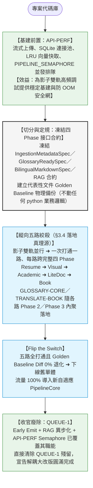

#### 🛠️ 全局路線圖執行細則

1.  **基建前置（`API-PERF`）**：SQLite 超時與 QueuePool 連接池、流式分塊上傳防 OOM、`PIPELINE_SEMAPHORE` 內存並發信號量排隊。先行落地，為後續影子雙軌高頻調試提供穩定基建。
2.  **第一大階段（切分與定規）**：切分四 Phase，凍結 `IngestionMetadataSpec` / `GlossaryReadySpec` / `BilingualMarkdownSpec` / RAG 合約的 JSON Schema，建立代表性文件的 Golden Baseline 物理備份。**此階段不改動任何運行中的 python 業務邏輯，不遞交任何代碼異動。**
3.  **第二大階段（縱向五路絞殺漸進落地）**：以**策略管線為縱向單元**，一次開發一路、打通一路、驗證一路（落地真理源見 §3.4，順序 Resume ➜ Visual ➜ Academic ➜ LiteDoc ➜ Book）：
    *   **既有計畫隨路內聚**：`GLOSSARY-CORE`（LCC 收斂 + 術語提取自癒）內聚於每條管線的 **Phase 2**；`TRANSLATE-BOOK`（Chained 滾動摘要引導 + 故事板翻譯）內聚於 `Book` 路的 **Phase 2（滾動摘要／術語）+ Phase 3（故事板正文翻譯）**。不再有獨立的「橫向 Phase 重構步驟」。
    *   **每路皆跨完整四 Phase**：純解析（P1）➜ Glossary & Context Prep（P2）➜ 翻譯與還原（P3）➜ 非同步 RAG（P4），打通即與 Golden Baseline 自動 Diff。
4.  **Flip the Switch**：五路全數打通、Golden Baseline Diff 0% 退化後，下線舊單體 Main Loop 與 11 stages，流量 100% 切至新 `PipelineCore`。
5.  **收官廢除（`QUEUE-1`）**：清理因大改版成功而無存在必要的舊調度代碼（其職能已被 Early Emit + RAG 異步化 + `API-PERF` Semaphore 完全覆蓋）。

---

### 3.3 大改版安全保障防線：絞殺者模式與 Golden Baseline

*   **絞殺者模式 (Strangler Fig Pattern) 漸進式替換**：嚴格遵循**「縱向五路絞殺」**（一次打通一條策略管線、每路跨完整四 Phase，順序 Resume ➜ Visual ➜ Academic ➜ LiteDoc ➜ Book，詳見 §3.4），確保系統在改版的每一天都能維持「可編譯、可運行、可隨時交付測試」的敏捷安全狀態。
*   **質量基準線 (Golden Baseline) 防退化驗證**：
    *   **黃金基準建置**：在動手改代碼的第一微秒，挑選 3 份最具代表性的測試文檔（1 篇複雜學術論文、1 份圖片密集簡報、1 份短篇新聞/履歷），在舊系統中運行並將產出物理存盤為 `Golden Baseline`。
    *   **防退化自動 Diff**：每打通一條策略管線，立刻使用新系統運行對應文檔，將新產出與 Golden Baseline 進行視覺比對與文本 Diff，確保還原排版 0% 退化，譯文品質 0% Regression。

---

### 3.4 🛠️ 影子重構戰略之「五路絞殺」落地流程

為了將系統升級時對線上使用者的干擾降至 0，同時確保新架構能夠安全、敏捷、穩健地落地，重構放棄了傳統「一次性推倒重來」的高風險方式，改為採用 **「影子並行 (Shadow Launch) + 縱向五路絞殺」** 的混合戰略。

#### 1. 影子並行測試模式 (Shadow Launch Mode) 之「同庫同目錄與極致隔離」方案
為了使開發與測試過程最簡化、直觀化，影子測試軌（B 軌）不使用獨立的物理環境，而是與主生產軌（A 軌）**共享同一個 SQLite 資料庫與同一個 output 檔案目錄**，並透過「主影分離 ID」與「標題後綴」實現物理隔離與極致的 UX 體驗：

*   **雙路並行運行**：當使用者上傳任何文件時，系統將同時且獨立地運行兩條 Pipeline：
    *   **主生產軌（A 軌）**：舊大單體 Pipeline 照常運作。
    *   **影子測試軌（B 軌）**：全新的 PipelineCore 自適應管線同步執行。
*   **主影分離 ID (Unique ID Isolation)**：
    *   影子軌執行時，系統會自動在該文件的 `paper_id` 或 `task_id` 尾端加上特定的影子識別碼（例如 `_shadow`，如 `paper_attention_is_all_you_need_shadow`）。
    *   這使得影子軌在相同資料庫中寫入全新的獨立 row，並將其物理產物輸出至同一個 `output/` 目錄下的專屬子目錄中（如 `output/paper_attention_is_all_you_need_shadow/`），**從物理上 100% 避免了檔案覆蓋與資料衝突**。
*   **標題自動後綴 (Title Testing Suffix)**：
    *   影子軌在 Phase 1 Metadata 提取或寫庫時，系統會自動在 Resolved Title 尾端強制加上 ` (測試)` 後綴（例如：*「Attention Is All You Need (測試)」*）。
*   **同端完美呈現與即時對照 (Frontend Visualization & Comparison)**：
    *   **零配置對照**：由於影子軌的資料與實體產物存放在同一個 SQLite 資料庫與 output 目錄下，**使用者不需切換任何測試機或配置**，直接在同一個前端頁面（`static/index.html`）的文檔列表中，就能同時看到原著文件與標註 `(測試)` 的影子重構產物。
    *   **雙視窗比對**：使用者可以在瀏覽器中以左右分頁或雙視窗同時開啟這兩份文件，實時比對排版還原度、雙語對照品質、AI Chat 檢索召回精準度，達成最直觀的 QA 驗證。
*   **零殘留一鍵清空 (Zero-Residue Clean Delete)**：
    *   **無痛清理**：測試完畢後，使用者只需在同一個前端 UI 列表上，點選該影子測試文件旁的「刪除」按鈕。
    *   **物理自癒**：這會直接觸發系統現有的 `delete_paper` API，自動將該影子 ID 對應的所有 SQLite 關聯欄位（`paper`、`paper_chunks` 等表）100% 清空，並遞迴刪除實體磁碟目錄（`output/*_shadow/`），**完全不留任何垃圾資料與硬碟殘留**。

#### 2. 前端入口 `web_server.py` 影子期臨時改造（Flip 後全數移除）

影子並行要能跑起來，最前端的 `web_server.py` 上傳入口必須做**最小幅度的臨時 scaffolding**。這些改動**全屬影子期專用**，第 6 步 Flip the Switch 時連同舊單體一併拆除，不留技術債：

*   **① 雙軌分派 (Dual-Dispatch)**：上傳 handler 在照常啟動既有 A 軌（舊單體 Pipeline）`BackgroundTasks` 後，**額外再拋一個 B 軌 `BackgroundTasks`**，傳入 `shadow=True` 旗標呼叫新 `PipelineCore`。A / B 兩軌共用同一份上傳檔，互不阻塞、各自獨立寫庫。
*   **② 影子開關 (Feature Flag)**：以環境變數（如 `SHADOW_LAUNCH_ENABLED`，預設 `false`）控制 B 軌是否啟動。影子驗證期間打開、出問題可一鍵關閉只跑 A 軌，**確保線上使用者 0 風險**。
*   **③ 影子分支收斂於 PipelineCore 內部**：`web_server.py` 只負責「多拋一個帶旗標的背景任務」，`_shadow` ID 後綴、` (測試)` 標題後綴、`output/*_shadow/` 子目錄等隔離邏輯**全部封裝在 `PipelineCore` 內部**，前端入口不寫任何影子業務細節（降低臨時改動面積）。
*   **④ 既有 API 零改動驗證點**：
    *   **列表 / 讀取 API**：影子 row 是同庫獨立 row，既有 `list_papers` / `get_paper` 自動帶出標 `(測試)` 的影子產物，**前端 `static/index.html` 與讀取 API 零改動**。
    *   **刪除 API**：影子清理共用既有 `delete_paper`，依 ID 物理自癒，**無需新增影子專用刪除端點**。
*   **⑤ 臨時性鐵律**：上述 ①②③ 為影子期 scaffolding。第 6 步 Flip the Switch 時**必須移除 dual-dispatch 與 `SHADOW_LAUNCH_ENABLED` 旗標**，使 `web_server.py` 回歸「單一入口 ➜ 單一 `PipelineCore`」的乾淨終態。

#### 3. 新五路程式命名策略（影子期共存 ➜ Flip 後零改名）

> **核心紀律：不引入臨時性命名債。** 新五路從第一天就用**最終正式命名**，靠「模組物理隔離 + 執行期旗標」與舊單體區分，**絕不**靠 `_v2` / `New` / `Shadow` 等污染性前後綴區分——否則 Flip 後得全檔改名，徒增巨量 diff 與 import 連鎖 regression 風險。

*   **① 影子期共存靠「檔案 / 模組隔離」，不靠改名**：新五路程式（`PipelineCore`、`AcademicPipeline`、`BookPipeline`、`SlidePipeline`、`ResumePipeline`、`LiteDocPipeline`）一律放入**獨立新模組 / 新目錄**（如新檔 `pipeline_core.py` 重寫版或 `pipelines/` 新目錄），與舊單體邏輯**物理隔離於不同檔 / 不同 class**。共存期間兩者靠**模組路徑**區隔，class 名 / 檔名即為正式名。
*   **② A / B 軌區分靠「執行期旗標 + 資料層後綴」，不在命名上動手腳**：A 軌走舊單體、B 軌走新 `PipelineCore(shadow=True)`，差異由 runtime 參數 + `_shadow` ID 後綴 + ` (測試)` 標題後綴達成——其中 `_shadow` ID 負責**資料庫 / output 目錄的物理隔離**，` (測試)` 標題後綴負責**前端列表的肉眼區分**（同一份文件並排顯示「原著」與「原著 (測試)」兩列），兩者皆為**資料識別**而**非程式命名**，**class 名與檔名上不帶任何影子標記**。
*   **③ Flip the Switch 後：零改名**：因新五路一開始就是正式名，收官時**無需任何重命名**，只需兩個刪除動作——(1) 刪除舊單體 main loop + 11 stages 舊調度邏輯與其所在舊檔；(2) 移除 `web_server.py` 的 dual-dispatch 與影子旗標。**零重命名 = 零 import 連鎖修改 = 零收官 regression**。
*   **④ 唯一需要清理的「臨時命名」是資料層後綴**：`_shadow` ID 與 ` (測試)` 標題後綴是**資料識別**而非程式命名；Flip 後新流量自然不再產生影子後綴，既有影子測試資料由使用者經 `delete_paper` 一鍵清空即可，**不涉及任何程式改名**。

#### 4. 縱向「五路絞殺」六大步驟
重構不以 Phase（如 Phase 1 ➜ Phase 2）進行橫向開發，而是以**五大策略管線**為縱向單元，採取「一次開發一路、打通一路、驗證一路」的絞殺策略。

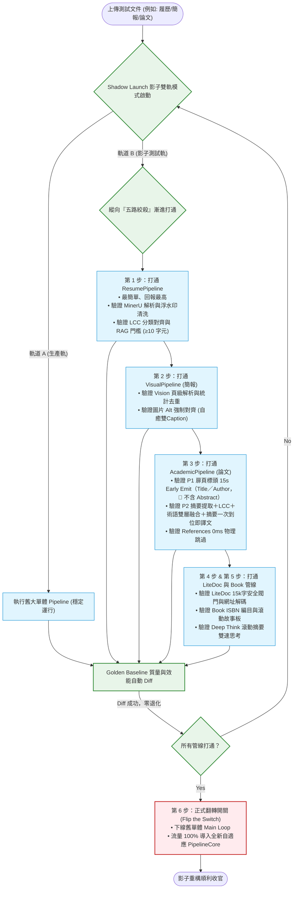

##### 🟢 第 1 步：打通 `ResumePipeline`（最簡單，回報最高）
*   **核心特性**：履歷字數極少、100% 繞過 Tiling、無 Tiling 截斷風險。
*   **重構重點**：
    *   實作 **MinerU 解析與 md_cleaner 浮水印清洗**，排除獵頭廣告等重複噪聲。
    *   實作 **姓名/電話/email/領域之 LLM 元數據提取**，並以抽出的領域呼叫共用 **`DomainNormalizer.normalize_to_lcc`** 收斂標準 LCC。
    *   實作 **RAG 標準向量化與同 Section 短 items 合併**，字元數門檻限制為 `≥ 10`。
*   **影子驗證**：上傳履歷，在影子軌同步運行新履歷管線，驗證 MinerU 提取、浮水印過濾以及 LCC 對齊後術語自癒翻譯的整體流暢度。

##### 🟢 第 2 步：打通 `VisualPipeline`（簡報）
*   **核心特性**：簡報字數極少、100% 繞過 Tiling。
*   **重構重點**：
    *   在履歷管線基礎上，實作 **Vision 每頁解析與 SlidesProcessor**。
    *   實作 **「簡報統計去重過濾器」**，物理剔除重複頁首頁尾噪聲（如重複的公司商標與保密宣告）。
    *   實作 **圖片 Alt 強制對齊約束**，將圖說直接譯出並寫回 `![figure_desc]` alt 中，徹底根治簡報雙重 Caption 渲染 Bug。
*   **影子驗證**：上傳 PPT，比對舊版重複商標、重複 caption 噪聲與新版乾淨排版的還原差異。

##### 🟢 第 3 步：打通 `AcademicPipeline`（論文）
*   **核心特性**：長度中等、具備標準 Abstract、具備專業學術領域（LCC）。
*   **重構重點**：
    *   **Phase 1 純解析快慢軌**：Page 1-2 快軌物理提取原文 Title / Author / 出處 / DOI，在 15 秒內 Early Emit 早發寫庫、解鎖前端搶跑渲染扉頁標頭。**🚫 此階段不提取 Abstract / LCC / Glossary、零翻譯。**
    *   **Phase 2 Glossary & Context Prep**：物理提取原文 Abstract ➜ 推導 LCC ➜ 實作 **GLOSSARY-CORE 歷史（SQLite）與實時（全文）術語雙層融合自癒機制** ➜ 翻譯摘要得 `translated_abstract`（一次到位即譯文）。
    *   **Phase 3 Translation & Restore**：實作 **References 物理防線**，對參考文獻標記 `skip_translation = true` 並執行 0ms 物理跳過。
*   **影子驗證**：上傳 PDF 論文，測試前台 15 秒內是否能順利渲染原文扉頁標頭（Title／Author），P2 完成後摘要直接以中文譯文一次到位呈現（不再有英文 Fallback 時序 Bug）、參考文獻未被 AI 誤翻譯。

##### 🟢 第 4 步 & 第 5 步：打通 `LiteDoc` 與 `Book` 管線
*   **`LiteDocPipeline` 重構重點**：
    *   實作 **URL 正則與 LLM publisher 媒體正式名稱解碼**（如轉換為 `"TechCrunch"` 或 `"The New York Times / 紐約時報"`）。
    *   實作 **15,000 字元字數安全物理閥門**，超長時自動降級走 Section 物理分組翻譯，確保未知/隨機超長 PDF 健壯不崩潰。
*   **`BookPipeline` 重構重點**：
    *   實作 **ISBN 權威編目與 LCC 標準分類查詢**。
    *   實作 **ChainedSummarizer 滾動大綱與 Global 故事板翻譯**。
    *   實作 **雙速思考調度**，逐包呼叫共用 `Translator`（🌟 滾動摘要翻譯 `mode=DEEP_THINK`，確保文學靈魂；🚀 正文章節翻譯 `mode=NORMAL` 降本提速）。
    *   實作 **三層 Sliding Window 故事承接與 800 字鄰接切片譯文承接**。
*   **影子驗證**：上傳長篇小說與網頁文章，驗證長文在影子軌上連續翻譯時的上下文譯名一致性與翻譯速度。

##### 🔴 第 6 步：正式翻轉開關 (Flip the Switch)
*   **收官動作**：當五大策略管線在預發布影子軌上經歷數週並行、累積數千份文件測試，且 Golden Baseline 自動 Diff 通過率達到 100%、性能監控指標符合 `API-PERF` 延遲與記憶體規範後：
    *   正式下線舊大單體 Pipeline Main Loop 及 11 個 stages 舊調度邏輯。
    *   將網頁伺服器（`web_server.py`）與 CLI 調用入口的流量 100% 切換至全新的自適應 `PipelineCore` 接口。
    *   影子重構宣告圓滿結束，系統平穩完成過渡。

---

## 附錄：重構待辦摘要（供建立 TODO 用）

> **組織原則**：TODO 以**縱向五路絞殺**為主軸（對齊 §3.4）。基建與定規先行，五路依序打通（每路跨完整四 Phase），收官 Flip 後再做 RAG 進階。橫跨多路共用的模組（GLOSSARY-CORE / DomainNormalizer / md_restore 純樣板化 / RAG 非同步剝離）於**第一條用到該模組的管線**首次落地、後續四路直接複用。

**基建與定規（前置）**
*   **PIPE-1**　基建前置 `API-PERF`：流式上傳 + SQLite 連接池 / `busy_timeout` + FAISS LRU 快取 + `PIPELINE_SEMAPHORE` 並發排隊（基建前置）
*   **PIPE-2**　四 Phase 切分與接口合約凍結：`IngestionMetadataSpec` / `GlossaryReadySpec` / `BilingualMarkdownSpec` / RAG 合約（第一大階段，純設計）
*   **PIPE-3**　Golden Baseline 建立（論文/簡報/短文 ×3）

**縱向五路絞殺（每路跨完整四 Phase，含共用模組首落地）**
*   **PIPE-4**　打通 `ResumePipeline`（§3.4 第 1 步，最簡回報最高）：MinerU 解析 + 浮水印清洗（P1）→ 領域 LCC 收斂 + 術語自癒（P2，**首落地 GLOSSARY-CORE 標準自癒演算法 + DomainNormalizer**）→ 一鍵翻譯（P3）→ RAG 門檻 `≥ 3`（P4，**首落地 RAG 非同步剝離 + `extra_info` 廢除 + 特徵工程內聚**）
*   **PIPE-5**　打通 `VisualPipeline`／slides（§3.4 第 2 步）：Vision 每頁解析 + 統計去重（P1）→ 摘要/LCC/術語（P2）→ 圖片 alt 強制對齊 + **`md_restore` 純樣板化首落地**（P3）→ RAG 門檻 `≥ 3`（P4）
*   **PIPE-6**　打通 `AcademicPipeline`（§3.4 第 3 步）：P1 扉頁標頭 15s Early Emit（Title／Author，🚫 不含 Abstract）→ P2 Abstract 提取 + LCC + 術語雙層融合 + 摘要一次到位即譯文 → P3 References `skip_translation=true` 0ms 跳過 + Section 引導翻譯 → P4 RAG
*   **PIPE-7**　打通 `LiteDocPipeline`（§3.4 第 4 步）：URL publisher 解碼 + 雙路並行（P1）→ 摘要/LCC/術語（P2）→ 15k 字安全閥門翻譯（P3）→ RAG 門檻 `≥ 10`（P4）
*   **PIPE-8**　打通 `BookPipeline`（§3.4 第 5 步，`TRANSLATE-BOOK`）：Chapter 樹 + ISBN（P1）→ 🌟 滾動例外內聚：API LCC + ChainedSummarizer 滾動摘要／術語同呼叫 + 全書摘要聚合自癒 + Deep Think 摘要翻譯（P2）→ 故事板正文翻譯 + 三層 Sliding Window（P3）→ RAG（P4）
*   **PIPE-9**　`metadata.resolved_summary` 統一摘要欄位 + 前端 Toolbar 渲染規則 + RAG Strategy A（`is_document_summary: true`）與 Strategy B（`Chapter Summary:` 前綴注入）（橫跨五路，隨各路 P4 落地）

**收官與進階**
*   **PIPE-10**　Flip the Switch（§3.4 第 6 步）：下線舊單體 + 移除 `web_server.py` dual-dispatch 影子旗標 + 流量 100% 切新 `PipelineCore` ➜ 廢除 `QUEUE-1`
*   **PIPE-11**　Phase 4 RAG 進階：父子分塊 + BM25/FAISS 混合檢索 + GLOSSARY-CORE 查詢擴展（Hook ②）+ Gemini Flash Re-ranking（Flip 後優化）
