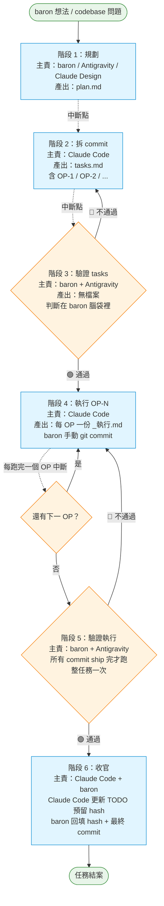
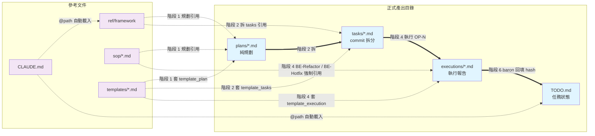
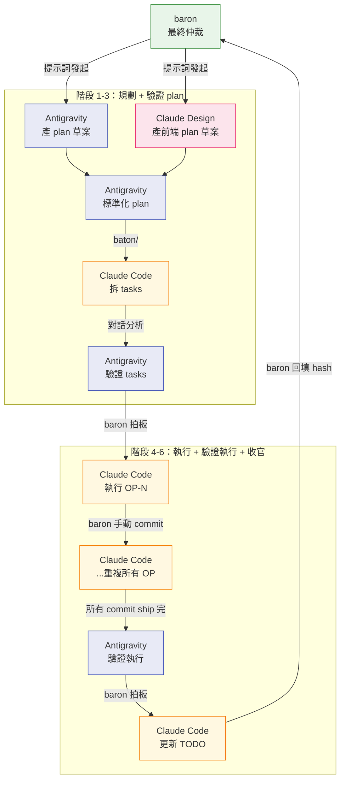
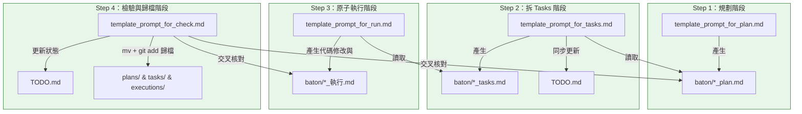

# WORKFLOW-1 流程簡化與文件治理 plan

> 當前版本：`v4-final-r4-v6-r11-Antigravity` (2026-05-26)

> 演進歷史、出包紀錄、雙評估報告、決策過程 → 見 `archive/WORKFLOW-1_設計歷程.md`（本檔不含）

---

## §0 改版規則

- 改版觸發：任一規格章節（§1.1-§1.17）變動
- 改版規則：直接修改對應章節 + 在 §99.2 加 Revision 紀錄
- 完整治理規格 → §99

---

## §0.5 設計理念與全景圖（baron 風格、High-level How）

### §0.5.1 核心設計理念

```
plan → tasks → execution

  純規劃     拆 commit    跑代碼
  Why+What   How          What was done
```

三層結構對應 AI 訓練語料中的自然語意：
- `plan`：通用詞、描述「打算做什麼 / 怎麼設計」
- `tasks`：Jira / Trello / GitHub Issues 慣用詞、描述「拆成多個可執行的任務」
- `execution`：通用詞、描述「實際做了什麼」

每階段轉換有明確角色與中斷點、不混淆。

### §0.5.2 六階段工作流全景圖



### §0.5.3 文件流向圖



### §0.5.4 跨工具角色分工全景



---

### §0.5.5 最終產出清單

本 plan 落地後、worktree 應新增 / 修改以下檔案、依性質分 5 類：

#### A. 既有檔修改（2 個）

| # | 路徑 | 改動 |
|---|---|---|
| 1 | `CLAUDE.md` | 補入新章節與整合改寫（@path 引用機制 / 核心規範與契約整合 / 工作流類別判定 / 工作目錄硬規則 / 跨環境同步）|
| 2 | `.claude-logs/ref/PROJECT_PROGRESS_CONTROL_FRAMEWORK.md` | 補 §9 對齊新規格（引用本 plan §1.1 / §1.3 / §1.7 + CLAUDE.md §3、不重寫）|

#### B. 新增必讀檔（3 個）

| # | 路徑 | 用途 |
|---|---|---|
| 1 | `.claude-logs/ref/WORKFLOW_SOP.md` | 工作流規則（六階段 / 階段切點 / 命名規則 / 文件歸屬判定 / SOP 一致性核查）|
| 2 | `.claude-logs/ref/GOVERNANCE_OVERVIEW.md` | 治理框架 overview（極簡指針 ~50 行、不含實質規範、指向各權威源）|
| 3 | `.claude-logs/baton/README.md` | baton 機制說明（命名 / 衝突 / 入版控規則）|

#### C. 模板（templates/、8 個新增）

| # | 路徑 | 用途 |
|---|---|---|
| 1 | `templates/template_plan.md` | 純規劃模板（不拆 commit）|
| 2 | `templates/template_file_governance.md` | 文件治理元資料模板（§99 內容範本）|
| 3 | `templates/template_specification.md` | API / Schema / 模組規格極簡格式 |
| 4 | `templates/template_prompt_for_plan.md` | 產生 plan 的提示詞模板 |
| 5 | `templates/template_prompt_for_tasks.md` | 產生 tasks 的提示詞模板（階段 2）|
| 6 | `templates/template_prompt_for_run.md` | 執行單一 OP 的提示詞模板（階段 4）|
| 7 | `templates/template_prompt_for_sop.md` | 產生 SOP 的提示詞模板 |
| 8 | `templates/template_prompt_for_check.md` | 成果檢驗與歸檔收官提示詞模板（階段 5-6） |

#### D. SOP（sop/、1 個新增）

| # | 路徑 | 用途 |
|---|---|---|
| 1 | `.claude-logs/sop/CACHE_OPTIMIZATION_SOP.md` | 快取友善度評分機制 SOP |

#### E. 一次性產物（基礎建設、3 個）

| # | 路徑 | 用途 |
|---|---|---|
| 1 | `.claude-logs/report/`（目錄初始化）| 快取友善度評分報告 / 其他工具產出報告 |
| 2 | `.claude-logs/archive/WORKFLOW-1_設計歷程.md` | 演進紀錄歸檔（Claude Code 不讀）|
| 3 | `流程簡化與文件治理_OVERVIEW.md` | 一次性治理概覽、待工作完成後 commit 時，透過 git 移動至所屬目錄或刪除 |

### §0.5.6 共同必用文件（session 啟動自動載入）

對應 §1.3 文件用途範疇「組 1」：

| 文件 | 負責的內容 |
|---|---|
| `CLAUDE.md` | session 入口 / 核心規範與契約 / 工作流類別判定 / 工作目錄硬規則 / 跨環境同步 |
| `ref/WORKFLOW_SOP.md` | 五類工作流定義 / 六階段工作流 / 命名規則 / 文件歸屬判定 / SOP 一致性核查 |
| `ref/PROJECT_PROGRESS_CONTROL_FRAMEWORK.md` | 任務生命週期 / 雙軌制 / 提示詞歸檔規範 |
| `TODO.md` | 任務狀態真理源 |
| `baton/*.md`（若存在）| 跨 AI 工具交接棒 |

載入機制：透過 `CLAUDE.md` 內 `@path` 引用、Claude Code 官方原生自動載入（無需提示詞指定）。

### §0.5.7 流程簡化與文件治理_OVERVIEW.md 內容規格

落地位置：`.claude-logs/ref/GOVERNANCE_OVERVIEW.md`
長度上限：~50 行
性質：純指針、不含實質規範內容

必含章節（每章節 2-3 行、指向實際權威源）：

```markdown
# 治理框架 Overview

> 本檔為治理框架 entry point、指向各規範的權威源。
> 不含實質規範內容、避免冗餘。

## 1. 工作流（六階段、階段切點、單一文件中斷點）
詳見 ref/WORKFLOW_SOP.md 的 ## §1 五類工作流定義 及 ## §2 六階段工作流

## 2. 文件用途範疇 / 命名規則 / 文件歸屬判定
詳見 ref/WORKFLOW_SOP.md 的 ## §3 文件用途範疇 及 ## §6 命名規則

## 3. 工作目錄硬規則 / 跨環境同步 / 工作流類別判定 / 核心規範與契約
詳見 CLAUDE.md 的 ## §3 工作目錄硬規則、## §4 跨環境同步、## §2 工作流類別判定 及 ## §1 核心規範與契約

## 4. 跨 AI 交接（baton 機制）
詳見 baton/README.md

## 5. 模板規格（template_plan / tasks / execution / prompt_for_*）
詳見 templates/<檔名>.md 的 ## §99 治理規格

## 6. SOP 一致性核查（logging / database / 模型）
詳見 ref/WORKFLOW_SOP.md 的 ## §5 SOP 一致性核查機制 及 sop/<領域>_SOP.md

## 7. 快取友善度評分
詳見 sop/CACHE_OPTIMIZATION_SOP.md

## 8. 任務生命週期 / 雙軌制 / 提示詞歸檔
詳見 ref/PROJECT_PROGRESS_CONTROL_FRAMEWORK.md
```

維護責任：DOC-Refactor commit、跟對應權威源同步更新（如 WORKFLOW_SOP 錨點標題變動、本檔指針同步改）。因為使用語意標題錨點而非具體章節編號，防範了因小修訂引起的頻繁 cache invalidation。

---

## §1 目標規格

### §1.1 六階段標準工作流

```
階段 1：規劃
  主責：baron / Antigravity / Claude Design
  輸入：問題描述
  必讀文件：§0.5.6 共同必用文件（CLAUDE.md / WORKFLOW_SOP / framework / TODO / baton/*）
  選用文件：sop/<相關領域>.md / plans/<既有相關 plan>.md / templates/template_plan.md / ref/GOVERNANCE_OVERVIEW.md（新人查框架時）
  產出：plan.md
  中斷點：產出即停

階段 2：拆 commit
  主責：Claude Code
  輸入：plan.md
  必讀文件：§0.5.6 共同必用文件 + 本任務 plan.md
  選用文件：templates/template_tasks.md / templates/template_prompt_for_tasks.md / 既有 sop/<相關領域>.md
  產出：_tasks.md（含 Commit代號/OP序號，如 P2-1、BUG-F1、C1 或 OP-1 等 commit 拆分表） + 同步更新 TODO.md（在根目錄 TODO.md 中新增該任務與其 commit 拆分列表，並將該任務狀態相關文字由 ⚪ 未啟動 更新為 🟡 WIP）
  中斷點：產出文件與更新 TODO.md 後即停

階段 3：驗證 tasks
  主責：baron（Antigravity 輔助判斷）
  輸入：plan.md + _tasks.md
  必讀文件：plan.md + _tasks.md（baron 在腦袋裡對照、不需自動載入）
  產出：無檔案
  分支：
    🟢 通過 → 階段 4
    🔴 不通過 → 階段 2

階段 4：執行（單 commit 觸發）
  主責：Claude Code
  輸入：_tasks.md + 提示詞指定單一 OP
  必讀文件：§0.5.6 共同必用文件 + 本任務 _tasks.md + templates/template_execution.md
  選用文件：templates/template_prompt_for_run.md / BE-Refactor 或 BE-Hotfix 必讀 sop/logging_SOP_手冊.md + sop/database_SOP_手冊.md（依 WORKFLOW_SOP §5 SOP 核查強制）
  產出：每 OP 一份 _執行.md
  中斷點：每跑完一個 OP 即停

階段 5：驗證執行
  主責：baron（Antigravity 輔助判斷）
  輸入：_tasks.md + 所有 _執行.md
  必讀文件：_tasks.md + 所有 _執行.md（baron 在腦袋裡對照）
  時機：所有 commit ship 完才跑（整任務一次）
  產出：無檔案 + commit 動作
  分支：
    🟢 通過 → 階段 6
    🔴 不通過 → 階段 4

階段 6：收官
  主責：Claude Code + baron
  必讀文件：§0.5.6 共同必用文件 + 本任務 _tasks.md + 所有 _執行.md + TODO.md + prompts/INDEX.md
  選用文件：templates/template_prompt_for_check.md
  Claude Code 動作：執行 Conformance 成果檢驗與歸檔收官，依執行文件更新 TODO.md（hash 欄留空）並將 baton/ 內暫存文件 mv 移動歸檔至正式目錄 + 更新 prompts/INDEX.md
  baron 動作：回填 commit hash + 手動 commit TODO.md
```

### §1.2 階段切點規則

| 規則 | 內容 |
|---|---|
| 單一文件產出 | 每階段只產一份新文件、產完即停（同步更新既有檔案如 TODO.md 除外） |
| 嚴禁跨階段 | Claude Code 收到單階段提示詞、嚴禁執行下一階段任務 |
| 驗證不產檔 | 階段 3 / 5 為 baron 判斷動作、無文件產出 |
| 階段 4 單 commit 觸發 | 提示詞必指定單一 Commit/OP（如「執行 P2-1」或「執行 OP-1」）、嚴禁要求執行整份 plan |

### §1.3 文件用途範疇

依「載入時機」分 4 組、每組 3-5 個檔、避免單一大表格的注意力跨行誤對應。

#### 組 1：session 啟動必讀（5 個、共同必用）

詳見 §0.5.6 共同必用文件表。

| 文件 | 修改責任 |
|---|---|
| `CLAUDE.md` | baron 手動 |
| `ref/WORKFLOW_SOP.md` | DOC-Refactor commit |
| `ref/PROJECT_PROGRESS_CONTROL_FRAMEWORK.md` | DOC-Refactor commit |
| `TODO.md` | 階段 2 新增任務與 WIP 更新、階段 6 收官同步，baron 回填 hash |
| `baton/*.md`（若有）| 執行方建立、執行方歸檔 |

#### 組 2：任務內讀（4 個）

| 文件 | 用途 | 修改責任 |
|---|---|---|
| `plans/*.md` | 改版規劃（純規劃） | baron / Antigravity / Claude Design |
| `tasks/*.md` | commit 拆分清單 | Claude Code（階段 2 產出）|
| `executions/*.md` | 執行報告 | Claude Code（階段 4 產出）|
| `hotfixes/*.md` | 緊急修補報告 | Claude Code |

#### 組 3：條件式讀（3 個）

| 文件 | 觸發條件 | 修改責任 |
|---|---|---|
| `sop/*.md` | 工作流類別判定後（BE-Refactor / BE-Hotfix 強制） | DOC-Refactor commit |
| `templates/*.md` | 套 template 時 | DOC-Refactor commit |
| `baton/README.md` | 跨 AI 交接時查閱 | DOC-Refactor commit |

#### 組 4：不自動讀（4 個）

| 文件 | 性質 | 修改責任 |
|---|---|---|
| `prompts/*.md` | 提示詞歸檔（手動查歷史時讀） | 任務啟動時歸檔 |
| `archive/*` | 過期文件暫存 | baron 手動 |
| `tools/*` | 工具腳本 | baron 手動 |
| `report/*` | 工具產出報告 | 工具自動 |

### §1.4 文件範疇邊界

每項規範只在唯一權威源定義、其他位置引用不重寫。

| 範疇 | 唯一權威源 |
|---|---|
| 工作目錄硬規則 | `CLAUDE.md` |
| 五類工作流定義 | `WORKFLOW_SOP.md` |
| 雙軌制 / 任務生命週期 | `PROJECT_PROGRESS_CONTROL_FRAMEWORK.md` |
| 命名規則 | `WORKFLOW_SOP.md` |
| 提示詞歸檔規則 | `prompts/README.md` |
| 六階段工作流 | 本 plan §1.1 |

### §1.5 CLAUDE.md 規格

| 規格項 | 內容 |
|---|---|
| 位置 | worktree 根層 |
| 自動載入機制 | Claude Code 官方原生（無需任何提示詞指定） |
| 必含章節 | §0 session 啟動必讀（@path 引用 WORKFLOW_SOP / framework / TODO）、§1 核心規範與契約（整合原「核心規範」與「互動流程契約」，實現紅線規則扁平化）、§2 工作流類別判定、§3 工作目錄硬規則、§4 跨環境同步、§5 任務代號 |
| §0 必用 @path 引用 | `@.claude-logs/ref/WORKFLOW_SOP.md`、`@.claude-logs/ref/PROJECT_PROGRESS_CONTROL_FRAMEWORK.md`、`@.claude-logs/TODO.md`、`@.claude-logs/baton/*.md`（如存在） |
| §2 工作流類別判定 | 含五類工作流判定流程圖（依 §1.6 五類定義） |
| §3 工作目錄硬規則 | 唯一目錄 `.claude/worktrees/hopeful-yalow-902c50/`、嚴禁主 repo 目錄讀寫、違規 baron 有權直接 revert；且 plan, task, run 產生的檔案在執行中都必須加入 baton/ 作為暫存交接 |
| 動態內容禁用 | 嚴禁含當前任務名 / TODO hash / commit hash / 變動數字 / 具體日期 |
| 長度上限 | ≤ 200 行 |

### §1.6 WORKFLOW_SOP.md 規格

| 規格項 | 內容 |
|---|---|
| 位置 | `.claude-logs/ref/WORKFLOW_SOP.md` |
| 自動載入機制 | 透過 CLAUDE.md `@path` 引用 |
| 必含章節 | §1 五類工作流定義、§2 文書類別、§3 強制觸發鏈、§4 驗證分級、§5 SOP 一致性核查、§6 命名規則 |
| §1 五類工作流 | FE-Refactor / BE-Refactor / DOC-Refactor / FE-Hotfix / BE-Hotfix；每類含：觸發條件 / 必讀 SOP / 套用 template / 驗收要求 |
| §4 驗證分級 | 核心 3 項（人人必跑）+ 進階 5 項（特定觸發條件啟動、grep 關鍵字定義在本節） |
| §5 SOP 核查 | 詳見 §1.14 |
| §6 命名規則 | 詳見 §1.13 |
| 結構 | §0 / §99 拆分式（§0 簡頂、§99 末尾） |

### §1.7 baton/ 機制規格

#### §1.7.1 baton/ 用途

- 跨 AI 工具之間的單向文件交接暫存區
- 平時為空（僅含 README.md）

#### §1.7.2 入版控規則

- `baton/README.md` 入版控
- baton/ 內其他 .md 不入版控（.gitignore 詳見 §1.11）

#### §1.7.3 命名規則

- 依 §1.13 命名規則（與正式目錄相同）
- 不另設 baton 專屬命名

#### §1.7.4 交接流程

```
階段 A：發起方放 baton 檔
  發起方產出文件後、放到 baton/<檔名依 §1.13>.md
  
階段 B：baron 給接收方提示詞
  提示詞明指要讀的 baton 檔（如「請讀 baton/<檔名>.md、依此產對應 plan」）
  
階段 C：接收方完成後歸檔
  接收方把 baton/ 內檔案 mv 到對應正式目錄（依 §1.12 歸屬判定流程）
  為防範交接歷史中斷、接收方必須在歸檔任務的收官報告中（如 _執行.md 之 §7 銜接）寫入被消化歸檔之 baton 檔名與對應 Git commit hash 映射，完成 Traceability交接鏈。
  baton/ 回到「只剩 README」
```

#### §1.7.5 跨工具流向

| 流向 | 文件類型 |
|---|---|
| Antigravity → Claude Code | plan（純規劃） |
| Claude Code → Antigravity | tasks / 執行紀錄 |
| Claude Design → Claude Code | 前端 plan（純規劃） |
| baron → Claude Code | 直接提示詞、不走 baton |

### §1.8 PROJECT_PROGRESS_CONTROL_FRAMEWORK.md 規格

| 規格項 | 內容 |
|---|---|
| 位置 | `.claude-logs/ref/PROJECT_PROGRESS_CONTROL_FRAMEWORK.md` |
| 自動載入機制 | 透過 CLAUDE.md `@path` 引用 |
| 必含章節 | §1-§8 既有內容（雙軌制 / 任務生命週期 / 命名 / 提示詞歸檔 / 互動契約）+ §9 補充條款 |
| §9 補充條款 | §9.1 工作目錄硬規則（引用 CLAUDE.md §3、不重寫）、§9.2 六階段工作流（引用本 plan §1.1、不重寫）、§9.3 文件用途範疇（引用本 plan §1.3、不重寫）、§9.4 被引用方掃描規則（Antigravity 自動掃描 `.claude-logs/*.md`、regex 抓 `[[]]` / `references` / `引用方`、每週一次 + Phase 結束時觸發） |
| 結構 | §0 / §99 拆分式 |

### §1.9 啟動提示詞規格

啟動提示詞由「提示詞模板」定義、模板位置 `.claude-logs/templates/`、實際模板規格詳見 §1.10。

必含的提示詞模板：

| 模板 | 用途 |
|---|---|
| `template_prompt_for_plan.md` | 產生 plan 的提示詞模板（給 baron / Antigravity / Claude Design 用） |
| `template_prompt_for_tasks.md` | 產生 tasks 的提示詞模板（階段 2 拆 commit、給 Claude Code 用） |
| `template_prompt_for_run.md` | 產生執行紀錄的提示詞模板（階段 4 執行單一 OP、給 Claude Code 用） |
| `template_prompt_for_sop.md` | 產生 SOP 的提示詞模板（領域 SOP 撰寫、給 Claude Code 用） |
| `template_prompt_for_check.md` | 成果檢驗與歸檔收官提示詞模板（給 Claude Code 用，對照執行結果與原始 plan，合規即更新 TODO 與移動歸檔） |

通用禁忌（所有提示詞模板必須遵守）：

- 嚴禁混合多階段任務
- 嚴禁缺少「停止指令」
- 嚴禁要求 Claude Code 執行「整份 plan」
- 嚴禁要求 Claude Code 自動 git commit / push

### §1.10 template 規格

#### §1.10.1 template_plan.md

| 規格項 | 內容 |
|---|---|
| 必含章節 | §0 改版規則、## §1 TL;DR（概要，含挑戰/解法/影響）、## §2 目標規格、## §3 現況與證據（含關鍵程式碼/ evidence / 呼叫鏈定位）、## §4 不可動清單、## §5 規格依據、## §6 驗證計畫（包含 pytest 指令與手動 E2E 驗收流程）、## §7 Open Questions、## §99 治理規格 |
| 嚴禁內容 | 設計脈絡 / 演進歷史 / 拍板過程 / 為何要做的理由 / commit 拆分（屬 plan 階段）/ 具體 commit 級別驗收 grep 條件（屬 tasks 階段） |
| 撰寫原則 | 純規格、What it should be、不含 Why |
| 結構 | §0 / §99 拆分式 |
| 參考來源 | `.claude-logs/plans/` 目錄下的既有 plan 檔案（做為實體範本與共通內容之參考依據，用以查詢 plans/ 中相關文件對齊格式） |
#### §1.10.2 template_tasks.md（既有、補充規格）

| 規格項 | 內容 |
|---|---|
| 必含章節 | §0 來源、## §0.5 成果盤點（Outcome Inventory，量化文件與 修改 數）、## §1 TL;DR（概要，採中英文雙子標題）、## §2 現況、## §3 觀察問題、## §4 設計方案、## §5 風險、## §6 測試計畫、## §7 不可動清單、## §8 推薦 Commit 拆分（Commit代號/OP序號，如 P2-1、C1、BUG-F1 等）、## §9 Open Questions、## §99 治理規格 |
| §8 commit 拆分 | 每個 Commit/OP 含：影響範圍 / 安全性 / 可逆性 / 驗收 grep 條件 / 依賴關係 / 具體實作細節 |
| §1 TL;DR 命名 | 採 `## §1 TL;DR（概要）`（含括號中文子標題） |
| 結構 | §0 / §99 拆分式 |
| 參考來源 | `.claude-logs/tasks/` 目錄下的既有 tasks 檔案（做為實體範本與共通內容之參考依據，用以查詢 tasks/ 中相關文件對齊格式） |
#### §1.10.3 template_execution.md（既有、補充規格）

| 規格項 | 內容 |
|---|---|
| 必含章節 | 頂部元數據塊（任務代號、執行日期、依據評估/規劃、次級參考、commit 留空、狀態） + §1 基準與完成狀態、§2 Commit 表格、§3 變動檔案清單、§4 修法說明、§5 測試結果、§6 不可動清單遵守、§7 銜接、§8 baron 執行命令、§99 治理規格 |
| §2 Commit hash 欄 | 留空、由 baron 回填 |
| §8 baron 執行命令 | 含 `git add` 清單 + commit message 草稿（寫入 `/tmp/<task>_msg.txt`）+ `git commit -F` 指令 + `git push` |
| 結構 | §0 / §99 拆分式 |
| 參考來源 | `.claude-logs/executions/` 目錄下的既有執行報告檔案（做為實體範本與共通內容之參考依據，用以查詢 executions/ 中相關文件對齊格式） |

#### §1.10.4 template_hotfix.md（既有、不變）

維持既有規格。

#### §1.10.5 template_file_governance.md

| 規格項 | 內容 |
|---|---|
| 用途 | 文件級別治理元資料模板（§99 內容範本） |
| 必含欄位 | 目的 / 用途 / 權威源 / 引用方 / 被引用方 / 約束事項 / 改版觸發 / 改版規則 / 刪除條件 / 重複防護 |

#### §1.10.6 template_specification.md

| 規格項 | 內容 |
|---|---|
| 用途 | API / Schema / 模組規格極簡格式 |
| 必含章節 | §0 用途、§1 介面定義、§2 行為合約、§3 邊界條件、§4 變動歷程 |

#### §1.10.7 template_prompt_for_plan.md

| 規格項 | 內容 |
|---|---|
| 用途 | 產生 plan 的提示詞模板（供 baron / Antigravity / Claude Design 拿來套用、產出 plan） |
| 最小必含 | 任務編碼 + 任務簡述 + 強制讀檔清單（既有 SOP / 既有規範） + 撰寫原則提醒（純規格、不含設計脈絡 / 演進 / 拍板） + 套 template_plan.md 結構（強制包含頂部 TL;DR、現況與證據、驗證計畫要求） + 產出位置（`.claude-logs/plans/`） + 明確停止指令 |
| 撰寫原則 | 純規格、嚴格單階段、產出 plan.md 即停（嚴禁跨越到任務拆分階段） |
| 參考來源 | `.claude-logs/plans/` 目錄下的既有 plan 檔案（做為實體範本與共通內容之參考依據，用以查詢 plans/ 中相關文件對齊格式） |

#### §1.10.8 template_prompt_for_tasks.md

| 規格項 | 內容 |
|---|---|
| 用途 | 階段 2 拆 commit 的提示詞模板（供 baron 給 Claude Code、產出 plan） |
| 最小必含 | 任務編碼 + 工作流類別（FE-Refactor / BE-Refactor / DOC-Refactor / FE-Hotfix / BE-Hotfix） + 強制讀檔清單（CLAUDE.md 自動 / 對應 plan / TODO.md / template_tasks） + 工作目錄硬規則提醒 + 成果數量盤點約束（強制在文件開頭首先進行成果數量盤點，如：新增或修改文件產生幾份、待修補 Bug 共計幾個等，對應 ## §0.5 成果盤點） + 彈性規劃約束（tasks 中的 commit 數量可以依最佳施行方式彈性規劃於文件中） + §8 每個 Commit/OP（例如 OP-N、C-N、P2-N 等 Commit代號）六維度細節要求（影響範圍/安全性/可逆性/驗收 grep 條件/依賴關係/實作細節） + §1 TL;DR（概要）括號中文子標題命名要求 + 引用語「請依 `<plan 路徑>` 拆 commit、產對應 tasks」 + 產出規格（路徑 `.claude-logs/tasks/<日期>_<任務>_tasks.md`、套 template_tasks.md） + 同步更新 TODO.md（在根目錄 TODO.md 中新增該任務與其 commit 拆分列表，並對狀態相關文字進行對應更新如由 ⚪ 未啟動 變更為 🟡 WIP） + 工作完畢將 plan 從 baton/（若有）mv 到 plans/ + 明確停止指令（產 _tasks.md 與更新 TODO.md 後即停、嚴禁產 _執行.md / 動業務代碼） + 提示詞歸檔指令（依 prompts/README.md） |
| 撰寫原則 | 純規格、嚴格單階段、產出 plan.md 即停 |
| 參考來源 | `.claude-logs/tasks/` 目錄下的既有 tasks 檔案（做為實體範本與共通內容之參考依據，用以查詢 tasks/ 中相關文件對齊格式） |

#### §1.10.9 template_prompt_for_run.md

| 規格項 | 內容 |
|---|---|
| 用途 | 階段 4 執行單一 OP 的提示詞模板（供 baron 給 Claude Code、產出執行紀錄） |
| 最小必含 | 元數據審計塊（收到時間、任務代號、觸發 commit、相關產出檔案、觸發情境） + 任務編碼 + 當前 Commit代號/OP序號（如「執行 OP-1」或「執行 P2-1」） + 工作流類別 + 強制讀檔清單（CLAUDE.md 自動 / 對應之 _tasks.md） + 任務執行命令「請依 `_tasks.md` 中該 Commit/OP 的 ## §8 實作細節進行代碼修改，嚴守 ## §7 不可動清單做為物理防線，並依 ## §6 測試計畫進行驗收與 pytest/E2E 驗證，產出單次執行報告」 + 產出規格（路徑 `.claude-logs/executions/<日期>_<任務>_<Commit代號/OP序號>_執行.md`、套 template_execution.md） + Baron 手動執行命令與 Commit message 草稿規範（含 git add 清單、寫入 /tmp/<task>_msg.txt，以及 git commit -F 指令） + 明確停止指令（產出該 Commit/OP 之執行報告即停、嚴禁繼續執行後續 Commit或修改其他程式碼） + 提示詞歸檔指令 |
| 撰寫原則 | 純規格、嚴格單一 commit 觸發、產出 _執行.md 即停 |
| 參考來源 | `.claude-logs/prompts/` 目錄下的既有提示詞檔案（做為實體範本與共通內容之參考依據，用以查詢 prompts/ 中相關文件對齊格式） |

#### §1.10.10 template_prompt_for_sop.md

| 規格項 | 內容 |
|---|---|
| 用途 | 撰寫領域 SOP 的提示詞模板（供 baron 給 Claude Code、產出 sop/ 內 SOP 手冊） |
| 最小必含 | SOP 領域名稱（logging / database / 模型 / 等） + 強制讀檔清單（既有 codebase 慣例 / 既有相關 SOP） + 撰寫原則（規範性、可 grep 化、含核查指令） + 產出規格（路徑 `.claude-logs/sop/<日期>_<領域>_SOP_手冊.md`、套 §1.16 §0 / §99 拆分式結構） + 明確停止指令（產 SOP 手冊即停） + 提示詞歸檔指令 |
| 撰寫原則 | 純規格、嚴格單階段、產出 SOP 手冊即停 |
| 參考來源 | `.claude-logs/prompts/` 既有歷史提示詞（如 LOGGING-1 提示詞 / database SOP 撰寫提示詞） |

#### §1.10.11 template_prompt_for_check.md

| 規格項 | 內容 |
|---|---|
| 用途 | 階段 5-6 成果檢驗與歸檔收官的提示詞模板（供 baron 給 Claude Code 或由 Antigravity 執行，核對執行成果並進行自動收官） |
| 最小必含 | 任務編碼 + 對應 plan.md 路徑 + 對應 _tasks.md 路徑 + 對應的所有 _執行.md 清單 + 引用語「請依 `_執行.md` 核對成果是否符合 `plan.md` 的目標規格」 + 強制讀檔清單（CLAUDE.md 自動 / plan.md / _tasks.md / 所有 _執行.md / TODO.md） + Conformance 驗收指示（要求 LLM 逐項交叉比對 plan.md 的 §2 目標規格、§6 驗證計畫與 executions/ 執行報告的成果，若有不符則明確提出漏洞與例外且不予收官） + 收官自動化動作（若全部合規，則引導：1. 將 TODO.md 中對應任務狀態由 🟡 WIP 移至 ✅ 完成且 hash 欄留空標註「待 baron 回填」；2. 將 baton/ 目錄下所有本任務的暫存文件以 `mv` 移動加上 `git add` 歸檔至所屬正式目錄，恢復 baton/ 為空） + 明確停止指令（完成 TODO 更新與歸檔移動即停，嚴禁自發進行 git commit） + 提示詞歸檔指令 |
| 撰寫原則 | 純規格、嚴格 Conformance 檢驗、非合規不予收官、執行歸檔移位後即停 |
| 參考來源 | `.claude-logs/prompts/` 目錄下的歷史提示詞與收官規範（做為實體範本與格式依據） |

### §1.11 .gitignore 規格

```
.claude-logs/                    全目錄不排除（既有）
.claude-logs/baton/*             不入版控
!.claude-logs/baton/README.md    README 入版控例外
.claude-logs/logseq/             排除（Logseq 工具產物）
.claude-logs/pages/              排除（Logseq 工具產物）
**/.DS_Store                     排除（既有）
```

### §1.12 文件歸屬判定流程

新增 .md 檔案時、依以下分支歸屬：

```
改版規劃（純規劃、不拆 commit）    → plans/
Claude Code 拆 commit 結果         → tasks/
Claude Code 執行紀錄               → executions/
緊急修補紀錄                       → hotfixes/
領域 SOP（規範性、長期）           → sop/
session 必讀核心（跨任務）         → ref/
模板                               → templates/
提示詞歸檔                         → prompts/
跨 AI 交接棒                       → baton/
工具產出報告                       → report/
工具腳本                           → tools/
過期 / 暫不確定                    → archive/
```

歷史命名「不溯及既往」：既有檔案依實際性質歸資料夾、檔名不改。

### §1.13 命名規則

| 文件類型 | 命名格式 |
|---|---|
| plan（純規劃） | `<YYYY-MM-DD>_<任務編碼>_<描述>_plan.md` 或加版本 `_v<N>` |
| tasks（commit 拆分） | `<YYYY-MM-DD>_<任務編碼>_<描述>_tasks.md` |
| 執行報告 | `<YYYY-MM-DD>_<任務編碼>_<Commit代號/OP序號>_執行.md` |
| 緊急修補 | `<YYYY-MM-DD>_<任務編碼>_hotfix.md` |
| 提示詞歸檔 | `<YYYY-MM-DD>_<任務編碼>_<階段>_提示詞.md` |
| 非 .md 檔案 | `<YYYY-MM-DD>_<任務編碼>_<描述>.<ext>`（一律加日期前綴；不需 §0 / §99 結構） |

*備註：1. 任務編碼與 Commit代號/OP序號 可自取並彈性命名（例如：Commit代號可為 P2-1、BUG-F1、C1、OP-1 等，非強制限制為 literal "OP-N"；OP-N 僅做為代稱舉例）。例如 DB 相關任務可取為 `DB-01`，LLM 相關可取為 `LLM-01`，依此類推。*

### §1.14 SOP 一致性核查機制

| 規格項 | 內容 |
|---|---|
| 觸發時機 | BE-Refactor / BE-Hotfix 落地前 |
| 雙工具共用 | Claude Code 在 _執行.md 內必貼 grep 結果（空輸出需貼「無命中（合規）」）；Antigravity 在驗證時必引用 grep 結果做合規判定 |
| §5.1 logging | `grep -n "traceback.format_exc\|logger\.error\|logger\.exception" <修改檔.py>`；用 `logger.error` 必須含 `exc_info=True` |
| §5.2 database | `grep -nE "\.commit\(\)" <修改檔.py> \| grep -v "with .*session.*begin\(\)"`；寬鬆匹配涵蓋 `db.commit / self.session.commit / await session.commit` 等變體；裸 commit（不在 `with session.begin()` 區塊內）→ 不合規 |
| §5.3 違規處理 | 暫停落地、加入 _plan.md §9 Open Questions、等 baron 拍板 |

### §1.15 快取友善度評分機制

| 規格項 | 內容 |
|---|---|
| 評分算法 | 靜態前綴檢測（輕量、grep base）。100 分：文件頂部 `# 標題` 後直接是靜態 `## §0`、所有動態欄位都在文件最後 10% 行；50 分（黃牌）：文件中段或前段含任何變動日期 / Revision / 時間戳；0 分（紅牌）：文件頂部前 20% 行含高頻變動內容 |
| 排除名單 | 自動將 `TODO.md`、`prompts/` 內的所有提示詞歸檔及 `report/` 目錄下的報告列為排除對象，防止誤判紅牌 |
| 評分結果存放 | `.claude-logs/report/<YYYY-MM-DD>_CACHE_FRIENDLINESS_REPORT.md`（不污染被評分文件本身） |
| 觸發時機 | Antigravity 掃 codebase 時觸發（建議週級）；baron 手動命令觸發 |
| 第一輪評分範圍 | `.claude-logs/ref/PROJECT_PROGRESS_CONTROL_FRAMEWORK.md` / `.claude-logs/ref/WORKFLOW_SOP.md` / `.claude-logs/sop/2026-05-23_logging_SOP_手冊.md` / `.claude-logs/sop/2026-05-23_database_SOP_手冊.md` |
| 配套 SOP | `.claude-logs/sop/CACHE_OPTIMIZATION_SOP.md`（由 Antigravity 撰寫、規範評分流程） |

### §1.16 拆分式 §0 / §99 結構

所有治理型 .md 採以下結構：

```
# 標題

> 文件總覽（一行）

---

## §0 改版規則（極簡靜態頂部）
- 改版觸發
- 完整治理規格 → §99

---

## §1 ... §N（主體內容）

---

## §99 治理規格與 Revision

### §99.1 治理規格表
| 維度 | 內容 |
... 目的 / 用途 / 權威源 / 引用方 / 被引用方 / 約束事項 / 改版觸發條件 / 改版規則 / 刪除條件 / 重複防護

### §99.2 Revision 歷程

- v4-final-r4 v6-r11-Antigravity (2026-05-26)：由 Antigravity 進行階段 2 任務拆分與 TODO 狀態同步更新之流程優化：
  · 修正 §1.1 階段 2、§1.2 階段切點、§1.3 文件載入與 §1.19.2 暫存移交流程，明定在拆分 tasks 文件的同時，必須同步更新根目錄的 TODO.md。
  · 於 TODO.md 中新增該任務與其 commit 拆分列表，並將任務狀態相關文字由「⚪ 未啟動」更新為「🟡 WIP」，確保任務啟動狀態即時同步。
  · 修正 §1.10.8 template_prompt_for_tasks.md 規格，在最小必含中補入 TODO.md 同步新增與狀態更新指示，建立流程閉環。

- v4-final-r4 v6-r10-Antigravity (2026-05-26)：由 Antigravity 進行 CLAUDE 核心契約整合與 Baton 歸檔指令安全化改寫：
  · 修正 `§1.5 CLAUDE.md` 規格與 `GOVERNANCE_OVERVIEW.md` 引用，將原「核心規範」與「互動流程契約」整合併入單一的 `§1 核心規範與契約` 扁平化章節，提升 AI 行為遵守率。
  · 修正 `§1.10.11` 成果檢驗與歸檔收官提示詞規格，將原本的 `git mv` 歸檔命令安全化重構為標準檔案系統 `mv` + `git add`，避開 Git 對 untracked/ignored 暫存檔案直接進行 git mv 的 fatal 錯誤。

- v4-final-r4 v6-r9-Antigravity (2026-05-26)：由 Antigravity 進行收官與成果檢驗提示詞合併重構：
  · 評估並確認 `template_prompt_for_closure.md` 與 `template_prompt_for_check.md` 存在邏輯重疊。
  · 刪除 `§1.10.11 template_prompt_for_closure.md` 規格，將其更新 `TODO.md` 之功能完全整併入 `template_prompt_for_check.md`，使 Step 4 Conformance Check 成為唯一的成果稽核與自動收官/暫存歸檔入口。
  · 修正全書上下文所有與收官流程相關的文字，保持與 4 步循環一致。

- v4-final-r4 v6-r8-Antigravity (2026-05-26)：由 Antigravity 進行四步文件流轉與繼承關係之戰略地圖改寫：
  · 新增 `§1.19 四步文件流轉與繼承閉環`，繪製並描述四步文件循環傳導與暫存移交 Git 歸檔之生命週期地圖（Step 1 -> Step 2 -> Step 3 -> Step 4）。
  · 明定嚴格之「繼承關係」條款（任務目標、物理防線、驗收指令），幫助 AI 執行者在階段 2（拆 Commit）時即擁有清晰之全局流轉與審計邊界，極大化拆 commit 與代碼變更之流暢度。

- v4-final-r4 v6-r7-Antigravity (2026-05-26)：由 Antigravity 進行 Step 4 Conformance 驗收與歸檔收官提示詞改寫：
  · 新增 `§1.10.12 template_prompt_for_check.md` 規格，補齊工作流閉環中缺失的「第 4 步 成果檢驗與歸檔收官」提示詞模板，確保在 Step 3 原子執行後，有標準化機制核對執行報告是否符合原始 plan 的目標規格。
  · 於模板中明定自動化收官與歸檔動作（包含：TODO.md WIP 移至完成、以 mv + git add 移動 baton/ 下暫存文件至正式目錄以淨空交接棒），達成 4 步循環自洽，確立各階段內容之嚴格繼承鏈。

- v4-final-r4 v6-r6-Antigravity (2026-05-26)：由 Antigravity 進行執行提示詞與任務檔案解耦合之自洽稽核改寫：
  · 修正並優化 `§1.10.9 template_prompt_for_run.md` 的「最小必含」，刪除重複累贅的約束與限制條款，落實「任務規劃 vs 原子執行」之職責分離原則。
  · 強制將執行期提示詞重構為「指向與採用任務檔案的相關內容」（直接引用 `_tasks.md` 的 `## §8 實作細節`、`## §7 不可動清單` 與 `## §6 測試計畫` 進行代碼變更、防線物理隔離與 pytest/E2E 驗收），從機制上杜絕 LLM 執行期產生二次規劃漂移或幻覺，實現最優解耦。

- v4-final-r4 v6-r5-Antigravity (2026-05-26)：由 Antigravity 進行載入邊界與 Bootstrap First 拆 commit 原則改寫：
  · 評估並確認三核心啟動文件（`CLAUDE.md`、`ref/WORKFLOW_SOP.md`、`ref/PROJECT_PROGRESS_CONTROL_FRAMEWORK.md`）具備高度清晰的「系統、實作、流程」三維度正交邊界。
  · 增設 `§1.18 Commit 拆分與落地順序原則`，訂定「基礎啟動優先」戰略：強制要求將自動載入之核心文件配屬在任務第一個 Commit（C1）中落地，從源頭杜絕規則缺失所引發的代碼 or 文件偏誤，保障工作流自舉。

- v4-final-r4 v6-r4-Antigravity (2026-05-26)：由 Antigravity 進行 commit 彈性命名特徵與 OP-N 去舉例化改寫：
  · 修正各章節（含 §1.1 階段 2、§1.2 切點、§1.10.2、§1.10.8、§1.10.9 以及 §1.13 命名規則）中過於絕對或可能引起混淆的 `OP-N` 與 `OP-1` 字眼，將其明確重構並定義為「Commit代號/OP序號」之自取彈性序列（如 P2-1、BUG-F1、C1、OP-1 等），解除強加 literal "OP-N" 命名之偏誤。

- v4-final-r4 v6-r3-Antigravity (2026-05-26)：由 Antigravity 進行 executions 執行報告共通性與執行期自洽稽核改寫：
  · 針對 `executions/` 目錄共通性進行盤點，歸納出「頂部元數據塊、範圍表格、變動清單、真因與修法分析、測試結果 snippet 與手動驗收、不可動清單檢核表、任務銜接、手動 Git 執行命令」等 8 大特徵。
  · 修正 `§1.10.3 template_execution.md` 的「必含章節」，補齊「頂部元數據塊」；並新增「參考來源」欄位，對齊為 `executions/` 目錄下的既有執行報告，達成規範一致性。
  · 驗證並確認在 `template_prompt_for_run.md` 的最小必含下，修改完程式碼後，能完全以 `template_execution.md` 為結構基礎自洽產生單次的 executions/ 執行報告，具備極高的實作可行性與審計完整性。

- v4-final-r4 v6-r2-Antigravity (2026-05-26)：由 Antigravity 進行 prompts 執行期自洽與 Audit Trail 稽核改寫：
  · 針對 `prompts/` 目錄共通性進行盤點，歸納出「元數據審計塊、執行對象、真理源範圍、物理級沙盒禁區、TODO 維護指引、手動 Commit 規範」等 6 大特徵。
  · 修正 `§1.10.9 template_prompt_for_run.md` 的「最小必含」，補齊「元數據審計塊」與「手動 Git 執行命令草稿規範（含 git add 清單、寫入 /tmp/<task>_msg.txt，以及 git commit -F 指令）」，完成提示詞模板的最優度規格化。
  · 修正 `§1.10.9` 的「參考來源」欄位，對齊為 `prompts/` 目錄下的既有檔案，達成與 plans/、tasks/ 模板的規格一致性。
  · 驗證並確認由 `template_prompt_for_run.md` 與 `template_tasks.md` 能完美自洽執行單一 OP-N 任務，確保實體級隔離與 audit trail 完整。

- v4-final-r4 v6-r1-Antigravity (2026-05-26)：由 Antigravity 進行 tasks 一致性與可生成性稽核改寫：
  · 針對 `tasks/` 目錄共通性進行盤點，發現 `template_tasks` 遺漏了成果盤點共通特徵，已於 `§1.10.2` 中補齊 `## §0.5 成果盤點`。
  · 修正 `§1.10.2` 新增 `參考來源` 表格欄位，明定參考 `tasks/` 目錄下既有檔案，達成規格一致性。
  · 修正 `§1.10.8 template_prompt_for_tasks.md` 的最小必含：補齊 `成果盤點章節映射`、`§8 OP-N 的六維度細節要求（影響範圍/安全性/可逆性/驗收 grep 條件/依賴關係/實作細節）` 以及 `§1 TL;DR 中文括號子標題命名要求`，保障提示詞與 tasks 模板的自洽與高可生成性。

- v4-final-r4 v6 (2026-05-26)：由 Antigravity 進行規格一致性稽核（Consistency Audit）改寫：
  · 針對 `plans/` 目錄共通性進行盤點，發現 `template_plan` 遺漏了 TL;DR、現況與證據、驗證計畫等共通特徵，已於 `§1.10.1` 進行完整補齊。
  · 修正 `§1.10.1` 新增 `參考來源` 表格欄位，明定參考 `plans/` 資料夾下既有檔案，達成與提示詞規格的一致性。
  · 修正 `§1.10.7 template_prompt_for_plan.md` 的致命邏輯 Bug：將原越界的「產出 tasks.md 即停」精確修正為「產出 plan.md 即停」，防範跨階段越界執行。
  · 在 `§1.10.7` 的最小必含中，補入 `頂部 TL;DR、現況與證據、驗證計畫` 要求，以正確由提示詞產生出合格的 `template_plan.md` 實體。

- v4-final-r4 v5-r1-Antigravity (2026-05-25)：由 Antigravity 依據 baron 最新回饋進行修訂改寫：
  · §0.5.5 「E. 一次性產物」中新增 `流程簡化與文件治理_OVERVIEW.md`，明定待工作完成後 commit 時移動或刪除。
  · §0.5.7 治理 Overview 內容規格全面升級為「穩定的標題語意錨點」，防範快取失效（Cache Miss）。
  · §1.5 `CLAUDE.md` 的 `§3 工作目錄硬規則` 加入「plan, task, run 產生的檔案在執行中都必須加入 baton/」的規範。
  · §1.7.4 與 §1.10.11 中，加入 baton 歸檔銜接的 Traceability 審計要求（在 _執行.md 寫入映射）。
  · §1.10.8 中，強制將 `TODO.md` 納入 template_prompt_for_tasks.md 必讀清單，排解代號衝突；且新增「文件開頭必須首要進行成果數量盤點」與「commit 數量可依最佳施行方式彈性規劃」之約束條件。
  · §1.10.7 的參考來源改為 `plans/` 下檔案；§1.10.8 的參考來源與資料查詢改為 `tasks/` 下檔案，做為格式與共通內容之實體範本與依據；§1.10.9 至 §1.10.11 仍為 `prompts/`。
  · §1.13 命名規則中加入備註「任務編碼可自取（如 DB-01, LLM-01 等）」。
  · §1.15 快取評分機制中注入「排除名單機制」，自動排除 `TODO.md`、`prompts/` 與 `report/`，防止誤判。
- vX (YYYY-MM-DD)：變更摘要
```

適用範圍：plans / plans / executions / hotfixes / SOP 手冊 / framework / WORKFLOW_SOP / template
不適用：TODO.md / prompts/*.md / 非 .md 檔案

### §1.17 跨環境同步規格

| 環境 | 路徑 | 拉取分支 |
|---|---|---|
| claude-lab Server worktree | `~/mad-professor-public/.claude/worktrees/hopeful-yalow-902c50/` | `gemini-refactor`（default branch） |
| Mac OrbStack | `~/mad-professor-public/` | `gemini-refactor` |
| GCP 正式機 | TBD | TBD |

`.claude-logs/` 全目錄入版控、跨環境完整同步。

### §1.18 Commit 拆分與落地順序原則

#### §1.18.1 「基礎啟動優先」原則 (Bootstrap First)
為了確保後續的任務拆分、代碼執行與報告生成工作能在一個高度明確、受約束的環境中運行，本任務必須遵守「基礎啟動優先」原則。其優先級別定義如下：

- **第一順位：自動載入核心 (Session Startup Core)**
  - 目的：使 Session 載入時立即可被正確的 @path 機制、沙盒硬規則與檔案生命週期框架規範所管控。
  - 包含檔案：`CLAUDE.md`、`.claude-logs/ref/WORKFLOW_SOP.md`、`.claude-logs/ref/PROJECT_PROGRESS_CONTROL_FRAMEWORK.md` 以及根目錄的 `TODO.md`（初始化）。
  - 要求：**必須在任務的第 1 個 Commit（OP-1 或 C1 等首個 Commit）中先行落地！**

- **第二順位：模板與引導 (Templates & Overview Guide)**
  - 目的：提供給後續所有 Commit 執行報告與提示詞歸檔的統一格式，並提供概覽 entry point。
  - 包含檔案：`templates/` 下的所有模板、`.claude-logs/ref/GOVERNANCE_OVERVIEW.md` 以及 `baton/README.md`。

- **第三順位：領域 SOP 與工具 (SOPs & Diagnostics)**
  - 目的：補齊各細分領域（如快取評分）的 SOP 與報告分析報告。
  - 包含檔案：`sop/CACHE_OPTIMIZATION_SOP.md` 與 `report/` 下之診斷輸出。

#### §1.18.2 AI 執行端之依循義務
當 Claude Code 開始執行本任務的 Commit 拆分（階段 2）時，**必須強制讀取本條款**，並在產出的 `_tasks.md` 中，將「第一順位（自動載入核心）」的文件編配在第一個可執行的單次原子 Commit 中，嚴禁將其與後續模板或 SOP 混合，以達成「代碼治理系統自舉（Bootstrap）」之目標。

### §1.19 四步文件流轉與繼承閉環 (Four-Step Document Flow & Inheritance Loop)

為了確保 AI 執行者在各階段能順暢地繼承上下文，並幫助階段 2（拆 Commit）順利產出符合規格的 `_tasks.md`，在此明定四步文件流轉與繼承之生命週期閉環：



#### §1.19.1 核心繼承規則 (Strict Inheritance Rules)
在流轉過程中，各階段文件必須遵守嚴格的「繼承關係」，任何階段皆不得擅自發明或變更前置約束：
1. **任務目標之繼承**：`_tasks.md`（Step 2）的 `## §8 拆分細節` 必須 100% 繼承 `_plan.md`（Step 1）的 `## §2 目標規格`，將其原子化拆分，不得漏失或擅改功能範疇。
2. **防線邊界之繼承**：`_tasks.md` 與後續的 `_執行.md`（Step 3）必須嚴格、完全地繼承 `_plan.md` 設立的 `## §4 不可動清單`，作為物理邊界。
3. **驗收指令之繼承**：執行期的 `_執行.md` 其 `§4 測試/驗收結果` 必須採用並滿足 `_tasks.md` 的 `## §6 測試計畫` 所規劃之 pytest 指令與手動 E2E 檢測，證明無迴歸。

#### §1.19.2 暫存移交（Baton）與 Git 歸檔流程
為了防範跨 Session 的 Context 污染，所有執行中文件在收官前皆以暫存方式處理：
1. **暫存階段（Step 2 & Step 3）**：拆分出的 `_tasks.md` 與每次執行產出的 `_執行.md` 一律先建立在 `baton/` 目錄下（不受 Git 版控污染）；且在 Step 2 拆分 tasks 同時，必須同步更新根目錄的 `TODO.md`，在其中新增該任務與其 commit 拆分列表，並將該任務狀態相關文字由 ⚪ 未啟動 更新為 🟡 WIP。
2. **檢驗與歸檔（Step 4）**：Baron 發起 `template_prompt_for_check.md`，由 Agent 交叉比對 `_執行.md` 與原始 `_plan.md`：
   - **🟢 Conformance 合規**：Agent 執行檔案系統移動 `mv baton/<文件> <正式目錄>/<文件>` 加上 `git add <正式目錄>/<文件>`（以繞過 untracked/ignored 檔案無法直接使用 `git mv` 的限制，將 plan 移入 plans/，tasks 移入 tasks/，執行報告移入 executions/ 進行版控歸檔），並將 `TODO.md` WIP 移至完成，清空 `baton/`。
   - **🔴 Non-Conformance 不合規**：暫停歸檔，拋出漏洞與例外，重回 Step 3 修正。

---

## §2 不可動清單

- 業務代碼：`pipeline_core.py` / `web_server.py` / `paper_manager.py` / `processor/*.py` / `static/*` / `design/*` / `tests/*`
- 主 repo 目錄（worktree 父目錄）：嚴禁讀寫
- 既有 100+ 歷史檔案：保留原檔名、不溯及既往（依 §1.12 歸屬判定流程歸位即可）
- 既有 plan / plan / 執行報告檔名：不重命名
- 既有業務 commit 歷史：不 amend、不 force push

---

## §3 規格依據

| 依據 | 來源 |
|---|---|
| Claude Code 自動載入機制 | Claude Code 官方文件（CLAUDE.md 自動載入 + `@path` 引用 + path-scoped rules） |
| 雙軌制框架 | 既有 `PROJECT_PROGRESS_CONTROL_FRAMEWORK.md` §1-§8 |
| logging SOP | 既有 `.claude-logs/sop/2026-05-23_logging_SOP_手冊.md` |
| database SOP | 既有 `.claude-logs/sop/2026-05-23_database_SOP_手冊.md` |
| 提示詞歸檔規則 | 既有 `.claude-logs/prompts/README.md` |
| 雙軌雙工具設計 | 既有跨 AI 工具協作模式（Claude Code / Antigravity / Claude Design） |

---

## §4 Open Questions

無。

---

## §99 治理規格與 Revision

### §99.1 治理規格表

| 維度 | 內容 |
|---|---|
| 目的 | 定義 WORKFLOW-1 流程簡化與文件治理的目標規格、作為 Claude Code 拆 plan 的純規格依據 |
| 用途 | baron 給 Claude Code 提示詞時引用、Antigravity 階段 3 驗證 plan 時引用 |
| 權威源 | §1.1-§1.17 各項規格條款 |
| 引用方 | 後續 WORKFLOW-1 plan / 執行報告 |
| 被引用方 | `<由 Antigravity 自動掃描注入>` |
| 約束事項 | 嚴禁含設計脈絡 / 演進歷史 / 拍板過程 / 為何要做的理由；嚴禁含 commit 拆分（屬 plan 階段）；嚴禁含具體驗收條件（屬 plan 階段） |
| 改版觸發條件 | §1.1-§1.17 任一規格條款變動 |
| 改版規則 | 直接修改對應條款 + §99.2 加 Revision 紀錄；不重寫整檔 |
| 刪除條件 | WORKFLOW-1 全部 OP commit ship 完、且 baron 確認後可移 archive/ |
| 重複防護 | §1.4 文件範疇邊界已定義各規範的唯一權威源、本檔不重複定義其他文件的內容 |

### §99.2 Revision 歷程

- v4-final-r4 v6-r11-Antigravity (2026-05-26)：由 Antigravity 進行階段 2 任務拆分與 TODO 狀態同步更新之流程優化：
  · 修正 §1.1 階段 2、§1.2 階段切點、§1.3 文件載入與 §1.19.2 暫存移交流程，明定在拆分 tasks 文件的同時，必須同步更新根目錄的 TODO.md。
  · 於 TODO.md 中新增該任務與其 commit 拆分列表，並將任務狀態相關文字由「⚪ 未啟動」更新為「🟡 WIP」，確保任務啟動狀態即時同步。
  · 修正 §1.10.8 template_prompt_for_tasks.md 規格，在最小必含中補入 TODO.md 同步新增與狀態更新指示，建立流程閉環。

- v4-final-r4 v6-r10-Antigravity (2026-05-26)：由 Antigravity 進行 CLAUDE 核心契約整合與 Baton 歸檔指令安全化改寫：
  · 修正 `§1.5 CLAUDE.md` 規格與 `GOVERNANCE_OVERVIEW.md` 引用，將原「核心規範」與「互動流程契約」整合併入單一的 `§1 核心規範與契約` 扁平化章節，提升 AI 行為遵守率。
  · 修正 `§1.10.11` 成果檢驗與歸檔收官提示詞規格，將原本的 `git mv` 歸檔命令安全化重構為標準檔案系統 `mv` + `git add`，避開 Git 對 untracked/ignored 暫存檔案直接進行 git mv 的 fatal 錯誤。

- v4-final-r4 v6-r9-Antigravity (2026-05-26)：由 Antigravity 進行收官與成果檢驗提示詞合併重構：
  · 評估並確認 `template_prompt_for_closure.md` 與 `template_prompt_for_check.md` 存在邏輯重疊。
  · 刪除 `§1.10.11 template_prompt_for_closure.md` 規格，將其更新 `TODO.md` 之功能完全整併入 `template_prompt_for_check.md`，使 Step 4 Conformance Check 成為唯一的成果稽核與自動收官/暫存歸檔入口。
  · 修正全書上下文所有與收官流程相關的文字，保持與 4 步循環一致。

- v4-final-r4 v6-r8-Antigravity (2026-05-26)：由 Antigravity 進行四步文件流轉與繼承關係之戰略地圖改寫：
  · 新增 `§1.19 四步文件流轉與繼承閉環`，繪製並描述四步文件循環傳導與暫存移交 Git 歸檔之生命週期地圖（Step 1 -> Step 2 -> Step 3 -> Step 4）。
  · 明定嚴格之「繼承關係」條款（任務目標、物理防線、驗收指令），幫助 AI 執行者在階段 2（拆 Commit）時即擁有清晰之全局流轉與審計邊界，極大化拆 commit 與代碼變更之流暢度。

- v4-final-r4 v6-r7-Antigravity (2026-05-26)：由 Antigravity 進行 Step 4 Conformance 驗收與歸檔收官提示詞改寫：
  · 新增 `§1.10.12 template_prompt_for_check.md` 規格，補齊工作流閉環中缺失的「第 4 步 成果檢驗與歸檔收官」提示詞模板，確保在 Step 3 原子執行後，有標準化機制核對執行報告是否符合原始 plan 的目標規格。
  · 於模板中明定自動化收官與歸檔動作（包含：TODO.md WIP 移至完成、以 mv + git add 移動 baton/ 下暫存文件至正式目錄以淨空交接棒），達成 4 步循環自洽，確立各階段內容之嚴格繼承鏈。

- v4-final-r4 v6-r6-Antigravity (2026-05-26)：由 Antigravity 進行執行提示詞與任務檔案解耦合之自洽稽核改寫：
  · 修正並優化 `§1.10.9 template_prompt_for_run.md` 的「最小必含」，刪除重複累贅的約束與限制條款，落實「任務規劃 vs 原子執行」之職責分離原則。
  · 強制將執行期提示詞重構為「指向與採用任務檔案的相關內容」（直接引用 `_tasks.md` 的 `## §8 實作細節`、`## §7 不可動清單` 與 `## §6 測試計畫` 進行代碼變更、防線物理隔離與 pytest/E2E 驗收），從機制上杜絕 LLM 執行期產生二次規劃漂移或幻覺，實現最優解耦。

- v4-final-r4 v6-r5-Antigravity (2026-05-26)：由 Antigravity 進行載入邊界與 Bootstrap First 拆 commit 原則改寫：
  · 評估並確認三核心啟動文件（`CLAUDE.md`、`ref/WORKFLOW_SOP.md`、`ref/PROJECT_PROGRESS_CONTROL_FRAMEWORK.md`）具備高度清晰的「系統、實作、流程」三維度正交邊界。
  · 增設 `§1.18 Commit 拆分與落地順序原則`，訂定「基礎啟動優先」戰略：強制要求將自動載入之核心文件配屬在任務第一個 Commit（C1）中落地，從源頭杜絕規則缺失所引發的代碼或文件偏誤，保障工作流自舉。

- v4-final-r4 v6-r4-Antigravity (2026-05-26)：由 Antigravity 進行 commit 彈性命名特徵與 OP-N 去舉例化改寫：
  · 修正各章節（含 §1.1 階段 2、§1.2 切點、§1.10.2、§1.10.8、§1.10.9 以及 §1.13 命名規則）中過於絕對或可能引起混淆的 `OP-N` 與 `OP-1` 字眼，將其明確重構並定義為「Commit代號/OP序號」之自取彈性序列（如 P2-1、BUG-F1、C1、OP-1 等），解除強加 literal "OP-N" 命名之偏誤。

- v4-final-r4 v6-r3-Antigravity (2026-05-26)：由 Antigravity 進行 executions 執行報告共通性與執行期自洽稽核改寫：
  · 針對 `executions/` 目錄共通性進行盤點，歸納出「頂部元數據塊、範圍表格、變動清單、真因與修法分析、測試結果 snippet 與手動驗收、不可動清單檢核表、任務銜接、手動 Git 執行命令」等 8 大特徵。
  · 修正 `§1.10.3 template_execution.md` 的「必含章節」，補齊「頂部元數據塊」；並新增「參考來源」欄位，對齊為 `executions/` 目錄下的既有執行報告，達成規範一致性。
  · 驗證並確認在 `template_prompt_for_run.md` 的最小必含下，修改完程式碼後，能完全以 `template_execution.md` 為結構基礎自洽產生單次的 executions/ 執行報告，具備極高的實作可行性與審計完整性。

- v4-final-r4 v6-r2-Antigravity (2026-05-26)：由 Antigravity 進行 prompts 執行期自洽與 Audit Trail 稽核改寫：
  · 針對 `prompts/` 目錄共通性進行盤點，歸納出「元數據審計塊、執行對象、真理源範圍、物理級沙盒禁區、TODO 維護指引、手動 Commit 規範」等 6 大特徵。
  · 修正 `§1.10.9 template_prompt_for_run.md` 的「最小必含」，補齊「元數據審計塊」與「手動 Git 執行命令草稿規範（含 git add 清單、寫入 /tmp/<task>_msg.txt，以及 git commit -F 指令）」，完成提示詞模板的最優度規格化。
  · 修正 `§1.10.9` 的「參考來源」欄位，對齊為 `prompts/` 目錄下的既有檔案，達成與 plans/、tasks/ 模板的規格一致性。
  · 驗證並確認由 `template_prompt_for_run.md` 與 `template_tasks.md` 能完美自洽執行單一 OP-N 任務，確保實體級隔離與 audit trail 完整。

- v4-final-r4 v6-r1-Antigravity (2026-05-26)：由 Antigravity 進行 tasks 一致性與可生成性稽核改寫：
  · 針對 `tasks/` 目錄共通性進行盤點，發現 `template_tasks` 遺漏了成果盤點共通特徵，已於 `§1.10.2` 中補齊 `## §0.5 成果盤點`。
  · 修正 `§1.10.2` 新增 `參考來源` 表格欄位，明定參考 `tasks/` 目錄下既有檔案，達成規格一致性。
  · 修正 `§1.10.8 template_prompt_for_tasks.md` 的最小必含：補齊 `成果盤點章節映射`、`§8 OP-N 的六維度細節要求（影響範圍/安全性/可逆性/驗收 grep 條件/依賴關係/實作細節）` 以及 `§1 TL;DR 中文括號子標題命名要求`，保障提示詞與 tasks 模板的自洽與高可生成性。

- v4-final-r4 v6 (2026-05-26)：由 Antigravity 進行規格一致性稽核（Consistency Audit）改寫：
  · 針對 `plans/` 目錄共通性進行盤點，發現 `template_plan` 遺漏了 TL;DR、現況與證據、驗證計畫等共通特徵，已於 `§1.10.1` 進行完整補齊。
  · 修正 `§1.10.1` 新增 `參考來源` 表格欄位，明定參考 `plans/` 資料夾下既有檔案，達成與提示詞規格的一致性。
  · 修正 `§1.10.7 template_prompt_for_plan.md` 的致命邏輯 Bug：將原越界的「產出 tasks.md 即停」精確修正為「產出 plan.md 即停」，防範跨階段越界執行。
  · 在 `§1.10.7` 的最小必含中，補入 `頂部 TL;DR、現況與證據、驗證計畫` 要求，以正確由提示詞產生出合格的 `template_plan.md` 實體。

- v4-final-r4 v5-r1-Antigravity (2026-05-25)：由 Antigravity 依據 baron 最新回饋進行修訂改寫：
  · §0.5.5 「E. 一次性產物」中新增 `流程簡化與文件治理_OVERVIEW.md`，明定待工作完成後 commit 時移動或刪除。
  · §0.5.7 治理 Overview 內容規格全面升級為「穩定的標題語意錨點」，防範快取失效（Cache Miss）。
  · §1.5 `CLAUDE.md` 的 `§3 工作目錄硬規則` 加入「plan, task, run 產生的檔案在執行中都必須加入 baton/」的規範。
  · §1.7.4 與 §1.10.11 中，加入 baton 歸檔銜接的 Traceability 審計要求（在 _執行.md 寫入映射）。
  · §1.10.8 中，強制將 `TODO.md` 納入 template_prompt_for_tasks.md 必讀清單，排解代號衝突；且新增「文件開頭必須首要進行成果數量盤點」與「commit 數量可依最佳施行方式彈性規劃」之約束條件。
  · §1.10.7 的參考來源改為 `plans/` 下檔案；§1.10.8 的參考來源與資料查詢改為 `tasks/` 下檔案，做為格式與共通內容之實體範本與依據；§1.10.9 至 §1.10.11 仍為 `prompts/`。
  · §1.13 命名規則中加入備註「任務編碼可自取（如 DB-01, LLM-01 等）」。
  · §1.15 快取評分機制中注入「排除名單機制」，自動排除 `TODO.md`、`prompts/` 與 `report/`，防止誤判。

- v4-final-r4 v5 (2026-05-25)：依 baron 三項精準修正：
  · §0.5.5 「真正」分類化為 5 類（A 既有檔修改 / B 新增必讀檔 / C 模板 / D SOP / E 一次性產物）、加入 GOVERNANCE_OVERVIEW.md 到清單 B
  · §0.5.7 精簡為「GOVERNANCE_OVERVIEW.md 內容規格」、刪除「為什麼不建 SOP」段落（plan 不該寫 Why）
  · §1.1 六階段「真正」補入完整「必讀 / 選用文件」欄、含 BE-Refactor / BE-Hotfix 強制 SOP 核查
  · 修正前一輪修改腳本字串匹配失敗造成的殘留問題

- v4-final-r4 v4 (2026-05-25)：依 baron 修正、新增治理 overview 設計決策 + 補完六階段缺漏文件。
  · §0.5.5 最終產出清單分類化為 5 類（A 既有檔修改 / B 新增必讀檔 / C 模板 / D SOP / E 一次性產物）
  · §0.5.5 新增 ref/GOVERNANCE_OVERVIEW.md 進入清單
  · §0.5.7 新增「治理框架 overview 設計」（明文說明不建獨立治理 SOP、改建極簡 OVERVIEW 指針 ~50 行）
  · §1.1 六階段補漏：階段 1 加 GOVERNANCE_OVERVIEW / 階段 4 明指 WORKFLOW_SOP §5 SOP 核查 + 對應 SOP 領域檔 / 階段 6 加 prompts/INDEX.md 更新

- v4-final-r4 v3 (2026-05-25)：依 baron 修正、精簡 plan 內容、刪除對 Claude Code 拆 tasks 無幫助的章節。
  · 刪除 §0.5.5 改版前後對比（屬演進歷史、應歸 archive/設計歷程.md）
  · 刪除 §0.5.6 預估落地規模（屬 tasks 階段工作、不該在 plan 內預判 commit 數）
  · 新增 §0.5.5 最終產出清單（14 新增 + 1 修改、表格化、Claude Code 一眼看到該 ship 什麼）
  · 新增 §0.5.6 共同必用文件表（5 個檔、對應 §1.3 組 1）
  · 修正 §0.5.3 文件流向圖（補規劃階段引用 + templates 在三階段角色）
  · §1.1 六階段流程每階段補入「必讀 / 選用文件」欄
  · §1.3 重組為 4 組（依載入時機分組、避免 17 行單一大表格 LLM 注意力跨行誤對應）

- v4-final-r4 v2 (2026-05-25)：依 baron 「plan / tasks 自然語意」拍板、全文命名替換 + 補入 baron 風格 High-level How。
  · 命名替換：「revision_plan」→「plan」、「plan / commit 拆分」→「tasks」、template_plan → template_tasks、template_revision_plan → template_plan
  · §0.5 新增「設計理念與全景圖」（3 個 Mermaid 流程圖：六階段工作流 + 文件流向 + 跨工具角色）
  · §1.13 命名規則加入 tasks 文件類型
  · §1.12 文件歸屬判定流程對齊新命名
  · §1.3 文件用途範疇表對齊新命名

- v4-final-r4 v1 (2026-05-25)：純規格版重寫、剔除全部設計脈絡 / 演進歷史 / 拍板過程；採用「plan 只寫 What it should be」原則。歷史紀錄轉移至 `archive/WORKFLOW-1_設計歷程.md`。
  · §1.9 啟動提示詞規格簡化為「提示詞模板存在於哪裡」、實際模板規格移至 §1.10
  · §1.10 新增 5 個提示詞模板規格（plan / tasks / run / sop / closure）
  · §1.7 baton/ 機制簡化：刪除 active_ 前綴、統一用 §1.13 命名規則；刪除衝突規則章節（現階段純人工觸發、不需自動仲裁）
  · §1.10.8 / §1.10.9 / §1.10.11 提示詞模板新增「請依 X 產 Y」引用語要求
  · §1.11 .gitignore 規格對齊新 baton 命名（`baton/*` 排除 + `!baton/README.md` 例外）
