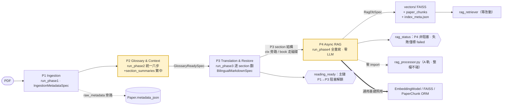
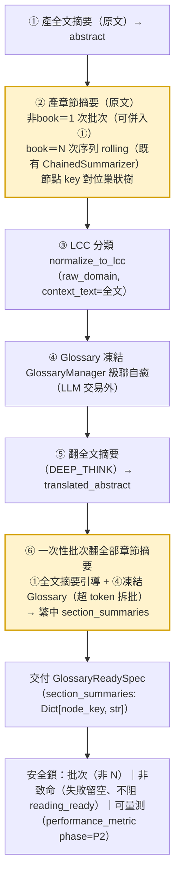
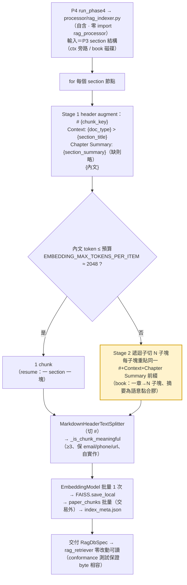

# RAG-ASYNC P4 RAG 索引共用真理源與全 P2 Section Summary plan v2

> 定義 PIPE 大改版 Phase 4（Async RAG）的共用真理源化規格：B 軌**全重寫**自有 RAG 索引引擎（零依賴 A 軌 `rag_processor`），依 P3 結構自生 Strategy B 摘要增強型分塊 markdown + **size-cap 二段子切**；section summary 收斂為**統一 P2 六步流程**同步產出（全五路通用、單一節點摘要欄、繁中、批次翻譯）。同步更新 PIPE-SPEC 與母 plan v10。首落地 resume，修復 B 軌 P4 `chunks=1` 退化並修正 A 軌 header-only 無 size-cap 之潛在弱點。本 plan 為純規格定義、不含 commit 拆分。

---

## §0 改版規則

- 改版觸發：§1–§7 任一規格條款變動 → 直接修改對應章節 + §99.2 加 Revision 紀錄
- 完整治理規格 → §99

---

## §1 TL;DR（概要）

- **挑戰**：B 軌 ResumePipeline P4（影子實測）對 13358 字元履歷只切出 **1 個 chunk**（`est_tokens=11997`），RAG 召回粒度崩潰（A 軌同文件 24 chunk）。根因＝切塊器 `MarkdownHeaderTextSplitter([("#","Header")])` 只切 `#`，B 軌 P4 直接餵 reading-view `final_zh.md`（HEADING-HOTFIX 後 section 皆 `##`、唯一 `#` 為 META header）→ 整份塌成 1 塊。此實作偏離 PIPE-SPEC §1.4（每 chunk `# {chunk_key}` + 摘要增強）與母 plan R4.3（RAG 輸入＝P3 結構），屬 PIPE-RESUME C5「最小暫行首落地」未竟之 RAG-ASYNC 規格。另查得 A 軌切塊**無 size-cap 二段切**（`rag_processor.py:231-233` header-only）→ 書籍一章一個 `#` 將塌成超大 chunk（同款病、per chapter），為潛在弱點。
- **解法**：P4 升格為與 P2（DomainNormalizer/GlossaryManager）、P3（Translator）對稱的**共用真理源模組**——新建 B 軌**完全自有**的 RAG 索引引擎（**零 import `processor.rag_processor`**、A 軌整檔不碰），依 P3 section 結構**自生** Strategy B 摘要增強型分塊 markdown（每節點 `#` + `Context:` + `Chapter Summary:` + 內文），並加 **size-cap 二段子切**（超 embedding token 預算之大節點遞迴子切、每子塊重貼 augmentation 前綴），交既有共用基建（`EmbeddingModel`/FAISS/`PaperChunk` ORM）落庫、吐凍結 `RagDbSpec`。Strategy B 所需 `section_summary` 收斂為**統一 P2 六步流程**（全五路同形狀、單一節點摘要欄、繁中、批次翻譯），衍生語境內聚 P2（§U2）。
- **影響**：① 新增 B 軌 P4 索引模組（建議 `processor/rag_indexer.py`，完全自含）；② `pipelines/contracts.py` `GlossaryReadySpec` 以**單一節點摘要欄 `section_summaries`** 取代 Book 專用 `chapter_summaries`（五路通用）；③ `pipelines/resume_pipeline.py` `run_phase2`（統一六步、產 section_summaries）/`run_phase4`（改呼自有模組、移除 `rag_processor` import）改寫；④ **規格文件**：PIPE-SPEC §1.1②/§1.4/§1.3 + 母 plan v10 §U2/§U6 同步（含順手修 SPEC §1.3 resume P3「100% Bypass」doc-drift）；⑤ 輸出側 `vectors/` FAISS + `paper_chunks` schema + `index_meta.json` + `rag_retriever` 檢索端 **零改動**（凍結 ④ 合約，以 conformance 測試保證 B 軌全重寫輸出 byte 相容）。

---

## §1.5 流程圖

### 圖 A — 四 Phase 資料流與 A/B 軌切割（本任務動 P2/P4，灰底）



### 圖 B — 統一 P2 六步流程（全五路同形狀；②/⑥ 批次、非致命、可量測）



### 圖 C — P4 Strategy B + size-cap 二段子切（B 軌 rag_indexer 自有、零 LLM）



---

## §2 目標規格

> 「最終狀態」目標,可量化檢驗;不含 commit 拆分（屬 tasks 階段）。

### U1. P4 升格共用真理源、B 軌全重寫、A 軌整檔不碰
- 新建 B 軌**完全自有**的 RAG 索引引擎模組（建議 `processor/rag_indexer.py`，與 `domain_normalizer.py`/`glossary_extractor.py`/`translator.py` 同層定位），五路策略共用、首落地 resume。
- 模組**自含** chunk-md 生成 + chunk 過濾（門檻 ≥3 + email/phone/url 保護邏輯，自實作、不沿用 rag_processor）+ split→filter→embed→FAISS→paper_chunks→index_meta 編排。
- **零 import `processor.rag_processor`**（grep `rag_processor` 於新模組 + `pipelines/` 命中 = 0）。
- **通用基建照用、不算耦合**：`config.EmbeddingModel`（embed API client、MODEL-11）、`models.PaperChunk` ORM、FAISS 函式庫、langchain splitter——皆框架/基建、非 A 軌業務邏輯。
- **A 軌 `processor/rag_processor.py` 整檔零改動**（不抽 helper、不重構；A 軌 frozen-until-Flip，保 golden 參考實作零 regression 風險）。

### U2. P4 依 P3 結構自生 Strategy B + size-cap 二段子切
- P4 輸入＝**P3 的 section 結構**（P3 譯後 section 樹，經 `ctx` 旁路傳遞；大文件分流見 D4），**不再餵 `final_zh.md` 閱讀 markdown**（對齊母 plan R4.3）。
- **Stage 1（header augment）**：每節點生成分塊前綴，格式對齊 PIPE-SPEC §1.4 Strategy B：
  ```markdown
  # {chunk_key}
  Context: {doc_type} > {section_title}
  Chapter Summary: {section_summary}

  {chunk_content}
  ```
  每 chunk 以單 `#` 起首，使 `MarkdownHeaderTextSplitter([("#","Header")])` 切得開。`section_summary` 缺失時降級為無 `Chapter Summary:` 行。
- **Stage 2（size-cap，修 A 軌弱點）**：若節點內文超過 embedding 單段 token 預算（`EMBEDDING_MAX_TOKENS_PER_ITEM`，MODEL-11、預設 2048）→ 內文遞迴子切為多塊，**每子塊重貼同一 `# {chunk_key}` + `Context:` + `Chapter Summary:` 前綴**（保每子塊攜帶節點級語意脈絡）。
- **量化驗收**：
  - resume 影子（13358 字元、8 section）：chunks 由 **1** 回升至**與 A 軌同量級**（≥ 20、對標 A 軌 24）；不觸發 Stage 2。
  - book 影子（大章）：觸發 Stage 2、**無 `embedding_oversized_item` warning**、chunk 數 ≈ 章數 × 子切倍數。

### U3. 統一 P2 六步流程（全五路同形狀、單一節點摘要欄、繁中）
- `GlossaryReadySpec` 以**單一節點摘要欄 `section_summaries`**（五路通用）取代 Book 專用 `chapter_summaries`；型別承載「節點 → 摘要」對應（key＝section_key/path，對位巢狀樹）。
- **P2 六步流程（全路統一形狀，見圖 B）**：
  | 步 | 內容 | 非 book | book |
  |---|---|---|---|
  | ① | 產全文摘要（原文）→ `abstract` | 1 次（可與②併呼） | 既有 |
  | ② | 產章節摘要（原文）| **1 次批次**（節點獨立、可併入①；超 token 拆批） | **N 次序列 rolling**（敘事依賴、既有 ChainedSummarizer、非新增成本） |
  | ③ | LCC 分類（`normalize_to_lcc`）| 既有 | 既有 |
  | ④ | Glossary 凍結（`GlossaryManager`）| 既有 | 既有 |
  | ⑤ | 翻全文摘要（DEEP_THINK）→ `translated_abstract` | 既有 | 既有 |
  | ⑥ | **以全文摘要引導、一次性批次翻全部章節摘要 → 繁中 `section_summaries`** | **1 次批次**（超 token 拆批） | **1 次批次**（同左） |
- **安全鎖**：
  - **批次（取代並行）**：⑥ 為單批次呼叫（正常文件 1 次、超 token 預算才拆批），成本有界 ~2 次 LLM（非 N 次），非 book 淨增可壓至 ~1 次。
  - **非致命**：②/⑥ 任一失敗 → 該節點留空摘要、chunk 降級為無 `Chapter Summary:` 行、**絕不阻 `reading_ready`**、不拋例外。
  - **可量測**：P2 新增 summary 開銷有 `performance_metric` 埋點（`event=performance_metric`、`phase=P2`、可辨識 stage），影子 E2E 量出 P2 增量。
- **繁中**：`section_summaries` 為繁中（與 chunk 內文/RAG query 同語系、召回最佳；術語經 ④ 凍結 Glossary + ① 全文摘要引導與 P3 正文翻譯對齊）。

### U4. P4 零 LLM、Embedding 僅 P4 一次
- P4 索引模組**不含任何 LLM 呼叫**（summary 已在 P2 備妥、P4 純消費）。
- Embedding 僅 P4 批量一次（沿用 `config.EmbeddingModel`）；P1/P2/P3 **零 Embedding 呼叫**（P2 section summary 為 LLM 文字生成、非 embedding，不計）。
- 字元門檻 resume **≥3**、含 `email`/`phone`/`url` 之 chunk 不論長度保留（門檻邏輯由新模組自實作、語意等價）。

### U5. 凍結 ④ 合約零退化 + conformance 測試
- P4 仍交付 `RagDbSpec`（既有欄位 `vectors_path` 等不變、`extra='forbid'` 不破）。
- 物理產出 `vectors/`（`index.faiss`/`index.pkl`）+ `paper_chunks` 表 + `index_meta.json`（`model`/`dim`/`chunks_total`）+ 距離策略（`MAX_INNER_PRODUCT`）與既有 **byte 相容**。
- **conformance 測試**（全重寫之代價護欄）：以 B 軌新模組產出的 vector store 餵 `rag_retriever.load_vector_store`，驗證讀得出、召回正常、index_meta 鍵齊全、paper_chunks 欄位齊全。
- `paper_db_id` 為 None 時維持優雅降級（僅 FAISS + index_meta、跳過 paper_chunks）。

### U6. 規格與母計畫同步（文件交付物）
- **PIPE-SPEC §1.1②**：`GlossaryReadySpec` 以 `section_summaries`（五路通用節點摘要、產出位置＝P2）取代 `chapter_summaries`。
- **PIPE-SPEC §1.4**：chunk 格式 `Chapter Summary` 來源＝P2 `section_summaries`；Embedding 流程之「物理分塊」更正為「P4 依 P3 結構自生 RAG md + size-cap 二段子切」（非閱讀 md、非 header-only）。
- **PIPE-SPEC §1.3**：resume（及五路）P4 欄補「RAG md 由 P4 依 P3 結構自生」；**順手更正 resume 列 P3「100% Bypass 一鍵」→「逐 heading section 翻譯 + 退化 fallback」**（修 RESUME-P3 落地後未同步之 doc-drift）。
- **母 plan v10 §U2/§U6**：§U2 明文「RAG 所需 section summary 歸 P2 同步產（統一六步流程、衍生語境內聚）」；§U6「P1/P2/P3 零 Embedding」措辭修正為「零 Embedding 呼叫；P2 section summary 屬 LLM 文字生成（非 embedding）、批次有界、非致命、不阻 `reading_ready`」。
- 上述各文件於 §99.2 加 Revision 條目（留追溯，記變更與依據）。

---

## §3 現況與證據

- **`processor/rag_processor.py`**：
  - 切塊 `L231-233`：`headers_to_split_on = [("#", "Header")]` + `MarkdownHeaderTextSplitter` → **只 header-split、無 size-cap 二段切**（書籍大章塌成超大 chunk 之潛在弱點）。
  - `_generate_markdown L600` / `L587/L695 f"# {key}"`：A 軌每節點 `#` 渲染（→ A 軌多 chunk 之源；B 軌自有等價物取代、不沿用）。
  - `_create_vector_store L201` / `_is_chunk_meaningful L41` / `_write_paper_chunks_to_db L305` / `write_index_meta_json L92`：A 軌索引流程（B 軌全重寫、不 import）。
- **`pipelines/resume_pipeline.py`**：
  - `L72-73`：`from processor.rag_processor import RagProcessor`（B 軌咬 A 軌耦合點、待砍）。
  - `run_phase4 L799-`：`① 唯一輸入＝ctx.bilingual.final_zh_path` → `L833 RagProcessor()._create_vector_store(final_zh_path,…)`（餵閱讀 md 之 bug 源）。
  - `_collect_render_slots L628 "level": min(2+depth,6)` → 頂層 `##`；`_render_meta_header L699 f"# {title}"`＝整份唯一 `#`（HEADING-HOTFIX 後狀態 → chunks=1 成因）。
- **`pipelines/contracts.py`**：
  - `GlossaryReadySpec L38-55`（`frozen, extra="forbid"`）：`abstract`/`lcc`/`glossary`/`translated_abstract`/`chapter_summaries:Optional[List[str]]=None`（Book 專用、待換 `section_summaries`）/`domain_name`。
  - `RagDbSpec L74-`（`frozen, extra="forbid"`）：`vectors_path: str` 等（P4 輸出凍結合約）。
- **`rag_retriever.py L68-75`**：`FAISS.load_local` / `index.faiss`——檢索端讀 `vectors/`、輸出格式硬合約。
- **`config.py L30 EmbeddingModel`** + MODEL-11 常數 `EMBEDDING_MAX_TOKENS_PER_ITEM=2048`（size-cap 門檻來源）：通用 embed 基建（非 A 軌）。
- **PIPE-SPEC §1.4**：Strategy B 格式（`# {chunk_key}` + Context + Chapter Summary）+ Embedding 七步。
- **PIPE-SPEC §1.3 L133**：`ResumePipeline | … | 100% Bypass 一鍵 | ≥3`（P3 doc-drift）。
- **母 plan v10 L54 §U6**（RAG 輸入＝P3 結構）/ `L57`（P1-P3 零 Embedding）/ `L18 §U2`（衍生語境內聚 P2）。

### §3.1 grep 鋼鐵證據

```bash
# 切塊只 header-split、無 size-cap（chunks=1 + 書籍超大 chunk 之根因）
grep -n 'MarkdownHeaderTextSplitter\|RecursiveCharacterTextSplitter\|chunk_size' processor/rag_processor.py
# 6:from langchain_text_splitters import MarkdownHeaderTextSplitter
# 232:        md_splitter = MarkdownHeaderTextSplitter(headers_to_split_on=headers_to_split_on)
#  （無 RecursiveCharacterTextSplitter / 無 chunk_size → 確認無二段 size-cap）

# B 軌 P4 咬 A 軌 + 餵閱讀 md
grep -n 'rag_processor\|RagProcessor\|final_zh_path' pipelines/resume_pipeline.py
# 73:from processor.rag_processor import RagProcessor
# 833:            RagProcessor()._create_vector_store(

# 合約現有欄位（chapter_summaries 待換 section_summaries）
grep -n 'chapter_summaries\|class GlossaryReadySpec\|class RagDbSpec' pipelines/contracts.py
# 51:    chapter_summaries: Optional[List[str]] = None

# 檢索端讀 FAISS（輸出格式硬合約、conformance 測試標的）
grep -n 'FAISS.load_local\|index.faiss' rag_retriever.py
# 75:            store = FAISS.load_local(

# size-cap 門檻來源（MODEL-11）
grep -n 'EMBEDDING_MAX_TOKENS_PER_ITEM' settings.py
```

---

## §4 不可動清單

- [ ] `processor/rag_processor.py` **整檔零改動**（A 軌 frozen-until-Flip、golden 參考實作；B 軌全重寫不抽 helper、不碰它）。
- [ ] `rag_retriever.py` 全檔（檢索演算法、`load_vector_store`、距離策略）——讀端零改動。
- [ ] `vectors/` FAISS 物理格式（`index.faiss`/`index.pkl`）+ `index_meta.json` schema（`model`/`dim`/`chunks_total`）+ `models.PaperChunk` 表結構——凍結 ④ 輸出合約（B 軌重寫須 byte 相容、以 conformance 測試保證）。
- [ ] `config.EmbeddingModel` Embedding 機制（模型/維度/L2/批次/`EMBEDDING_MAX_TOKENS_PER_ITEM`）——沿用不改（MODEL-11）。
- [ ] `RagDbSpec` 既有欄位與 `frozen=True, extra="forbid"`——P4 輸出合約不變。
- [ ] A 軌 `pipeline_core.py` 對 RAG 的調用——不動（A 軌留存至 Flip）。
- [ ] resume P1（`run_phase1`）/ P3（`run_phase3` 翻譯品質/結構/層級）既有交付——本任務僅動 P2（統一六步、加 section_summaries）與 P4；P3 翻譯輸出不退化。
- [ ] `processor/translator.py`/`domain_normalizer.py`/`glossary_extractor.py`——既有簽名不變。
- [ ] 主 repo 目錄（worktree 父目錄）——嚴禁讀寫（CLAUDE.md §3）。

---

## §5 規格依據

| 依據名稱 | 來源位置 |
|---|---|
| PIPE 母計畫（§U2 衍生語境內聚 P2 / §U6 RAG 解耦 / 五路 P4 門檻） | `baton/2026-06-01_PIPE_PipelineCore流程重構大改版_plan_v10.md` |
| PIPE-SPEC（§1.1② 合約 / §1.3 五路表 / §1.4 RAG Schema + Strategy B / §2.4 R4.x） | `baton/2026-06-01_PIPE-SPEC_PipelineCore流程重構架構_specification.md` |
| PIPE-RESUME 落地基準（P1-P4 目標規格、§U5 P4 ≥3） | `plans/2026-06-01_PIPE-RESUME_ResumePipeline策略管線_plan_v1.md` |
| RESUME-PERF-1（P3 ThreadPool 受限並行 + section 樹/slots 結構） | `plans/2026-06-06_RESUME-PERF-1_run_phase3逐section翻譯並行化_plan_v1.md` |
| MODEL-11（`EMBEDDING_MAX_TOKENS_PER_ITEM=2048` size-cap 門檻 / 真批次 / task_type） | `plans/2026-06-06_MODEL-11_Embedding模型換用gemini-embedding-001與真批次_plan_v1.md` |
| TRANSLATE-BOOK（book P2 滾動章節摘要 ChainedSummarizer、150-300 tokens/章） | `baton/2026-06-01_TRANSLATE-BOOK_書籍並行翻譯與雙語故事板引導_plan_v7.md` |
| logging SOP（logger.error 須 exc_info=True） | `ref/WORKFLOW_SOP.md §5.1` |
| database SOP（無裸 commit、Embedding/LLM 交易外） | `ref/WORKFLOW_SOP.md §5.2` |
| 專案進度管控框架（plan-execution 雙軌、不可動清單、Open Questions） | `ref/PROJECT_PROGRESS_CONTROL_FRAMEWORK.md` |

---

## §6 驗證計畫

### §6.1 自動化單元測試

- **既有測試執行**：
  ```bash
  venv/bin/python -m pytest tests/ -q
  ```
- **預計新增的測試**（落點：新模組測試檔 + `tests/test_resume_pipeline.py`）：
  1. **多塊切分**：N 個 section 的結構 → 新模組 RAG md 經 splitter 切出 ≈ N 塊（每 section 一 `#`）。
  2. **Strategy B 格式**：chunk 含 `# {chunk_key}` + `Context:` + `Chapter Summary:` + 內文；summary 缺失自動降級為無 `Chapter Summary:` 行、仍可切。
  3. **size-cap 子切**：超 `EMBEDDING_MAX_TOKENS_PER_ITEM` 之大節點 → 子切多塊，**每子塊重貼同一 `#`+Context+Chapter Summary 前綴**；小節點不觸發。
  4. **門檻 ≥3 + 結構化保護**：短技能詞（`Go`/`C++`）保留；含 email/phone/url chunk 不論長度保留。
  5. **統一 P2 六步**：resume `run_phase2` 產 `section_summaries`（key 對位 section）；②/⑥ 批次（非 N 次）；⑥ 以全文摘要為引導。
  6. **非致命**：某 section summary 拋例外 → 該段留空、`GlossaryReadySpec` 仍交付、不拋。
  7. **P4 零 LLM**：spy 確認 `run_phase4` 無 LLM client 呼叫。
  8. **零耦合**：`grep rag_processor`（新模組 + resume_pipeline.py）命中 = 0。
  9. **④ 合約 conformance**：B 軌產 vector store → `rag_retriever.load_vector_store` 讀得出 + 召回正常 + index_meta/paper_chunks 欄位齊全；`paper_db_id=None` 降級僅 FAISS。
  10. **全套件不退化**：`pytest tests/` 綠（僅既知 env flake）。

### §6.2 手動端到端（E2E）驗證流程

1. `SHADOW_LAUNCH_ENABLED=true` 影子上傳 DeHunt 履歷。
2. P4 log：**`chunks_total` ≥ 20**（從 1 修回；對標 A 軌 24）、不觸發 size-cap。
3. `[retrieve]` 五條固定 query 分數分布正常（非單塊命中；對照 golden D3）。
4. P2 `performance_metric`：量 section summary（②+⑥ 批次）新增之 P2 耗時、評估 `reading_ready` 延遲可接受性（安全鎖 3）。
5. 注入 summary 失敗模擬 → 確認 chunk 降級無 `Chapter Summary:` 行、`reading_ready` 不阻（安全鎖 2）。
6. （book pipeline 落地後）book 影子 → 觸發 size-cap、**無 `embedding_oversized_item` warning**、chunk 數 ≈ 章數 × 子切倍數。
7. Golden D3：resume 重捕後召回不退化（容差 ≥ 0.90；baron 運維重捕）。

---

## §7 已定案紀錄與待調實作參數

> 原 v1 §7 Open Questions 經七輪設計討論全數定案；本節改為「定案紀錄（不可逆設計決策）+ 待調實作參數」。

### §7.1 已定案紀錄（七輪討論收斂）

| # | 議題 | 定案 | 依據 |
|---|---|---|---|
| D1 | 節點摘要欄位結構 | **單一節點摘要欄 `section_summaries`**（section≡chapter 同為文件樹節點、僅命名/粒度別）；`chapter_summaries` 併入廢除 | section/chapter 文件架構同構；List/Dict 之分屬實作不應上升為合約之分 |
| D2 | summary 語言與產出階段 | **繁中、P2 產**（非 P3）；**統一 P2 六步流程**全五路同形狀 | chunk 內文/query 皆繁中召回最佳；② 產 book 因敘事須 rolling、其餘批次；⑥ 翻全路批次。P2/P3 同屬阻塞主鏈、放 P2 不劣於 P3 且衍生語境內聚（§U2） |
| D3 | 與 rag_processor 關係 | **B 軌全重寫、零 import、A 軌整檔不碰**；通用基建（EmbeddingModel/ORM/FAISS）照用 | A 軌 frozen-until-death，抽 helper 須改 golden 參考實作＝regression 風險；重複為暫時且 A 軌不維護。代價＝④ 輸出 conformance 測試 |
| D4 | P4 輸入形態 | **P3 section 結構經 ctx 旁路**（小文件）/**磁碟 translate JSON**（book 等大文件、釋放記憶體）；**不再餵 final_zh.md** | slots/樹本就在 P3 記憶體、傳參考零複製；book 大樹 + 非同步 P4 有記憶體壓力故磁碟分流 |
| D5 | chunk 大小（書籍） | **Strategy B + size-cap 二段子切**：大節點超 `EMBEDDING_MAX_TOKENS_PER_ITEM` 遞迴子切、每子塊重貼 augmentation 前綴 | A 軌 header-only 無 cap、書籍一章塌超大 chunk；全重寫順手修。summary 為大章子塊的語意黏合膠 |
| D6 | 首落地範圍 | **合約欄 + rag_indexer 模組＝五路通用、現落**；**section_summaries production＝僅 resume**（其餘四路 pipeline 未建、隨各自 PIPE-N 跟上） | 五路僅 resume pipeline 存在，production 無他檔可落、現實逼定 |
| D7 | 修 SPEC §1.3 P3 doc-drift | **是、一併修**（§2 U6 納入） | 「規格因實務同步」原則；修 SPEC 本就要動 §1.3、順手成本趨近零 |

### §7.2 待調實作參數（tasks/實作階段定，非設計分岔）

| 參數 | 候選 | 推薦 |
|---|---|---|
| size-cap 子切觸發門檻 | `EMBEDDING_MAX_TOKENS_PER_ITEM`（2048）vs 留 margin（如 0.9×2048） | 留 ~10% margin 防 token 估值誤差致 oversized；實作量測微調 |
| size-cap 子切 overlap | 0 vs 小重疊（如 ~50 token） | 小重疊保跨子塊語意連續、利召回；值待實測 |
| ⑥ 批次翻譯拆批門檻 | 單批上限（節點數 or 累計 token） | 沿用 MODEL-11 token-aware 封批精神（累計 token 上限）；正常文件仍單批 |

---

## §99 治理規格與 Revision

### §99.1 治理規格表

| 維度 | 內容 |
|---|---|
| **目的** | 定義 RAG-ASYNC（P4 RAG 索引共用真理源 B 軌全重寫 + 統一 P2 六步 section summary + size-cap 子切）的目標規格,作為後續 tasks 拆分與原子執行的唯一基準 |
| **用途** | 供 baron 審查並在 tasks.md 拆分時引用;Antigravity 階段 3 驗證時引用 |
| **權威源** | 本檔 §1–§7 |
| **引用方** | 後續 RAG-ASYNC tasks / 執行報告 |
| **被引用方** | <由 Antigravity 自動掃描注入> |
| **約束事項** | 嚴禁含 commit 拆分（屬 tasks 階段）;規格變更須同步 PIPE-SPEC/母 plan 並記 Revision;輸出 ④ 合約與檢索端為硬約束、以 conformance 測試保證 byte 相容 |
| **改版觸發條件** | §1–§7 任一規格條款變動 |
| **改版規則** | 直接修改對應章節 + §99.2 加 Revision 紀錄 |
| **刪除條件** | 任務全部完成,經 baron 同意且歸檔至 archive/ |
| **重複防護** | 僅定義技術規格;工作目錄/流程規格引用 CLAUDE.md / WORKFLOW_SOP.md;P4 輸出格式唯一真理源在 PIPE-SPEC §1.4 ④ |

### §99.2 Revision 歷程

- **v2 (2026-06-07)**：七輪設計討論定案 + 加 §1.5 **mermaid 流程圖**（圖 A 四 Phase 資料流與 A/B 軌切割 / 圖 B 統一 P2 六步 / 圖 C P4 Strategy B + size-cap 子切）。① D1 單一節點摘要欄 `section_summaries`（取代 chapter_summaries）；② D2 統一 P2 六步流程（全路同形狀、繁中、② 產 book rolling/其餘批次、⑥ 全路批次翻、全文摘要引導）；③ D3 B 軌**全重寫**零 import rag_processor、A 軌整檔不碰、通用基建照用、加 ④ conformance 測試；④ D4 P4 輸入 ctx 旁路（小）/磁碟 JSON（book）；⑤ D5 **size-cap 二段子切**（修 A 軌 header-only 無 cap、書籍超大 chunk 弱點）；⑥ D6 production 僅 resume 首落地、合約+模組五路通用；⑦ D7 修 SPEC §1.3 P3「100% Bypass」doc-drift。§2 目標規格 U1-U6 全面改寫；§7 由 Open Questions 改為「定案紀錄 D1-D7 + 待調實作參數」。（v2 原檔誤刪、本次重建並補流程圖。）
- v1 (2026-06-07)：初版建立。依據 chunks=1 根因盤點 + SPEC §1.4/R4.3 核對 + P1-P3 一致性盤點（P3 doc-drift）；提出 P4 共用真理源 + Strategy B + 全 P2 summary 雛形 + 七項 Open Questions。
