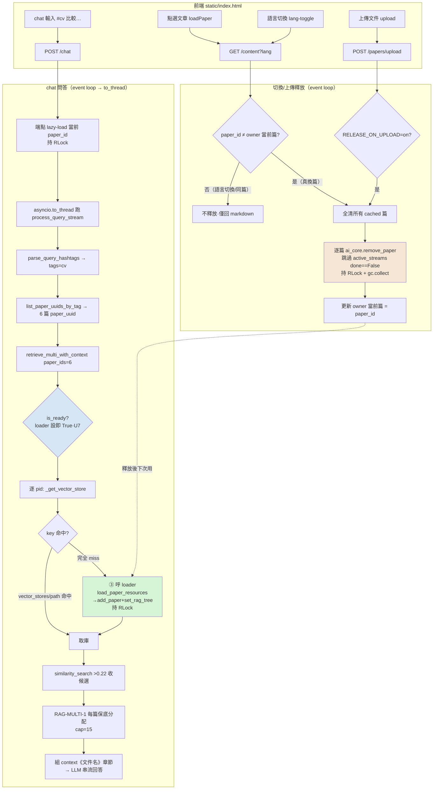

# LAZYLOAD-MULTI-1 跨文件 lazy-load 接縫修復與記憶體釋放策略 · plan v5

> 工作流類別：**BE-Refactor**（改 rag_retriever / ai_core / web_server / settings 業務邏輯）
> 必讀 SOP：logging_SOP + database_SOP（§5 SOP 核查）
> 跨模組 + handoff（loader callback + rag_tree 重載 + 釋放跳過活躍串流 + cache 鎖）→ WORKFLOW_SOP §7（見 §4）

---

## §0 改版規則
- 改版觸發：§2 / §4 / §9 任一變動 → 改章節 + §99.2 加 Revision
- 多輪 review（§1.9）：v1 → v2 Antigravity → v3 Antigravity → v4 合併(baron 釋放決策+Claude P0 鎖+校正) → **v5 三軸深 review（前端互動/資料傳導/記憶體）+ mermaid 流程圖**

---

## §1 TL;DR（概要）

跨文件 hashtag 檢索（`#cv 比較…`）只召回「當前開著那一篇」、漏其餘 tagged 篇 → 答案誤判「只有一位候選人」。**根因＝ API-PERF C3 廢啟動 preload、chat 端點只 lazy-load「當前 paper_id」,但 `retrieve_multi` 需「全部 tagged 篇」已註冊**；未註冊者 `_get_vector_store` 回 None → `rag_retriever.py:260` 靜默 `continue` 跳過。

**修法（baron 拍板）**：
1. **③ retriever 自帶 lazy-load hook**（`_get_vector_store` 完全 miss 呼注入 loader 自載；一鎖點修單篇/多篇/attach）。
2. **`is_ready()` loader-aware（U7）** + **cache mutation 持鎖（U8·RLock，與 DB 連線安全兩層）**。
3. **釋放策略**：cap 5→**100** + **切換文章釋放（僅實際換篇）** + **上傳釋放（`RELEASE_ON_UPLOAD`=on）**；砍 60min TTL；釋放=全清（唯一豁免 active_streams 仍生成者）+ **`gc.collect()`**。

**非本任務**：RAG-MULTI-1 演算法（已落地）；embedding/regen（28 篇全 `-001`）。

---

## §1.2 作業流程圖（mermaid）

> 綠＝③ 自載咽喉（本任務核心）；橘＝釋放（全清+跳過串流+鎖+gc）；藍＝is_ready loader-aware 防繞過。

---

## §2 目標規格（baron 已拍板項）

| # | 規格 | 狀態 |
|---|---|---|
| U1 | `RagRetriever` 加 `set_loader(fn)`；`_get_vector_store` 完全 miss 且 loader 設時自載重試；loader 未設＝現況回 None | 拍板（③）|
| U2 | web_server 啟動接線 `set_loader(λ o,p: load_paper_resources(OUTPUT_DIR,o,p,ai_core))`；retriever 不 import paper_manager（存不透明 callable） | 拍板 |
| U3 | `#cv…` 經 ③ 後 retrieve_multi 涵蓋全 tagged 篇；**重載後 `paper_title` 非空** | 拍板（核心驗收）|
| U4 | `RAG_MAX_CACHE` 5→**100**（env 可覆寫） | 拍板 |
| **U5（v5 改）** | 釋放時機：**(a) 切換文章**（`GET /content` **且 `paper_id ≠ owner 當前篇`**——避語言切換誤放，見 §3.5 F1）+ **(b) 上傳**（`POST /upload`、`RELEASE_ON_UPLOAD`=on）；砍 60min TTL。**釋放對象＝所有 cached 篇，唯一豁免＝active_streams `done==False`**（當前篇亦清、③ 重載）。釋放＝全清（複用 `ai_core.remove_paper`）**＋ 釋放後 `gc.collect()`**（促 FAISS C++ 記憶體歸還 OS、騰給 MinerU，見 §3.6 M1） | 拍板 |
| U6 | 釋放後正確性靠 ③ 自載（重載 vector + rag_tree、不回空、title 不退化） | 拍板 |
| U7 | **`is_ready()` 改判 loader 已設即 ready**（全清後 paper_vector_paths 空、原回 False 繞過 ③） | 拍板 |
| U8 | in-memory cache mutation **全程持鎖**（`RagRetriever` RLock 包三 dict 全 mutation；`ai_core._paper_cache` 同理）。**涵蓋兩條載入路：chat 端點 L800（event loop）＋ retrieve_multi ③ 自載（to_thread worker）**——同進程跨執行緒、RLock 跨緒有效。與 DB 連線安全（§3.1⑥）兩層 | 拍板（正確性）|
| U9 | 釋放必跳過 `active_streams` 活躍 paper（`done==False`）→ 不抽進行中 SSE 串流 | 拍板（硬規格）|

---

## §3 現況與證據

### §3.1 grep 鋼鐵證據

**① 根因**（`web_server.py:797-802`）：chat 端點只 `load_paper_resources(...paper_id...)` 當前一篇。
**② 跨文件靜默跳過**（`rag_retriever.py:258-261`）：`if vs is None: continue`；`_get_vector_store`(88-105) 兩層、缺第三層 miss 回 None＝③ 補。
**③ loader 含 tree 補載**：`load_paper_resources`(457)→`load_paper_cache`(466)→`set_rag_tree`(ai_core.py:103)。⚠️ 第二層（path 命中只重載 FAISS）不補 tree → 釋放 tree 留 path 致 title=""→ U5 全清強制 loader 全載。
**④ is_ready 繞過**（rag_retriever.py:111-113）：`is_ready()=bool(paper_vector_paths)`；retrieve_multi 開頭 `if not is_ready(): return ""` → 全清後繞過 ③ → U7 修。
**⑤ in-memory cache race（P0）**：`grep Lock` 全空；retrieve_multi 在 to_thread（web_server.py:124）；③ 後 add_paper 複合 mutation（`[key]=`+`move_to_end`+`popitem`）並發 → KeyError 窗 → U8 RLock。
**⑥ DB 連線 thread 安全（✅已解、與⑤兩層）**：`db.py:29 check_same_thread=False`+QueuePool+WAL+busy_timeout+唯讀；僅 DB 層、不替代 U8。
**⑦ active_streams 跳過依據**：`Dict[(owner,paper_db_id),StreamSession]`(L85)、`StreamSession.paper_uuid`(L826)、`.done`(134/146)→ 取活躍 uuid 集跳過。
**⑧ 線上 log**：`matched_papers=6` / `chosen=[14× YuLun_Wu_CV]`。
**⑨ 資料層健康**：28 篇全 `-001`；獨立載入 6 篇每篇 top 0.6-0.75 全 >0.22。

### §3.2 記憶體實測（du）
全 28 篇 ≈ **13 MB**（最大書 3.64MB，faiss 佔大頭）→ cap=100、釋放主導。

### §3.3 現有釋放機制（待改）
vector_stores/_paper_cache LRU cap5+gc；rag_trees/paper_vector_paths 永不淘汰（U5 全清根治）；`ai_core.remove_paper`(116-123) 全清四 dict（⚠️ docstring 寫「清對話」實未清、§9 P4 修）。

### §3.4 上傳場景
`POST /upload`(web_server.py:448)→ 同 VM MinerU Docker（重 RAM）；U5(b) 釋放騰 RAM、`RELEASE_ON_UPLOAD`=on。

### §3.5 前端互動證據（v5 新·F1）
- **切換文章**：`static/index.html` `item.onclick→loadPaper`(L2634)→`fetchContent`(L2678)→`GET /content`(L2698)。✅ 切換訊號真實。
- **⚠️ F1 語言切換也打 /content**：`lang-toggle.onclick`(L2761)→`fetchContent(currentPaperId,...)`(L2766) **同一篇**重抓。→ 無條件「打 /content 即釋放」會在**每次 zh/en 切換誤放當前工作集** → churn + 多餘 reload。**修：釋放僅在 `paper_id ≠ owner 伺服器側記錄之當前篇` 時觸發**（U5；server 記 owner→當前 paper_uuid，實際換篇才放；語言切換同篇 → 不放）。
- **✅ F2 /content 端點 display-only**：`web_server.py:735-749` 只 `md_path.read_text()`、**零 retriever/向量庫**→ 在此釋放對閱讀視圖無影響。

### §3.6 記憶體管理證據（v5 新）
- **M1 上傳釋放對 MinerU 的實效（誠實）**：FAISS 向量為 C++ 配置（每書 ~2.5MB 大宗）、`free` 後**歸還 OS** → 同 VM MinerU 容器可用；Python dict 層記憶體受 arena 碎片**未必即還 OS**（小量）。淨效：釋放主要回收 FAISS C++ 大宗、確有助 MinerU。→ **U5 釋放後 `gc.collect()`** 促即時回收（`remove_paper` 現未 gc、僅 LRU `_evict` 有）。
- **M2 ✅**：全清根治 rag_trees 永不淘汰漏。
- **M3**：F1 語言切換 churn 亦致記憶體抖動 → 「實際換篇才放」一併緩解。

---

## §4 跨 Phase 接縫契約（WORKFLOW_SOP §7）

| handoff | producer | consumer | key 精確身份 + 同基準保證 |
|---|---|---|---|
| lazy-load callback | web_server 啟動 `set_loader(λ o,p: load_paper_resources(...))` | `_get_vector_store` 完全 miss 呼 `self._loader(o,p)` | key＝`(owner_id, paper_uuid)`；consumer 之 `paper_id` ≡ retrieve_multi.paper_ids（源 list_paper_uuids_by_tag）≡ loader 寫回 paper_vector_paths key——同 **paper_uuid 原值、不轉換** |
| rag_tree 重載 | loader（已含 set_rag_tree）；釋放全清 | retrieve_multi L269 load_rag_tree 取 title | 同 paper_uuid；tree 與 vector 釋放/重載必同步；禁「evict tree 留 path」致 title="" |
| 釋放跳過活躍串流（P2） | 切換/上傳釋放端 | active_streams `done==False` 之 paper_uuid | 釋放前收活躍 uuid 集、逐篇 skip；釋放端與串流端同以 **paper_uuid**（非 db_id） |
| cache 鎖不變式（P0） | 所有 mutation（add/evict/自載/remove/端點 L800 load）| 所有 read | 同一 RLock；**管 in-memory dict、與 DB 連線安全正交**、不可互替 |
| **當前篇狀態（v5·F1）** | 切換釋放端記 `owner → 當前 paper_uuid` | 下次 /content 比對 | 同 owner 維單一「當前篇」；僅 `新 paper_id ≠ 記錄值` 觸發釋放（語言切換同篇不放）|

> 反例錨點：① sanitize 檔名 vs raw uuid → 自載仍 miss。② 釋放 tree 留 path → title 退化。③ 釋放用 db_id、串流用 uuid → 跳過錯位。④ 誤以 DB safe＝cache safe → 漏鎖。⑤（v5）無條件 /content 釋放 → 語言切換誤放。**凍結：paper_uuid 原值、全清四 dict+gc、跳過活躍 uuid、mutation 持鎖、is_ready loader-aware、釋放僅實際換篇。**

---

## §5 變動風險與相容性評估

| 風險 | 評估 | 緩解 |
|---|---|---|
| retriever 介面變動 | set_loader + 自載；loader 未設＝現況 | 向後相容、既有測試不破 |
| **P0 in-memory cache race** | ③ 寫推進並行 worker、OrderedDict 無鎖、複合 mutation KeyError 窗 | **U8 RLock 包全 mutation（含端點 L800 路）**；§8 並發測試 |
| is_ready 全清回 False 繞過 ③ | paper_vector_paths 空 | **U7 loader-aware**；§8 測試 |
| P2 切換抽掉進行中串流 | 釋放砍活躍串流向量庫 | **U9 跳過 active_streams**；§8 測試 |
| **F1 語言切換誤放當前工作集（v5）** | /content 同篇重抓也觸發釋放 | **U5 僅 `paper_id≠當前篇` 才放**（§3.5）；§8 測試 lang-toggle 不放 |
| rag_tree 釋放後 FAISS-only 路 title="" | 第二層不補 tree | U5 全清強制 loader 全載；§8 title 非空測試 |
| DB 連線 thread 安全（✅已解） | to_thread 唯讀查詢 | db.py 四層；僅此層、不替代 U8 |
| **M1 上傳釋放未必即還 OS（v5·誠實）** | Python dict arena 碎片不即還；FAISS C++ 會還 | **U5 釋放後 gc.collect()** 促回收；大宗 FAISS 確還、有助 MinerU |
| import/物件循環 | callable 注入；loader closure 環 | 啟動注入；GC 處理 |
| cap5→100 / reload I/O | 13MB 無虞、tagged 實務有界（§9 P3）| 切換+上傳釋放、③ 兜底 |
| docstring stale | ai_core.remove_paper 寫「清對話」實未清 | §9 P4 修註解 |

---

## §6 不可動清單

- [ ] `retrieve_multi_with_context` **保底演算法**（RAG-MULTI-1 C2）——只補「篇有沒有被載」、不碰分配。
- [ ] `retrieve_with_context` 單篇邏輯（除共用 `_get_vector_store` 鎖點/RLock 外）。
- [ ] context 格式 `## 摘自文件《…》` / 向量資料 / FAISS / index_meta（不重嵌）。
- [ ] embedding 模型 / RAG_SCORE_THRESHOLD / 上游 hashtag 解析。
- [ ] `/content` 端點 display 邏輯（只加釋放 hook、不改其讀檔回傳；§3.5 F2）。
- [ ] **shadow 過濾**——指不改 UI 可見性（list_papers/status）；非指 retrieve_multi 加過濾（shadow 應參與驗 B 軌）。
- [ ] **禁無鎖 mutate in-memory cache**（U8）。

---

## §7 規格依據（grep 行號）

- `web_server.py:797-802`（lazy-load 缺口）/ `:735-749`（content display-only）/ `:448`（upload）/ `:85,124,807-829`（active_streams/to_thread/409）
- `rag_retriever.py:88-105`（兩層）/ `:111-113`（is_ready）/ `:258-261`（跳過）/ `:269`（title）/ `:37-40`（LRU）/ `:49-67`（add_paper 含 _evict）/ `:115-121`（remove_paper）；`grep Lock` 全空
- `ai_core.py:94-103`（load_paper_cache→set_rag_tree）/ `:104-108`（_paper_cache LRU）/ `:116-123`（remove_paper·stale docstring）
- `static/index.html:2634`（loadPaper）/ `:2678,2697-2698`（fetchContent/GET content）/ `:2761-2766`（lang-toggle 同篇打 content·F1）
- `db.py:29,39-41,59-61`（thread 安全四層）/ `paper_manager.py:336,457-476` / `settings.py:65`（RAG_MAX_CACHE）

---

## §8 驗證計畫

### §8.1 自動化單元測試（新建 `tests/test_lazyload_multi.py`）
1. `test_get_vector_store_self_loads_on_miss` / 2. `test_..._loader_unset_returns_none`（向後相容）。
3. `test_retrieve_multi_loads_all_tagged`（**§7.2 整合**、只註冊 1/6、其餘自載 → 全 6 篇）。
4. `test_evict_then_reload_preserves_title`（全清→重載→title 非空）。
5. `test_is_ready_after_full_evict`（U7、全清+loader 設→is_ready True→不繞過）。
6. `test_concurrent_lazyload_no_corruption`（U8·P0、多 thread 自載+evict 無 KeyError）。
7. `test_release_skips_active_stream`（U9·P2、done==False 不清）。
8. **`test_release_only_on_actual_switch`（v5·F1、同 paper_id /content 不釋放、不同才放）**。
9. `test_release_on_upload_toggle`（RELEASE_ON_UPLOAD on/off）。
10. `test_cap_100_default` + env override。
- 全套件不退化。

### §8.2 手動 E2E（baron · PaperRead-Lab）
1. 重啟 → 直接 `#cv 比較這幾位候選人的學歷背景` → 涵蓋全 6 位 + 引用顯《文件名》非「(pid)」。
2. log 驗 chosen ≥5 種 pid。
3. **並發**：兩 paper 同時 `#cv` → 無 500/錯亂（U8）。
4. **串流不中斷**：跑 chat 串流時切到別篇 → 串流不斷（U9）。
5. **F1**：同篇切 zh↔en → **不觸發釋放**（log 無釋放）；換到別篇才釋放。
6. **上傳**：上傳 → 釋放 log + gc + MinerU 期間 RAM 降；之後問答正確（③ 重載）。
7. **shadow**：B 軌完成後 `#cv` → chosen 含 `_shadow` pid。

---

## §9 Open Questions（全定案）

| # | 問題 | 定案 |
|---|---|---|
| Q1 | 切換訊號 | `GET /content` **且 `paper_id≠owner 當前篇`**（語言切換同篇不放，F1）；釋放全清、豁免 active_streams |
| ~~Q2~~ | ~~TTL~~ | 砍 60min TTL |
| Q3 | 釋放含 rag_trees | 是、全清四 dict + gc |
| Q4 | cap+切換+上傳優先序 | cap100＝天花板；主力切換+上傳；皆 ③ 兜底 |
| Q5 | attach 走 ③ | 是 |
| Q6 | 拆 commit（**降低 AI 亂改風險**）| **5 commit**：C1 `rag_retriever.py`（set_loader+自載+is_ready+單元含整合）/ C2 `rag_retriever.py`+`ai_core.py`（**RLock 純硬化**+並發測試、行為不變）/ C3 `web_server.py` 啟動段+`settings.py`（接線+cap100、純加法→核心 LIVE）/ C4 `web_server.py` 端點+`ai_core.py` docstring+`settings.py`（釋放：content 換篇 gate+upload 開關+跳過 active_streams+gc+單元）/ C5 Checkout。**web_server 僅 C3 啟動段 + C4 端點段動、不同 function、hunk 不重疊** |
| Q7 | `RELEASE_ON_UPLOAD` | **on**（可關）|
| P3 | 廣 tag 上限 | 不設（實務有界）|
| P4 | stale docstring | C4 順手修 |

---

## §99 治理規格與 Revision

### §99.1 治理規格表
| 維度 | 內容 |
|---|---|
| 目的 | 修跨文件 hashtag 漏召（lazy-load 接縫）+ 併發安全 + 記憶體釋放策略 |
| 權威源 | §2 / §4 |
| 引用方 | tasks / executions（待產）|
| 不可動唯一源 | §6 |
| 改版觸發 | §2/§4/§9 變動 |

### §99.2 Revision 歷程
- **v5 (2026-06-10)**：三軸深 review + mermaid——**前端互動 F1**（/content 在語言切換同篇也打→ U5 改「僅實際換篇才釋放」、§3.5 證據、§4 handoff⑤當前篇狀態、§8 lang-toggle 不放測試）+ **F2**（/content display-only、釋放安全、§6 條目）；**記憶體 M1**（釋放後 gc.collect 促 FAISS C++ 歸還 OS 給 MinerU、誠實列 Python arena 不即還）+ M2/M3；**資料傳導**（U8 明訂涵蓋端點 L800 + 自載兩路、§4 鎖不變式補）；**§1.2 mermaid 全流程圖**（FE/釋放/chat 三子圖 + ③ 咽喉/釋放/is_ready 標色）
- v4 (2026-06-10)：合併——baron 砍 TTL+切換/上傳釋放+RELEASE_ON_UPLOAD+U9 跳過 active_streams；Claude P0 RLock(U8)；校正 DB≠cache 兩層；釋放語意鎖定；安全 5 commit 拆法
- v3 (2026-06-10)：Antigravity——U7 is_ready + DB thread 安全（v4 校正兩層）+ shadow 定調
- v2 (2026-06-09)：Antigravity——§4 rag_tree 重載 handoff + C2/C3 hunk 邊界
- v1 (2026-06-09)：初稿——根因 + 證據鏈 + 記憶體 13MB + ③ + cap100/切換+TTL + §4 + 六 OQ
