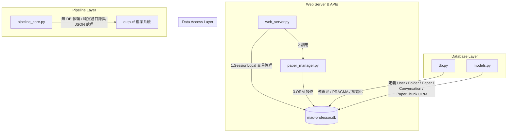

# Mad Professor SQLite 資料庫現況審查與未來擴展（MODEL-8 物理防線落地版）深度分析報告

> [!NOTE]
>   **當前基準 Commit 資訊** (最後更新時間: 2026-05-23)：
>   * **最新 Commit**: `6e764ea` — *feat(logging): LOGGING-3 - tools/regen_rag.py CLI 統一 setup_logging*
>   * **資料庫關鍵落地 Commit**:
>     * `16f62d4` — *feat(cli): MODEL-8 階段 C3 - tools/regen_rag.py CLI（6 子命令、含 cmd_init 反向導入）*
>     * `ab40fdc` — *feat(rag): MODEL-8 階段 C2 - rag_processor 寫入 paper_chunks + pipeline_core 注入 paper_db_id*
>     * `aeb42cb` — *feat(db): MODEL-8 階段 C1 - PaperChunk ORM + DAL helper + OUTPUT_DIR env*

本報告針對當前系統（Phase 1.6+ 與 MODEL-8 C1-C3 已完全落地階段）的資料庫設計、程式碼實作進行全面審查。以下對當前架構現狀、底層防禦機制，以及未來的**讀寫強化、Schema 版控、Docker 化、PostgreSQL 遷移與分布式 RAG** 等演進路徑進行深度分析，作為專案架構發展的權威文檔。

---

## §1 核心結論：這是「大改」還是「安全增量」？

> [!IMPORTANT]
> **結論：MODEL-8 物理防線的引進【完全不是大改】，而是一個極其安全、無縫相容、增量式（Additive）的架構擴充。**
> 
> 引進 `paper_chunks` 物理防線的本質是**在 SQLite 中新增一張子資料表**，將原先僅存在於外部 `*_tiled.json` 檔案中的 Markdown 原始文字（真理之源）永久固化於 DB 中。

### 為什麼這不是大改？
1. **完全不破壞既有表結構**：現有的 `users` (用戶)、`folders` (資料夾)、`papers` (論文) 與 `conversations` (對話紀錄) 四張表的欄位、資料與關係 **100% 保持不變**。
2. **零既有資料遷移成本 (No Data Migration)**：新增 `paper_chunks` 為一個全新的一對多（One-to-Many）子表。對於歷史上已上傳的舊論文，其 chunk 數據可為空，系統不會因缺少 chunk 記錄而崩潰，舊功能完全保持向下相容。
3. **免手動建表與 Schema 遷移 (Alembic-Free)**：本專案採用務實且輕量的建表機制。在服務啟動或初始化時，調用 SQLAlchemy 的 `Base.metadata.create_all` 即可自動在 SQLite 中建立新表，無須進行任何複雜的 SQL 遷移腳本編寫。

---

## §2 程式碼清查：資料庫當前調用現狀

經過全 codebase 審查，Mad Professor 目前的資料庫架構已經完成了 **Phase 1.3+ 全面資料庫化**，系統各模組的職責邊界極其清晰：



### 1. 連線與事務管理層 (`db.py`)
*   **功能定位**：負責資料庫引擎配置、高並發連線池管理及 SQLite 特性最佳化。
*   **關鍵底層機制**：
    *   **外鍵強制約束 (`PRAGMA foreign_keys=ON`)**：SQLite 預設不強制外鍵限制，`db.py` 在每次連線建立時透過 SQLAlchemy Event 強制開啟。這保障了 `papers` 被刪除時，其下的對話 (`conversations`) 以及 `paper_chunks` 能**自動觸發物理級級聯刪除 (Cascade Delete)**，絕不殘留髒資料。
    *   **高並發防寫鎖 (`PRAGMA journal_mode=WAL` & `busy_timeout=5000`)**：啟用 WAL (Write-Ahead Logging) 模式，允許多個讀取執行緒與單個寫入執行緒並行，並設置 5 秒超時鎖定等待，徹底防止 Pipeline 與對話同時操作資料庫時產生 `database is locked` 異常。

### 2. 資料模型定義層 (`models.py`)
*   **功能定位**：定義與資料庫 Table 對齊的 ORM 模型。目前共有五張核心表：
    *   `users`：儲存用戶密碼 Hash 與權限角色。
    *   `folders`：以自關聯（Self-Referential）結構實現無限層級資料夾樹。
    *   `papers`：論文元數據，包含 `metadata_json` (元數據緩存) 與 `original_filename` (原檔名)，但不存實體路徑（路徑由 owner_id 與 paper_uuid 動態計算）。
    *   `conversations`：對話紀錄，支援 `grounding_sources` 欄位以 JSON 格式儲存聯網搜尋來源。
    *   `paper_chunks`：文件切片物理防線表，儲存 Markdown 原始切片文字、Embedding 模型版本及維度。

### 3. 資料存取層 (DAL) (`paper_manager.py`)
*   **功能定位**：隔離底層 SQL/ORM 細節，為 Web Server 提供乾淨的業務 API。
*   **職責劃分**：
    *   **論文清單生命週期**：處理新增論文 (`add_paper`)、狀態變更 (`update_paper_status`)、資料夾搬移與物理刪除 (`delete_paper`)。
    *   **對話記錄管理**：處理歷史對話的加載 (`load_chat_history`) 與覆蓋儲存 (`save_chat_history`)、追加 (`append_chat_message`)。
    *   **切片數據讀寫**：批量寫入切片 (`replace_paper_chunks`，利用 SQLAlchemy 2.0 Bulk 寫入優化，耗時 < 50ms/千筆)、迭代讀取 (`iter_paper_chunks`)、與 check distinct JOIN (`list_papers_with_chunks`)。

---

## §3 物理防線已完工分析：MODEL-8 `paper_chunks` 落地回顧

在 `paper_chunks` 物理防線引入後，為系統在**穩定性、升級效率、混合檢索與翻譯成本控制**四個維度帶來了革命性的架構升級。

### 1. 物理防線表設計 (PaperChunk Schema 落地)
在 `models.py` 中新增 `PaperChunk` 類別，並與 `Paper` 建立一對多關聯：
* `chunk_index` (INT) 為物理序鍵，與 `paper_id` 構成 UNIQUE 約束。
* `raw_text` (Text) 存放 Markdown 原始文字（真理之源）。
* `embedding_model` 與 `output_dimensions` 用於後續版本 mismatch 自動偵測。
* `chunk_filter_version` 標註 Chunk Filter 邏輯版本，確保召回邏輯追溯。

### 2. 優化效益 A：0ms 免 PDF 重析自適應重跑 (Re-embedding)
*   **痛點**：一旦 Embedding 模型變更（例如從 `text-embedding-001` 升級為 `gemini-embedding-2`），因為 FAISS 向量特徵不相容，歷史論文全部作廢。為了重新向量化，必須從頭重跑 PDF 解析。然而，**MinerU PDF 解析是 CPU/GPU 密集型操作，對大型文檔或書籍需要耗時 30 分鐘至 1 小時，且極易崩潰。**
*   **架構升級**：
    1. 當檢測到模型變更時，後端啟動 `Re-embedding` 工作流。
    2. 系統**100% 跳過** PDF 解析與 Tiling 階段，直接從 SQLite 的 `paper_chunks` 表中讀取所有 `raw_text`。
    3. 調用 `EmbeddingModel.embed_documents` 進行批量向量化，重構 FAISS 索引。
    4. **耗時對比**：大文件重處理時間從 **30-60 分鐘驟降至 2-3 秒**，實現真正「無感」的熱升級自癒。
    5. **CLI 工具**：落地了 `tools/regen_rag.py` 增強型管理工具，支援 `--check` 掃描 mismatch、`--init` 從既有向量庫反向一次性導入 DB、以及 `--all / --paper` 重建嵌入。

### 3. 優化效益 B：譯文快取與成本防禦 (Translation Caching)
*   `PaperChunk` 設有 `translated_text` 欄位。當翻譯 Pipeline 完成後，將中文譯文寫回此欄位。
*   未來當用戶需要「重新生成對照 PDF」、「匯出 Markdown 譯文」或「調整對話介面顯示」時，系統**直接從 SQLite 讀取譯文快取**。
*   這形成了一道強力的財務防線，**100% 杜絕了對已翻譯內容重複調用 LLM 翻譯 API 的資源與資金浪費。**

---

## §4 交易安全與 Concurrency 進階強化

### 1. 交易範式優化：從 Commit 到自動回滾（Rollback Guard）
目前 `paper_manager.py` 中許多寫入函數的交易結構使用標準 `with db.SessionLocal() as s:` 配合 `s.commit()`。
* **潛在風險**：如果在 `s.commit()` 之前發生非預期異常（例如序列化 JSON 錯誤或資料庫斷線），Session 雖然會關閉，但 transaction 未顯式 rollback，可能會殘留未提交的交易鎖。
* **推薦改法**：後續開發應改用 SQLAlchemy 2.0 推薦的 `session.begin()` 上下文管理器，它會**自動在成功時 Commit、在異常時自動 Rollback**，寫法更簡潔且無漏洞：
```python
# 增強型寫法範例
with db.SessionLocal() as s:
    with s.begin():  # 自動處理 commit / rollback
        p = Paper(...)
        s.add(p)
```

### 2. 長時間交易阻斷防禦（Transaction Timeout）
當 RAG 進行大規模 PDF 批次 backfill 時，雖然 WAL 模式允許多個讀取，但 **SQLite 的寫入交易仍然是互斥且排隊的**。
* **推薦規範**：在寫入密集的 DAL helpers（如 `replace_paper_chunks`）中，不要在交易區間內進行任何網絡 API 調用（如 Gemini API 請求），保持交易時間極短，防範高載時出現寫入鎖超時。

---

## §5 系統 Schema 版控與升級方案（Alembic）

> [!WARNING]
> **當前系統最大的潛在技術債在於「缺乏資料庫版控機制（Migration Tool）」。**

### 1. 為什麼 `create_all()` 是生產環境的定時炸彈？
目前系統採用 `Base.metadata.create_all(bind=engine)` 來建表。其限制在於：
* 它**只會建立不存在的資料表**。
* 如果我們未來需要修改現有表結構（例如：加一個 `email` 欄位到 `User`、修改 `Paper` 的欄位長度、或是新增索引），`create_all()` **完全不會對現有的資料庫做任何事情**。
* 這會導致開發者或用戶升級系統後，因為 DB 沒有對應新欄位而發生 `OperationalError: no such column`。

### 2. 強化方案：引入 Alembic
* **整合 Alembic**：利用標準的 `alembic` 庫來追蹤與管理 SQLAlchemy 的 Schema 變動。
* **SQLite 批次修改支援（Batch Mode）**：
  * SQLite 由於底層架構限制，不支援許多標準的 `ALTER TABLE` 操作（如 Drop Column、Modify Column 等）。
  * 在配置 `alembic/env.py` 時，**必須強制開啟 `render_as_batch=True`**：
    ```python
    with context.begin_transaction():
        context.run_migrations(render_as_batch=True)
    ```
    這會讓 Alembic 在 SQLite 環境下自動使用「建立臨時表 -> 複製資料 -> 刪除舊表 -> 重命名」的安全 Workaround 流程。

---

## §6 Docker 化與雲原生部署的物理防線

### 1. 致命警示：禁止在網路檔案系統（NFS/EFS）上使用 SQLite WAL
在雲端環境部署多副本（Replicas）時，開發者為了讓多個 Pod 共享同一個 `mad-professor.db`，常會將其放在 **AWS EFS 或 NFS** 等網路掛載磁碟上。
* **崩潰根因**：SQLite 的 WAL 模式需要建立 `*.shm`（共享記憶體）檔案。**這個機制是透過 OS 的 `mmap()` 系統調用實現的，而在 NFS/EFS 等網路檔案系統上，`mmap()` 共享記憶體會直接失敗，或者 POSIX 檔案鎖反應極慢，這將 100% 導致資料庫瞬間損毀（Database Corruption）或無盡的死鎖。**
* **部署規範建議**：
  * **單機/單副本部署**：SQLite 檔案必須掛載在宿主機的**本地區塊儲存（如 EBS, 本地 SSD）**上。
  * **多節點高併發部署**：**必須一鍵切換至 PostgreSQL（Pg-Ready）**，嚴禁在多副本環境下掛載同一個 SQLite 檔案。

### 2. 容器持久化防線（Volume Persistency）
* **資料夾掛載統一**：目前 `OUTPUT_DIR` 已完成環境變數化。在 Docker 部署時，只需將單一實體卷掛載到 `/app/storage`，並設置環境變數：
  ```bash
  DATABASE_URL=sqlite:////app/storage/data/mad-professor.db
  OUTPUT_DIR=/app/storage/output
  LOG_DIR=/app/storage/logs
  ```
  這樣可以確保所有狀態（DB、PDF實體檔、向量庫、日誌）都在同一個實體卷中持久化，容器重啟 0 資料遺失。
* **無狀態解耦（MODEL-10）**：目前圖片抓取仍依賴 `scp` 命令與本機 SSH Key。在 Docker 容器內這會造成安全性漏洞。**MODEL-10（改為 HTTP API 簽名傳輸）必須是 Docker 化部署的高優先前置任務**。

---

## §7 未來遷移的終極演進路徑（PostgreSQL / 分布式 RAG 擴展）

若未來系統需要支撐「數萬篇文檔」、「多用戶高併發提問」或「多節點水平擴展」，從 SQLite 升級為 **PostgreSQL** 將是必經之路。

### 1. RAG 的終極瓶頸：從 FAISS 遷移至 pgvector（中央向量資料庫）
> [!CAUTION]
> **當前系統最大的分布式瓶頸不是 SQLite，而是 FAISS。**

* **瓶頸分析**：目前向量庫是作為扁平檔案（FAISS 檔案）儲存在本地磁碟目錄中。
  * 當有多個 Web Server Pod 時，每次查詢都必須去本機磁碟讀取這些 FAISS 檔案並加載到記憶體中。
  * 若檔案未掛載共享磁碟，Pod A 建立的向量庫，Pod B 根本讀不到。
  * 若掛載共享磁碟，讀取速度會受限於網絡 I/O，且高併發加載 FAISS 檔案會耗盡伺服器記憶體（OOM）。
* **未來遷移方案**：引進 PostgreSQL 的 **`pgvector`** 插件。
  * 新建一張 `paper_embeddings` 資料表，直接將向量與關聯資料表合二為一：
    ```sql
    CREATE TABLE paper_embeddings (
        id SERIAL PRIMARY KEY,
        paper_id INT REFERENCES papers(id) ON DELETE CASCADE,
        chunk_index INT,
        embedding vector(768), -- 對齊 gemini-embedding-2 的 768 維度
        raw_text TEXT
    );
    -- 建立 HNSW 索引以實現超高速向量檢索
    CREATE INDEX ON paper_embeddings USING hnsw (embedding vector_cosine_ops);
    ```
  * **效益**：Web Server 徹底變為**完全無狀態（Stateless）**；向量檢索直接由 PostgreSQL 完成，還能極其輕鬆地實現 **「跨文件混合檢索（BM25 + 向量）」** 與 **「基於用戶權限的 Row-Level Security 隔離」**。

### 2. 大檔案儲存的雲端遷移（LocalStorage to S3/GCS）
當走向多節點時，原始 PDF 和圖片無法存放在本地。
* **建議**：引入一個抽象的 `StorageProvider` 介面，在本地開發時使用 `LocalStorageProvider`，在雲端 Docker/K8s 生產環境一鍵切換至 `S3StorageProvider`（Amazon S3 或 Google Cloud Storage）。

### 3. PostgreSQL 連線池與 Keep-Alive 防禦優化
* **防禦優化**：在 `db.py` 中，針對 PostgreSQL 引擎，應配置環境變數動態調優連線池，啟用 `pool_size`、`max_overflow`，並設置 `pool_recycle=1800`（30分鐘自動回收，防止雲端 NLB 靜默切斷 TCP 連線），配合 `pool_pre_ping=True` 保障自癒能力。

### 4. 欄位類型優化：`JSON` 轉 `JSONB`
* 目前 `Conversation.grounding_sources` 欄位使用的是 SQLAlchemy 的 `JSON` 類型（SQLite 底層為 text）。
* **建議**：在遷移至 Postgres 時，將其指定為 **`JSONB`**（二進制 JSON），這能大幅提升 JSON 內容的檢索效能，並支援建立 GIN 索引。

---

## §8 其他安全性防禦與盲點

### 1. 安全線上備份機制（Safe Online SQLite Backup）
* **問題**：定時備份 SQLite 時，若直接 `cp` 正在 WAL 併發寫入的 DB 檔案，90% 會產生損毀的備份檔。
* **解決方案**：在 Python 或維護腳本中，利用 SQLite 原生的 `backup` API 進行線上安全熱備份：
  ```python
  import sqlite3

  def backup_sqlite(db_file, backup_file):
      src = sqlite3.connect(db_file)
      dst = sqlite3.connect(backup_file)
      with dst:
          src.backup(dst)
      dst.close()
      src.close()
  ```

### 2. 跨文件查詢（RAG-1）的 SQL `IN` 變數限制（999 Limit）
* **問題**：即將實作的「RAG-1 跨文件查詢」會允許用戶在資料夾層級進行提問，SQL 查詢會包含 `Paper.id.in_(list_of_ids)`。
* **致命限制**：**SQLite 對於 SQL 中的綁定變數有 999 個的硬上限。** 若資料夾內上傳了超過 1000 份論文，查詢會直接崩潰。
* **預防方案**：在 `paper_manager.py` 的查詢邏輯中，若傳入的 `paper_ids` 長度超過 500，應自動進行「分批查詢（Chunked Query）」或改用子查詢（Subquery）。

### 3. 資料夾巢狀深度限制與環偵測設計（Anti-Recursion Loop）
* **問題**：資料夾巢狀深度在應用層限制為 5，但若是經由 SQL 繞過可能會產生「循環關聯」導致死循環。
* **防禦建議**：在遞迴尋找父節點深度時，必須使用 `seen` 集合偵測環（目前代碼中已實作 `pid not in seen` 安全哨兵），並在寫入時強化對環的阻斷。

### 4. 軟刪除機制（Soft Delete）
* **問題**：目前論文與對話刪除是物理 `DELETE`。一旦誤觸，資料將 100% 無法找回。
* **強化方案**：引入 `deleted_at: DateTime` 欄位實作軟刪除，提供「垃圾桶（Trash Bin）」功能，允許用戶在 30 天內一鍵還原，過期才進行物理清除。

---

## §9 優先執行建議與總結

為使 Mad Professor 的資料庫架構更具備生產力與健壯性，建議將強化任務分為以下三階段執行：

```
【第一階段：系統改版版控】(工時: ~0.5 天)
 └─ 引入 Alembic，設定 SQLite render_as_batch=True
 └─ 將 models.py 的 metadata_json、original_filename 納入首版版控 migration
               │
               ▼
【第二階段：交易與部署安全】(工時: ~1 天)
 └─ 重構 paper_manager.py，將 s.commit() 改為 with s.begin() 交易自動管理器
 └─ 在 Dockerfile/Compose 說明中，明確加入「禁止掛載 SQLite 於 EFS」的防禦性宣告
 └─ 實作 SQLite 線上備份腳本，防範備份損毀
               │
               ▼
【第三階段：大規模擴展準備】(工時: ~2-3 天，視雲端部署需求而定)
 └─ MODEL-10 HTTP API 落地（消滅容器內 SSH 金鑰）
 └─ 當本地 FAISS 遇到多 Replica 瓶頸時，啟動 pgvector 遷移計畫，將向量存入 DB 實現 100% 無狀態
```

本報告提出的強化方案旨在為當前極佳的「Phase 0/1 基礎」鋪設通往「雲原生、多副本、安全商用」的平坦道路，避免在規模擴大後撞上架構牆。
