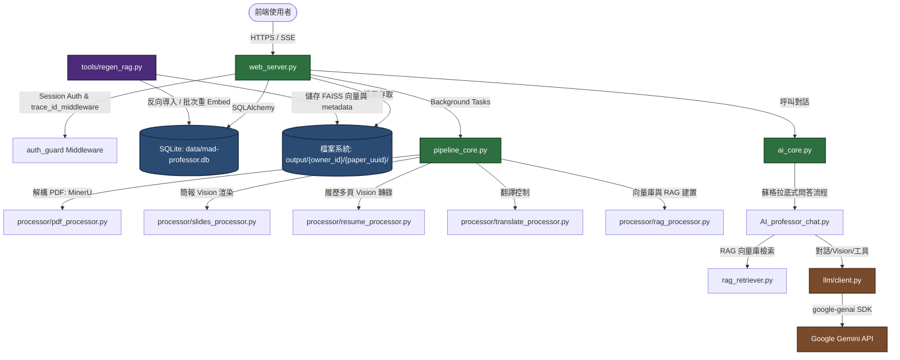
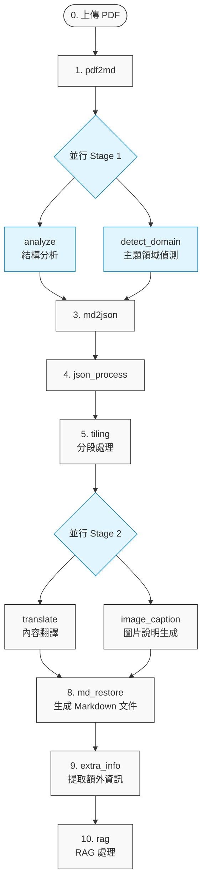
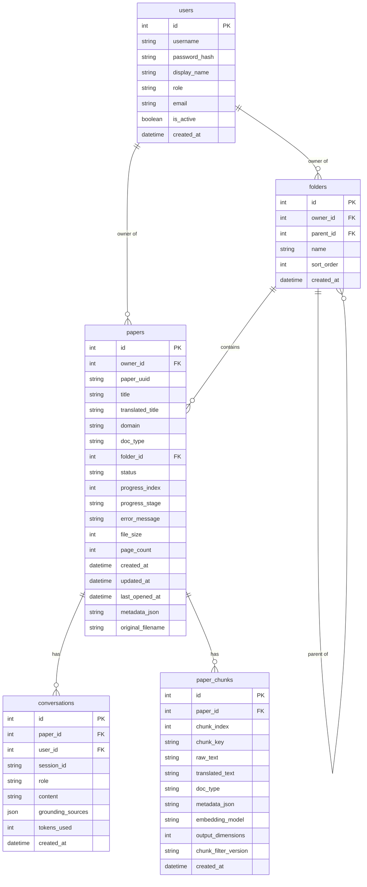
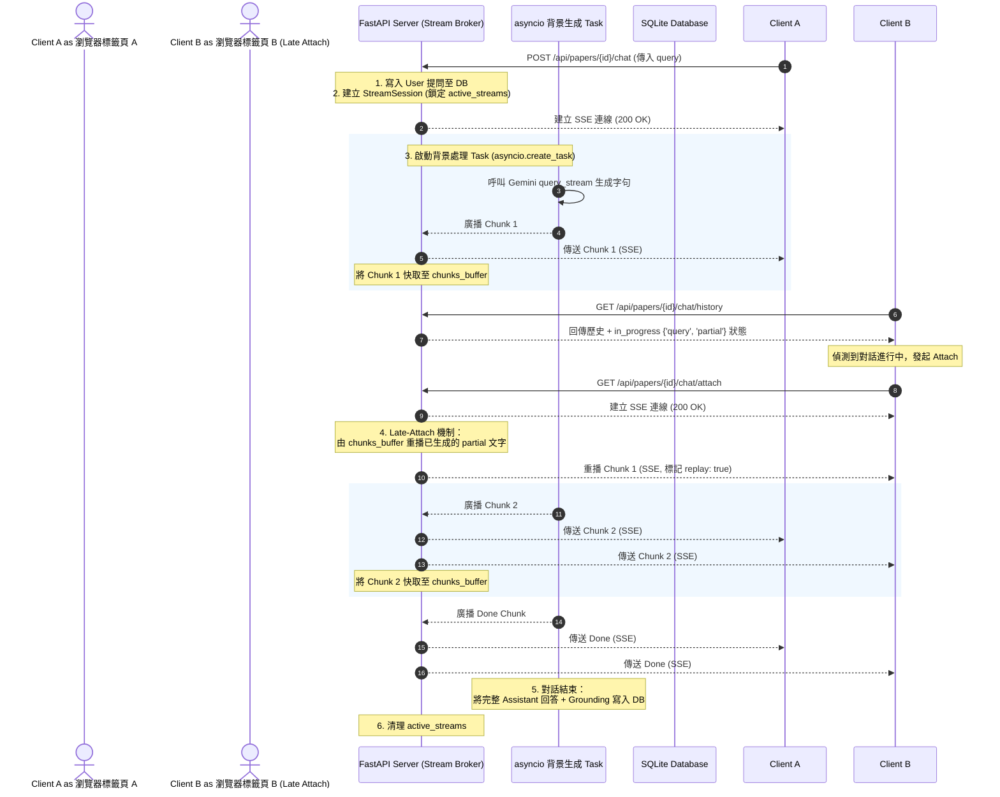
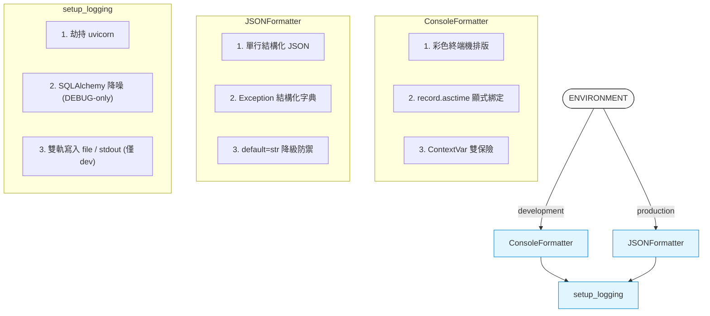

# Mad Professor: 專案架構與程式碼庫深度分析 (V2 — 2026-05-23 更新)

> [!NOTE]
> **最後 Git 提交資訊 (最後更新基準)**
> - **Commit Hash**: `6e764ea387d9ed8478f55cb1f4074cc857db5374`
> - **提交作者**: `jialuncheng <baronz@gmail.com>`
> - **提交時間**: `Sat May 23 14:25:31 2026 +0800`
> - **提交說明**: `feat(logging): LOGGING-3 - tools/regen_rag.py CLI 統一 setup_logging`

`Mad Professor` 是一個整合學術論文、簡報、履歷、新聞等多文件類型的 AI 智慧閱讀與 RAG (Retrieval-Augmented Generation) 問答系統。本專案將原本的桌面應用重構為現代化的 Web 服務架構（FastAPI + 純原生 CSS/JS 前端），並全面以 Google Gemini 系列模型為核心，開發出極具設計美感與高吞吐性能的智慧文件助理。

在最新的版本迭代中，專案引入了諸多企業級優化，包含**履歷專用 Vision Pipeline**、**Tiling 分段三合一最佳化**、**以 SQLite 為核心的 Raw Text 物理防線**、**Gemini Embedding 2 與 L2 正規化**、**SSE 串流 Broker 延遲掛載 (Late-Attach)**，以及**統一結構化日誌 (JSON/Console) 與 Trace ID 追蹤基建**。

---

## 一、 系統整體架構與模組關係

系統採用 **Web 服務端 + 異步管線 (Pipeline) + 資料庫/檔案儲存雙軌分離** 的典型企業級架構。以下是各核心模組間的最新交互關係：



### 1. 核心組成模組角色
*   **`web_server.py`**: 提供 Web 服務端點與路由，以 FastAPI 實現。處理登入認證 (Session)、全域 ContextVar Trace ID 注入與傳播、論文上傳、檔案提供、對話管理，並使用 Server-Sent Events (SSE) + 記憶體內 `StreamSession` 實現防並發的問答串流與 Late-Attach。
*   **`pipeline_core.py`**: 作為文件的「離線解析編排器」。它串聯起多格式 PDF 解析（MinerU、SlidesProcessor、ResumeProcessor）、標題修正、翻譯、圖說生成、RAG 向量化與 SQLite 物理分段備存等多個階段，並支持特定階段的並行執行以加速任務。
*   **`paper_manager.py`**: 數據持久化抽象層。將資料庫的操作（如使用者、資料夾、論文、對話紀錄、`PaperChunk` 儲存）封裝起來，並協調硬碟檔案的清理工作。
*   **`ai_core.py`**: 系統問答核心。處理 RAG tree 緩存，管理向量檢索器的初始化與多用戶鍵值隔離，防止跨用戶對話與論文資訊的洩漏。
*   **`AI_professor_chat.py`**: 蘇格拉底式的智慧導師決策器。內建基於 LLM 的路由器（Router），根據使用者問題決定是直接回答、提取全書摘要，還是進行基於向量庫的 RAG 精確檢索。
*   **`llm/client.py`**: 統一的 Gemini API 通訊適配器，封裝了 `google-genai` SDK。管理全域並發限制（`LLM_MAX_CONCURRENT`）、全域 Jitter 指數型自動重試、共享連接池（Keep-Alive httpx.Client）與 Google 搜網功能。
*   **`tools/regen_rag.py`**: 增強型後台 RAG 管理與回填 CLI。支持一次性將既有向量庫反向導入資料庫，以及在升級嵌入模型或變更分段規則時，單緒批次（保護 SQLite 鎖與 API 頻寬）重 Embed 所有文件。

---

## 二、 11 階段處理管線 (Pipeline) 深度解析

當用戶上傳 PDF 並確認文件類型（如：學術論文 `academic`、簡報 `slides`、履歷 `resume`、書籍 `book`、技術文件 `technical`、網頁 `web`、新聞 `news` 等）後，`PipelineCore` 會依序執行以下 11 個處理階段。部分階段被設計為**並行 (Parallel) 執行**以提升效率：



### 1. 各階段核心功能與技術演進

| 階段名稱 | 內部名稱 | 處理器 (Processor) | 技術與處理機制 |
| :--- | :--- | :--- | :--- |
| **PDF 轉 Markdown** | `pdf2md` | `PDFProcessor` / `SlidesProcessor` / `ResumeProcessor` | **多類型精準分流與 Vision 轉錄**：<br>1. **簡報 (`slides`) / 履歷 (`resume`)**：直接用 PyMuPDF 渲染頁面成高清晰度 JPEG（履歷採 2.5 倍 dpi，超限時自動降級 1.5 倍），送 `Gemini Vision` 進行整頁文字忠實轉錄與結構辨識。此二類型**跳過 `md_cleaner` 清理**以防格式損壞。<br>2. **其餘（含未知類型 fallback）**：呼叫 `MinerU` HTTP API 取得 Markdown，並用 `MarkdownCleaner` 進行 ligature（連字）拆解、浮水印自動偵測與移除。 |
| **文件結構分析** | `analyze` | `DocAnalyzer` | 使用 `LLM_DOC_MODEL` 對 Markdown 的標題層級進行檢測與修正，輸出修正後的標題層級關係，避免標題層級誤判。對 `resume` 而言，此階段作為標題修正的雙保險。 |
| **主題領域偵測** | `detect_domain` | `DomainDetector` | **極速非阻塞偵測**：優先從 Stage A 緩存的 `metadata['domain'].value` 讀取。若無，則提取首頁的前 1500 字，透過 `LLM_DOMAIN_MODEL` 偵測文件屬於哪個主題領域（如 `Computer Science`），用以精準翻譯專業術語。 |
| **Markdown 轉 JSON** | `md2json` | `MarkdownProcessor` | 將扁平的 Markdown 文字文件，依照分析出的標題層級重建為具有樹狀巢狀結構的 JSON。 |
| **JSON 處理** | `json_process` | `JsonProcessor` | 對 JSON 進行細部掃描，將區塊分類為 `text`（本文）、`figure`（圖片）、`table`（表格）與 `formula`（公式），進行清洗與特徵標記。 |
| **分段處理** | `tiling` | `TilingProcessor` | **Tiling 三合一最佳化**：<br>1. **短文 Fast-path Bypass**：總字數 < `TILING_BYPASS_CHAR_LIMIT` (5000) 的短文直接 bypass TextTiling 切割（標記 `tiling_method='bypass'`），以防格式斷裂，並保留原始 index 供還原對齊。<br>2. **長文書籍段落級滑動**：總字數 > `TILING_PARAGRAPH_THRESHOLD` (30000) 時，切換為段落級 regex 分割（容錯 `\r\n` 與多餘空白），大幅減少向量 RTT 耗時。<br>3. **公式穿透與智慧拼接**：`_merge_small_text_blocks` 支援公式穿透，LaTeX 公式不計入 size-based flush，且 text+formula 之間以單空格拼接，避免行內公式（如 $x$）被截斷為獨立三段。 |
| **內容翻譯** | `translate` | `TranslateProcessor` | **全文翻譯**：將切片逐段翻譯為繁體中文。翻譯時會自動載入該文件的 `doc_type` 與 `domain`，並將前一段的翻譯結果作為 Prompt 上下文，保證前後文術語一致且翻譯風格符合類型（如學術論文格式、簡報簡潔條列格式）。 |
| **圖片說明生成** | `image_caption` | `ImageCaptionProcessor` | 使用 `LLM_VISION_MODEL` 掃描 MinerU 抽取的圖片，為每張圖片產生精準的繁體中文多模態圖表說明，用於未來問答檢索。 |
| **生成 Markdown 文件** | `md_restore` | `RestoreProcessor` | **中英雙語還原**：將翻譯好的中文 Tile 與英文原 Tile，分別重新拼裝還原成兩個完整的雙語對照 Markdown，並將 Vision 產生的圖說整合進對應圖片的下方。支援 `_preserve_pipe_table` 保留 Pipe 表格，並關閉 marked.js 的單 `~` 刪除線渲染，防止範圍表示（如 10~20）損毀。 |
| **提取額外資訊** | `extra_info` | `ExtraInfoProcessor` | 自底向上產生每個章節的摘要、核心問題以及公式解析。對於 `news`/`web`/`slides`/`resume` 等短文類型，則改採單次整份文件摘要。 |
| **RAG 處理** | `rag` | `RagProcessor` | **多重語意增強與物理存檔**：<br>1. **短文 Section 級合併**：短文類型（`resume`/`slides`/`news`/`web`）自動將同一個 section 內的多個 text items 合併為單一 chunk，避免 embedding 信號被稀釋。<br>2. **Context 語意前綴**：在 Document 內容最前端注入 `Context: {doc_type} > {section_title}`，綁定全域背景與局部細節。<br>3. **智慧雜訊過濾**：使用 `_is_chunk_meaningful` 過濾純標題、數字年份與 markdown 噪聲（放寬 `resume`/`slides` 字數下限至 ≥3 以保留關鍵技能詞），並百分百保留 email/phone/url 等重要資訊。<br>4. **向量生成**：呼叫 `gemini-embedding-2`（768維降維，客戶端手動 L2 正規化以確保內積等於餘弦相似度），在本地建立 `FAISS` 向量庫並持久化儲存。<br>5. **物理備存與 Metadata 記錄**：批次寫入資料庫 `paper_chunks` 表備存，並寫入 `index_meta.json` 記錄當前模型配置。 |

---

## 三、 資料庫設計與儲存策略

系統採用 **「DB 儲存 Metadata + 檔案系統持久化實體檔案」** 的混和設計。新版資料庫在 SQLite 物理防線上進行了大幅強化。

### 1. 關係型資料庫與實體防線 (SQLite + SQLAlchemy)
資料庫位於 `data/mad-professor.db`，由五張核心表組成，新增了 `PaperChunk` 作為 Raw Text 的實體防線：



*   **`Paper` (論文表)**: 新增 `original_filename`（保留原始中文、空格與特殊字元），便於下載與除錯；`paper_uuid` 則作為物理路徑的隔離主鍵。
*   **`PaperChunk` (分塊備存表 - 新增)**:
    > [!IMPORTANT]
    > **實體防線的設計目的**
    > 1.  **資料不遺失**：將 RAG 階段分割好的 meaningful raw_text、翻譯與完整 metadata JSON 永久儲存於 SQLite 資料庫。
    > 2.  **升級零門檻**：當未來升級 Embedding 模型（如升級到 `gemini-embedding-3`）或調整向量維度時，可以直接從 `paper_chunks` 讀出 `raw_text` 直接重 Embed 寫入 FAISS，**完全不需要重新解析 PDF**，省去 95% 的計算耗時。
    > 3.  **防線檢測**：記錄了寫入時的 `embedding_model`、`output_dimensions` 與 `chunk_filter_version`，供 CLI 工具檢測 mismatches。
*   **`Conversation` (對話表)**: 移除了前端 POST /chat/history 全包覆寫的 endpoint，改由後端 chat 生成管道直接寫入 DB（進入時寫 user 提問，SSE stream finally 寫 assistant 回答），物理防守數據寫入順序。

### 2. 檔案系統儲存架構與環境變數化
實體檔案儲存在 `settings.OUTPUT_DIR` 目錄（支援藉由環境變數 `OUTPUT_DIR` 統一集中掛載卷，便於 Docker / K8s 雲原生部署）：
```text
output/
  └── {owner_id}/                     # 使用者隔離層
        └── {paper_uuid}/             # 論文隔離層
              ├── {paper_uuid}.pdf    # 原始 PDF 檔案
              ├── {paper_uuid}.md     # MinerU 解析出的原始 Markdown
              ├── final_{paper_uuid}_en.md  # 還原後的英文 Markdown
              ├── final_{paper_uuid}_zh.md  # 還原後的繁體中文 Markdown
              ├── final_{paper_uuid}_rag.md # 供 RAG 檢索使用的 Markdown
              ├── final_{paper_uuid}_rag_tree.json # 論文 RAG 巢狀結構 JSON 樹
              ├── images/             # 從 PDF 中提取的所有圖片檔
              │     ├── page_01.jpg   # 簡報/履歷 Vision 渲染頁面
              │     └── ...
              └── vectors/            # FAISS 向量庫持久化資料
                    ├── index.faiss
                    ├── index.pkl
                    └── index_meta.json # 向量庫版本與模型簽名 JSON
```

---

## 四、 AI 問答路由與雙重隔離串流機制

### 1. 智慧問答決策路由器 (Router)
當使用者發起提問時，系統會將問題、當前頁面內容、歷史對話與文件主題送入路由器 `_make_decision`，由 LLM 判斷使用者意圖並分流至四個通道：

*   **`direct_answer` (直接問答)**: 當用戶詢問通用常識或與文件無關的問題時，不檢索文件，直接回答以節省 Token。
*   **`page_content_analysis` (頁面分析)**: 當用戶說「這頁的公式在寫什麼？」，直接抓取前端當前顯示的局部 Markdown 內容作為 Context，保證精準答覆。
*   **`macro_retrieval` (宏觀檢索)**: 當用戶詢問「這份文件的核心論點是什麼？」，直接從 `rag_tree.json` 中提取整份文件的**總摘要**與**各章節層級摘要**。
*   **`rag_retrieval` (微觀檢索)**: 當用戶針對細節提問（如「實驗數據中 Batch Size 是多少？」），呼叫 `FAISS` 檢索向量庫，找出最相關的 **Top-5 語意 Chunks**，並注入 `paper_title` 作為引用來源。

### 2. 異步串流 Broker (Stream Sessions) 與 Late-Attach 機制

為了給 Web 端提供極致體驗，後端引進了基於記憶體 `StreamSession` 的串流代理器 (Broker)：



*   **並發鎖定限制**：拒絕同一個 `(owner_id, paper_id)` 同時發起兩個對話生成（若重複發起會回傳 `409 Conflict`），保護資料庫寫入順序。
*   **Late-Attach (延遲掛載) 與重播**：用戶在問答過程中若重新整理瀏覽器、切換分頁或開啟同份文件的多個標籤頁，前端會打 `/chat/attach` 接口。Stream Broker 會從記憶體 `chunks_buffer` 中**回放 (Replay)** 已生成好的字句，再繼續播放剩餘的 SSE 串流，避免對話中斷或遺失。

---

## 五、 統一結構化日誌基建 (Logging Infrastructure)

為適應容器化、微服務雲原生部署以及開發除錯需求，系統重構了全域的日誌配置 `utils/logging_config.py`，作為全專案唯一的日誌配置入口。



### 1. 核心特點與防禦設計
*   **雲原生 12-factor 與雙軌輸出**：以 stdout 輸出為主，但在 `development` 模式下保留 `RotatingFileHandler` 雙寫至 `logs/pipeline.log`，方便開發人員使用 `tail -f` 進行實時追蹤。
*   **JSONFormatter 異常字典化**：生產環境輸出結構化單行 JSON。若日誌中包含 `exc_info`，將其解析為 `{type, message, stacktrace}` 結構化字典，並通過 `any(exc_info)` 進行安全防衛，防禦空值 crash。
*   **ContextVar 雙保險傳播**：引進 `trace_context` ContextVar（`default=None`，使用 `.get(None)` 安全讀取），在 CLI 運作或單元測試環境無注入時，防範 LookupError。
*   **`trace_id_middleware` 追蹤機制**：
    *   為每個 HTTP 請求注入一個 Trace ID。若前端傳入 `X-Trace-ID` 則重用，否則隨機生成 8 碼 short hex。
    *   自動將 `trace_id`、`owner` (使用者名稱)、`path` 與 `method` 綁定至 `trace_context`，並回填至 Response Headers。
    *   **SSE背景繼承**：基於 Python 3.9+ 的 `asyncio.to_thread` 傳播機制，背景 SSE 對話生成執行緒會自動繼承此 ContextVar，完美解決 SSE 異步任務日誌斷鏈的痛點。
*   **第三方 Logger 噪聲分流與劫持**：
    *   劫持 `uvicorn`、`uvicorn.access`、`uvicorn.error`，防止其默認 formatter 覆蓋全域配置。
    *   **SQL 降噪**：硬編碼限制 `sqlalchemy.engine`，僅在 Root Logger 為 `DEBUG` 時才輸出 SQL 語句，防範 `INFO` 級別下的 SQL Spam。
*   **Uvicorn 啟動防禦**：在 `web_server` 啟動時傳入 `log_config=None`，防範 uvicorn 預設日誌配置覆寫已初始化好的 root logger。

---

## 六、 CSS 變數驅動的多主題美學系統

系統完全廢棄了 ad-hoc 的行內樣式，改用高度抽象化、可配置的**「設計代幣系統 (Design Tokens)」**。在 `static/index.html` 中定義骨架，色彩、字型、圓角與陰影，全部交由 `/static/themes/{theme_name}.css` 動態覆寫。

專案內建了四款高質感設計主題：

```carousel
### 🧱 Kahn (路易·康) 主題
- **設計語彙**：Kimbell 美術館的安靜、漫射天光。
- **主色調**：清水混凝土冷中性灰 (`#dcdcdc`)、受光面淺灰。
- **排版字型**：非襯線 `IBM Plex Sans`，展現清水模硬朗與人文幾何感。
- **細節**：figure 區塊頂部帶有 1px 的銀色線性漸層，暗示展覽館頂部透下的線性天窗陰影。
<!-- slide -->
### 🖼️ Kandinsky (康丁斯基) 主題
- **設計語彙**：俄羅斯抽象畫派與包浩斯時期的點、線、面構成。
- **主色調**：極深墨黑底色，高飽和黃、紅、藍三原色點綴。
- **排版字型**：充滿幾何現代感的 `Outfit` 字體。
- **細節**：強烈的對比色彩與活潑的圓角，為數據密集的系統注入極富衝擊力的視覺體驗。
<!-- slide -->
### 📐 Mies (密斯·凡德羅) 主題
- **設計語彙**：極簡主義經典「Less is More」與巴塞隆納展覽館。
- **主色調**：高對比的純黑 (`#111`) 與純白背景，石材紋理般的深灰色分隔。
- **排版字型**：高雅的襯線字體 `Playfair Display` 用於大標題，內文使用精準的 `Inter`。
- **細節**：完全沒有圓角 (`border-radius: 0`)，線條極細、乾淨，展現極致精密的鋼骨玻璃結構感。
<!-- slide -->
### 🎨 Nara (奈良美智) 主題
- **設計語彙**：溫暖、手作感的安靜畫廊空間。
- **主色調**：溫和的米色 (`#fdfbf7`) 與溫暖的奶油黃，文字使用帶有紅棕色調的木炭灰。
- **排版字型**：溫婉的襯線字體 `Georgia`，提供如同實體紙張印刷的舒適閱讀體驗。
- **細節**：大圓角、軟綿綿的邊界設計，極大緩解了閱讀時的心智壓力。
```

---

## 七、 專案擴充與管理指南

### 1. 如何加入新的文件類型 (Doc Type)
若要新增一種文件類型（例如：專利文件 `patent` 或合約 `contract`）：
1.  **已知類型註冊**：編輯 `pipeline_core.py` 的 `KNOWN_DOC_TYPES` 常數集（對應 `web_server.py` 的 `confirm_type` 白名單），將 `'patent'` 加入。
2.  **準備 Prompt**：在 `prompt/doc/` 資料夾下，新增該類型的標題修正與結構分析提示詞：
    *   `prompt/doc/heading_fix_patent.txt`
    *   `prompt/doc/structure_patent.txt`
3.  **註冊分析 Prompt**：編輯 `processor/doc_analyzer.py`，將這兩個提示詞註冊入 `HEADING_FIX_PROMPTS` 與 `STRUCTURE_PROMPTS` 對應字典中。
4.  **設定翻譯風格與短文判斷**：
    *   在 `translate_processor.py` 的 `style_hints` 字典中加入專利文件的翻譯風格描述。
    *   評估其是否屬於「短文型」（如合約）。若是，將 `'contract'` 加入 `rag_processor.py` 的 `_SHORT_DOC_TYPES` 常數集中，啟用自動區塊合併與 Context 前綴。
    *   在 `llm/client.py` 的已知文檔類型白名單中更新。

### 2. 如何調整 LLM 與 Embedding 模型
所有的模型配置皆可直接透過修改 `.env` 檔案達成，無須修改程式碼：
*   **使用者對話**: 編輯 `LLM_CHAT_MODEL`（建議使用 Pro 等級，如 `gemini-3.5-pro`，以啟用最佳的 RAG 決策與多步推理）。
*   **後台批次任務**: 編輯 `LLM_TRANSLATE_MODEL`、`LLM_DOC_MODEL`、`LLM_VISION_MODEL` 與 `LLM_EXTRA_INFO_MODEL`（建議使用 Flash 等級，如 `gemini-3.5-flash`）。
*   **向量配置**:
    *   `EMBEDDING_MODEL`：預設為 `gemini-embedding-2`。
    *   `EMBEDDING_OUTPUT_DIMENSIONS`：設定為 `768`（搭配客戶端自動 L2 正規化）。
    *   `RAG_SCORE_THRESHOLD`：向量距離閾值（預設 `0.22`）。
*   **全域並發限制**: `LLM_MAX_CONCURRENT`（預設 `6`），防範後台並行跑多個 pipeline 時撞 429 速率限制。

### 3. RAG 向量維護與重構 ( Regen CLI )
在調整 RAG 參數或升級 Embedding 模型時，可藉由 `tools/regen_rag.py` 進行安全維護：
*   **反向備份既有資料**：
    `python tools/regen_rag.py --init`
    系統會掃描所有物理 `vectors/` 目錄，將 FAISS 內的原生 Document 內容反向寫入 SQLite 的 `paper_chunks` 表，建立實體防線。
*   **檢測簽名不符 (Mismatch)**：
    `python tools/regen_rag.py --check`
    比對所有論文儲存的 Embedding 簽名與當前 `.env` 配置是否一致。
*   **批次重 Embed 所有論文**：
    `python tools/regen_rag.py --all`
    對所有 mismatched 的論文，從資料庫讀出 raw_text 重新調用 API 嵌入，並刷新 FAISS 向量與 `index_meta.json` 檔案。
