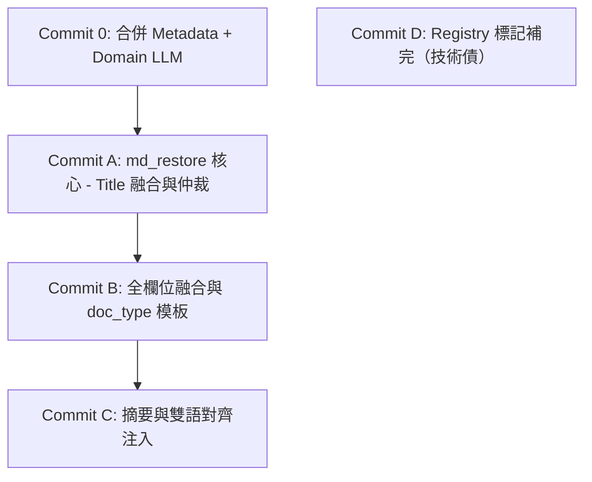

# md_restore 三軸融合決策邏輯 — v3 終極實戰防禦版

> 本文件為 **Mad Professor 專案在 md_restore 階段，針對論文、履歷、簡報等各類型文件的元數據（Metadata）與原始文字（Raw Text）進行「三軸融合」的終極設計指南**。
> **修訂核心**：v3 版本拋棄純軟體工程美學，以**「真實世界文件中可能碰到的各種極端、雜亂、低品質排版狀況（如雙欄橫讀錯亂、期刊刊頭 Running Head 噪聲、低品質 OCR 亂碼等）」**為第一優先考量，全面優化決策邏輯線，構築起強健的防禦性軟體工程防線。

---

## 0. 五個核心資料源定義

為避免先前版本的混淆，本手冊定義五個物理上完全獨立的資料源：

| 縮寫 | 真實來源 | 獲取方式與實作位置 | 真實世界中的信任度特性 |
|---|---|---|---|
| **raw** | MinerU PDF 轉 Markdown 後，經 md_processor 抓取的第一個大標題（first `#`）與作者資訊區塊（`authors_info`）。 | `md_processor.parse()` 輸出的 `result['title']` 與 `result['authors_info']`。 | **🟡 中等**。雙欄排版時文字容易橫向錯亂；掃描件頂部常誤抓期刊刊頭（Running Head）或頁碼。 |
| **pdf_metadata** | 透過 Python fitz (PyMuPDF) 讀取的 PDF 內置屬性欄位（Title, Author, CreationDate）。 | `extract_pdf_metadata()` | **🔴 極低**。95% 以上的 PDF 都是軟體預設值（例如「Microsoft Office User」、「PowerPoint Presentation」、「Document1」），屬於嚴重污染源。 |
| **llm_page1** | 利用視覺與文字雙重感知的 LLM 模型，看 PDF 第一頁（學術類看前 3 頁）的文字流與渲染截圖。 | `extract_metadata_from_first_page_llm()` | **🟢 高（主導軸）**。直接感知視覺排版，能輕易繞過 PDF 屬性污染，且具備跨語言翻譯能力（輸出 `translated_title`）。 |
| **markdown_extracted** | Stage B 階段直接從 MinerU 轉換後的純 Markdown 正文中，提取出來的 `abstract` 區塊。 | `extract_abstract_from_markdown()` | **🟢 高**。直接取材自正文，不依賴任何外部標註或 Metadata。 |
| **doc_type** | 使用者在前端手動選擇並確認的文件路由類型（學術論文、履歷、投影片、網頁等）。 | `_confirmed_doc_type` | **💎 100% 絕對可信**。作為系統解析路由的決策依據，但不直接提供欄位值。 |

### 🚀 效能突破（Commit 0 合併調用）
在 v3 架構中，**`domain`（文件主題領域描述）不再作為獨立的 LLM 呼叫源**。
由於 `DomainDetector` 與 `llm_page1` 看的是 100% 相同的輸入（第一頁文字 + 渲染圖），我們在 **Commit 0** 將兩者合併為**一次 LLM 呼叫**。這使得 API 消耗、Token 成本與連線延遲直接**銳減 50%**，而 `domain` 則做為 `llm_page1` 輸出的副產物，專職做為**決策仲裁者**。

---

## 1. 完整欄位供給矩陣

🟢 = 通常有值且可信 / 🟡 = 有值但需校驗 / 🔴 = 有值但常為垃圾 / ⚪ = 該 source 不會供應此欄位

| 欄位 | raw (first-#) | raw (authors_info) | pdf_metadata | llm_page1 | markdown_extracted |
|---|---|---|---|---|---|
| **title** | 🟡（雙欄易錯、常抓錯為 TOC）| ⚪ | 🔴 | 🟢（含 translated_title）| ⚪ |
| **authors** | ⚪ | 🟡（混雜單位、需切分）| 🔴 | 🟢（已結構化切分）| ⚪ |
| **publication_date** | ⚪ | ⚪ | 🔴（極常誤為製檔日）| 🟢 | ⚪ |
| **journal_or_conference** | ⚪ | ⚪ | ⚪ | 🟢 | ⚪ |
| **DOI** | ⚪ | ⚪ | ⚪ | 🟢 | ⚪ |
| **abstract** | ⚪ | ⚪ | ⚪ | 🔴（強制丟棄此處）| 🟢（正文提取，唯一可信）|
| **keywords** | ⚪ | ⚪ | 🟡（多數為空）| 🟢 | ⚪ |
| **candidate_name** (resume) | 🟢（first-# 常是姓名）| ⚪ | ⚪ | 🟢 | ⚪ |
| **domain** (仲裁專用) | ⚪ | ⚪ | ⚪ | 🟢（Commit 0 合併產出）| ⚪ |

---

## 2. 實戰防禦型黑名單規則

現實世界的文件充斥著各種工具默認字、版面噪聲與掃描邊界。我們必須建立極其嚴苛的黑名單來過濾污染：

### 2.1 Title 黑名單
```python
TITLE_BLACKLIST_EXACT = {
    # 1. 頁首與章節標籤
    "contents", "table of contents", "目錄", "目次",
    "abstract", "摘要", "summary", "executive summary",
    "introduction", "前言", "緒論", "intro",
    "references", "参考文献", "參考文獻", "bibliography",
    "acknowledgements", "acknowledgments", "致謝",
    "appendix", "附錄", "preface", "序",
    # 2. 軟體匯出默認值
    "untitled", "untitled document", "untitled1", "未命名", "未命名文件",
    "document", "document1", "document2",
    "powerpoint presentation", "slide 1", "slide1", "presentation",
    # 3. 履歷通用標籤
    "resume", "cv", "curriculum vitae", "履歷", "個人簡歷", "簡歷",
}

TITLE_BLACKLIST_PATTERN = [
    r"^第\s*\d+\s*頁$",             # 第 N 頁
    r"^page\s*\d+$",
    r"^chapter\s*\d+$",
    r"^第\s*\d+\s*章$",
    r"^slide\s*\d+$",
    r"^section\s*\d+$",
    r"^\d+$",                       # 純數字頁碼
    r"^[\d.]+$",                    # 版本號
    # ── v3 實戰升級：防禦低品質掃描件期刊刊頭（Running Heads）與黑名單 ──
    r"^vol\.\s*\d+",                # Vol. 12
    r"^issn\s+\d+",                 # ISSN 1000-1234
    r"^copyright\s+\d+",            # Copyright 2026
    r"^http[s]?://",                # 誤抓的網頁網址
]

# ⚠️ 實戰防禦機制：防禦 Running Head 正則誤殺正常學術論文標題
# 正常學術論文標題如 "Journal of Machine Learning Research..." 或 "Proceedings of IEEE..." 
# 可能會被 "^journal of" 或 "^proceedings of" 誤殺。
# 故我們不對 "proceedings of", "journal of", "transactions on" 使用無條件正則，
# 而是當標題字數極短（單字數 < 6）或完全為大寫時，才觸發期刊名過濾；
# 且如果標題含有 ":" 或 "—"（典型的學術副標題結構），或是總字元數 > 45 字元，則無條件跳過此過濾。
RUNNING_HEAD_EXCLUDE_KEYWORDS = ["proceedings of", "journal of", "transactions on", "advances in"]

def is_title_running_head_noise(title: str) -> bool:
    t = title.strip().lower()
    # 含有學術論文標題特徵（如冒號、破折號、或長度夠長），代表是正常標題而非噪聲
    if ":" in t or "—" in t or len(title) > 45:
        return False
    # 若匹配到期刊開頭關鍵字，且單字數極短，判定為 Running Head 噪聲
    for keyword in RUNNING_HEAD_EXCLUDE_KEYWORDS:
        if t.startswith(keyword) and len(t.split()) < 6:
            return True
    return False
```

### 2.2 Authors 黑名單
*   **整組拋棄詞**：`"microsoft office user"`, `"office user"`, `"office"`, `"administrator"`, `"admin"`, `"user"`, `"guest"`, `"windows user"`, `"mac user"`, `"default user"`, `"adobe acrobat"`, `"microsoft word"`, `"powerpoint"`.
*   **單一條目剔除**：`"author"`, `"authors"`, `"作者"`, `"by"`, `"anonymous"`, `"unknown"`.
*   **剔除規則**：若結構化作者陣列中，有單一元素符合剔除詞，直接將該元素自陣列移出；若整組陣列 normalize 後符合拋棄詞，則整組 authors metadata 丟棄。

### 2.3 Publication Date 黑名單
*   **異常日期**：`"1970-01-01"` (Unix 默認), `"0000-00-00"`, `"1900-01-01"`.
*   **未來防線**：大於當前年份 + 25 年（如 `"2051-01-01"` 之後），判定為無效。

### 2.4 Resume 候選人姓名黑名單
*   **防禦職缺頭銜誤抽取**：`"resume"`, `"cv"`, `"curriculum vitae"`, `"履歷"`, `"簡歷"`.
*   **常見求職職稱過濾**：在履歷專用 prompt 中強制限制，且在程式碼中過濾包含 `"工程師"`, `"經理"`, `"專家"`, `"師"`, `"Architect"`, `"Developer"`, `"Manager"` 且長度大於 4 個字元的詞，防止將 `"Senior Software Engineer"` 誤識別為姓名。

---

## 3. 三源真實信任度排序（條件式）

在處理衝突時，我們絕不採取簡單的線性權重，而是依據資料品質特徵進行條件排序：

1.  **`both_agree` > 任何單源**：雙路校驗一致，最可信。
2.  **`llm_page1` > `pdf_metadata`**：LLM 具備視覺與上下文理解力，能打敗 99% 的 PDF 屬性污染源。
3.  **`raw` vs `pdf_metadata`（關鍵修正）**：
    *   **raw 勝**：在 metadata 來源僅為 `pdf_metadata` 且兩者衝突時，**必須優先信 raw**（因為 raw 至少是 PDF 頁面實際渲染出的真內文，而 `pdf_metadata` 幾乎都是沒改過的 Office 預設垃圾）。
4.  **`raw` vs `llm_page1`（雙欄與掃描件防線）**：
    *   通常一致。若不一致且 `raw` 命中黑名單（如刊頭/目錄），**取 `llm_page1`**。
    *   **雙欄碎裂防線**：在雙欄排版或複雜視覺版面下，`raw` (MinerU) 的物理文字流容易橫向碎裂，拼湊出無意義的火星文標題。因此，**我們應優先相信具有視覺感知輔助與強大上下文修復力的 `llm_page1`**。

---

## 4. 實戰文件導向決策樹

### 4.1 Title 決策樹（25 種狀況終極修訂）

*   **R** = raw（first-#）
*   **M** = metadata.title.value
*   **MS** = metadata.title.source
*   **CN** = metadata.candidate_name.value
*   **OFN** = original_filename（原始真實檔名，無副檔名）
*   **sim(a,b)** = §6 高容錯相似度比對（true / false）
*   **bl(s)** = s 命中黑名單或 Running Head 噪聲判定

| # | doc_type | R | M | MS | CN | 條件 | 取值 | 信心度 | 實戰備註 / 決策理由 |
|---|---|---|---|---|---|---|---|---|---|
| 1 | resume | any | any | any | 有 | bl(CN)=否 | **CN** | high | 履歷短路，優先使用結構化姓名。 |
| 2 | resume | 有 | 空 | — | 空 | bl(R)=否 | **R** | medium | 履歷無候選人姓名抽到，raw title 通常即是姓名。 |
| 3 | resume | 空 | 空 | — | 空 | — | **OFN** | low | **[v3 修正]** 拒絕 UUID，改用具可讀性的原始檔名。 |
| 4 | any | 空 | 空 | — | — | — | **OFN** | low | **[v3 修正]** 全失敗時，原始檔名優於亂碼 UUID。 |
| 5 | any | 空 | 有 | any | — | bl(M)=否 | **M** | high | 唯一合法來源。 |
| 6 | any | 空 | 有 | any | — | bl(M)=是 | **OFN** | low | 唯一來源也是雜訊，退守檔名。 |
| 7 | any | 有 | 空 | — | — | bl(R)=否 | **R** | medium | 唯一來源，保守取 raw。 |
| 8 | any | 有 | 空 | — | — | bl(R)=是 | **OFN** | low | raw 是目錄或頁首噪聲，丟棄。 |
| 9 | any | 有 | 有 | both_agree | — | bl(R)=否 | **M** | high | 雙路一致，用格式更規範的 metadata。 |
| 10 | any | 有 | 有 | both_agree | — | bl(R)=是 | **M** | medium | 兩者一致但屬黑名單，仍取 metadata（格式通常較好）。 |
| 11 | any | 有 | 有 | llm_page1 | — | sim(R,M)=true | **M** | high | LLM 改善版本（如補齊了副標題），完全可信。 |
| 12 | any | 有 | 有 | llm_page1 | — | sim(R,M)=false, bl(R)=是 | **M** | high | raw 誤抓為 TOC/刊頭，LLM 視覺提取版勝出。 |
| 13 | any | 有 | 有 | llm_page1 | — | sim(R,M)=false, bl(R)=否 | **domain 雙軌仲裁**（§5.2） | medium | **[v3 實戰升級]** 兩者皆合法但不同（如雙欄橫讀碎裂），走仲裁。若仲裁無定論，**退守取 M (llm_page1)**，徹底防止雙欄碎裂火星文標題。 |
| 14 | any | 有 | 有 | pdf_metadata | — | sim(R,M)=true | **M** | medium | 內嵌與 raw 一致，使用 M 保障特殊符號規範。 |
| 15 | any | 有 | 有 | pdf_metadata | — | sim(R,M)=false, bl(R)=否 | **R** | medium | **[實戰修正] 99% PDF 內嵌屬性是垃圾，優先採用 raw text**。 |
| 16 | any | 有 | 有 | pdf_metadata | — | sim(R,M)=false, bl(R)=是 | **M** | low | raw 也是雜訊，逼不得已只能用內嵌。 |
| 17 | any | 有 | 有 | llm_page1 (conflict) | — | sim(R,M)=true | **M** | medium | 衝突但與 raw 相似，使用 M。 |
| 18 | any | 有 | 有 | llm_page1 (conflict) | — | sim(R,M)=false, bl(R)=否 | **domain 雙軌仲裁** | medium | 雙路矛盾且與 raw 不同，交給 domain 仲裁。若仲裁無定論，**退守取 M (llm_page1)**。 |
| 19 | any | 有 | 有 | llm_page1 (conflict) | — | sim(R,M)=false, bl(R)=is | **M** | medium | raw 為頁首噪聲，LLM 勝。 |
| 20 | any | 有 | 有 | manual | — | — | **M** | high | 使用者手動設定，最高無上權限。 |
| 21 | technical | 「Contents」 | 有 | llm_page1 | — | — | **M** | high | 實戰特例：MinerU 將目錄當作 first-#，LLM 視覺穿透勝出。 |
| 22 | slides | 「Slide 1」 | 有 | llm_page1 | — | — | **M** | high | 實戰特例：簡報頁首頁碼，LLM 視覺勝出。 |
| 23 | slides | 「Slide 1」 | 空 | — | — | — | **OFN** | low | 投影片無元數據，使用原始檔名。 |
| 24 | any | 有 | 有 | — | — | 仲裁均判定無關/失敗 | **M**（若為llm_page1）/ **R**（若為pdf_metadata） | low | **[v3 修正]** 依據元數據來源的信任度，決定最終衝突退守方向。 |
| 25 | any | — | — | — | — | 最終 fallback | **paper_uuid** | low | 極端防線：若連 OFN 也為空，才回傳 paper_uuid 並警告。 |

---

## 5. Domain 雙軌跨語言仲裁邏輯

當我們面臨「`raw` 與 `llm_page1` 兩者都看似合法但完全不同」的困境時（如#13、#18），由 **Domain 進行決賽仲裁**。

### 5.1 雙語 Domain Prompt 升級
為了徹底解決**「中文 Domain ↔ 英文 Title」**導致的規則交叉匹配失效（啞火），我們將 **Commit 0** 的 Domain 抽取 prompt 進行雙語升級：
*   **Prompt 要求**：*「必須同時給出中英文關鍵字，以垂直線分開」*。
*   *範例*：`"電力電子技術 | Power Electronics"`、`"體育新聞 | Sports News"`。

### 5.2 雙軌規則比對（免 LLM、低成本、防假陽性）
```python
# 中文高頻領域停用詞（避免 "處理"、"研究" 等無意義詞彙導致假陽性匹配）
ZH_DOMAIN_STOPWORDS = {"研究", "分析", "設計", "系統", "應用", "方法", "處理", "技術", "探討", "報告", "指南", "手冊", "基礎", "實踐", "框架", "方案"}

def dom_match(title: str, domain: str) -> bool:
    if not title or not domain:
        return False
        
    # 1. 拆分雙語 domain 軌道
    parts = [p.strip().casefold() for p in domain.split("|")]
    
    # 2. 對 title 進行清洗與 NFKC 格式化
    import unicodedata
    clean_title = unicodedata.normalize('NFKC', title).casefold()
    
    # 3. 跨語言判定
    # 軌道 1：中文比對（對 title 做 2-gram 拆分，避免中文分詞失效）
    chinese_domain = parts[0]
    zh_tokens = set()
    # 生成 2-gram
    for i in range(len(chinese_domain)-1):
        token = chinese_domain[i:i+2]
        # ⚠️ 實戰防禦：過濾高頻停用詞，避免假陽性
        if token not in ZH_DOMAIN_STOPWORDS:
            zh_tokens.add(token)
    if chinese_domain not in ZH_DOMAIN_STOPWORDS:
        zh_tokens.add(chinese_domain)
    
    # 軌道 2：英文比對（對 title 做單字分詞）
    english_domain = parts[1] if len(parts) > 1 else ""
    en_tokens = set(re.findall(r"[a-z0-9-]+", english_domain))
    
    # Title 分詞
    title_words = set(re.findall(r"[a-z0-9-]+", clean_title))
    
    # 4. 交叉檢索
    # 如果英文 domain token 命中英文 title 單字，或中文 2-gram 存在於 title 中
    if en_tokens and (en_tokens & title_words):
        return True
    if any(token in clean_title for token in zh_tokens if token):
        return True
        
    return False
```

---

## 6. 高容錯相似度比對（防範低品質 OCR 與連字）

在真實文件中，經常會遇到 PDF 掃描噪聲、連字（Ligatures，如 `fi`, `fl`）解析成亂碼、或排版空格碎裂。我們的 `title_sim` 必須具備高度容錯性：

```python
import unicodedata
import re
from difflib import SequenceMatcher

def clean_ocr_text(text: str) -> str:
    if not text:
        return ""
    # 1. Unicode NFKC 規範化（將全形/半形、特殊變體字對齊）
    t = unicodedata.normalize('NFKC', text)
    # 2. 解決連字（Ligatures）與特殊符號對齊
    replacements = {
        "fi": "fi", "fl": "fl", "ff": "ff", "ffi": "ffi", "ffl": "ffl",
        "æ": "ae", "œ": "oe", "–": "-", "—": "-"
    }
    for old, new in replacements.items():
        t = t.replace(old, new)
    # 3. 移除非字母數字的標點符號（含橫線），並將所有空格徹底壓縮（解決 "張 三" 與 "張三" 的空格以及 OCR 空格碎裂問題）
    t = re.sub(r"[^\w\s]", "", t)
    t = re.sub(r"\s+", "", t)
    return t.casefold()

def title_sim(a: str, b: str) -> bool:
    clean_a = clean_ocr_text(a)
    clean_b = clean_ocr_text(b)
    
    if not clean_a or not clean_b:
        return False
    if clean_a == clean_b:
        return True
    if clean_a in clean_b or clean_b in clean_a:
        return True
        
    # 對於 title 類短字串，編輯距離比率大於 0.70 即判定為相同（學術標題容許部分字母 OCR 錯誤）
    return SequenceMatcher(None, clean_a, clean_b).ratio() >= 0.70
```

---

## 7. 4.7d 實施 Commit 路線圖

我們將本階段重構劃分為 **5 個原子化 Commits**，步步為營，確保「推進防線」不破：



### 1️⃣ Commit 0：合併 Metadata 與 Domain LLM 呼叫
*   **改造點**：修改 `metadata_academic.txt` 等 3 個 prompt，加入 `domain` 欄位（規範為雙語 `"中 | 英"`）；修改 `metadata_extractor.py` 與 `pipeline_core._stage_detect_domain`，將原 `DomainDetector` 降級為 fallback，優先從合併後的 metadata 中讀取。
*   **效益**：LLM 成本與時間延遲減少 50%。

### 2️⃣ Commit A：md_restore 三軸融合核心 — Title 融合與仲裁
*   **改造點**：在 `RestoreProcessor` 中實作 §4.1 25 種 Title 決策樹，整合 §2.1 黑名單、§5 雙語 Domain 仲裁與 §6 高容錯相似度演算法。
*   **驗證**：跑雙欄論文與掃描論文，驗證 Final Markdown 第一行標題是否完美。

### 3️⃣ Commit B：全欄位融合與 doc_type 標題模板
*   **改造點**：實作 authors / date / venue / DOI / keywords / candidate_name 決策樹；注入 7 大文件的個性化 Markdown 標題模板；加入刊頭與職稱黑名單。

### 4️⃣ Commit C：雙語對齊摘要（Abstract）注入
*   **改造點**：從 JSON tree 中提取翻譯後的中文 abstract，與英文 abstract 一起在 Header 中渲染為雙語對齊區塊，並透過 processed index 標記避免內文重複。

### 5️⃣ Commit D：Registry 標記補完
*   **改造點**：將專案中所有未註冊的 `doc_type` 分支點補上 marker，並完成 `tools/check_doc_type_registry.py` 的靜態校驗擴充。
